# ctfshow-爆破


### web21

#### 有前缀加base64

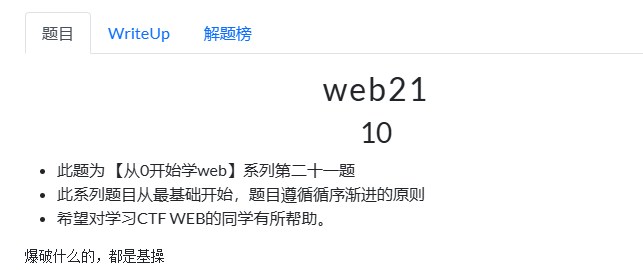

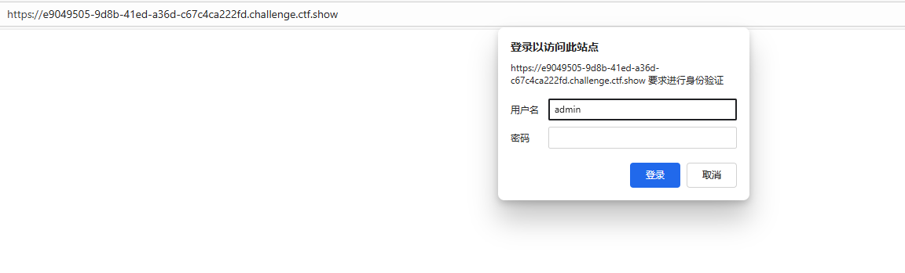

我们进行抓包

发现base64加密

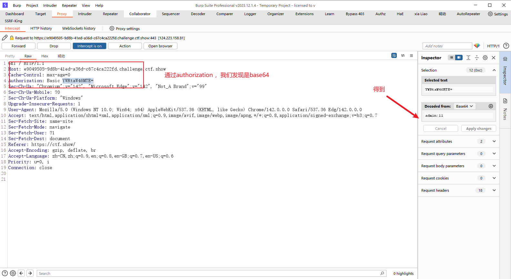

发送到爆破模块

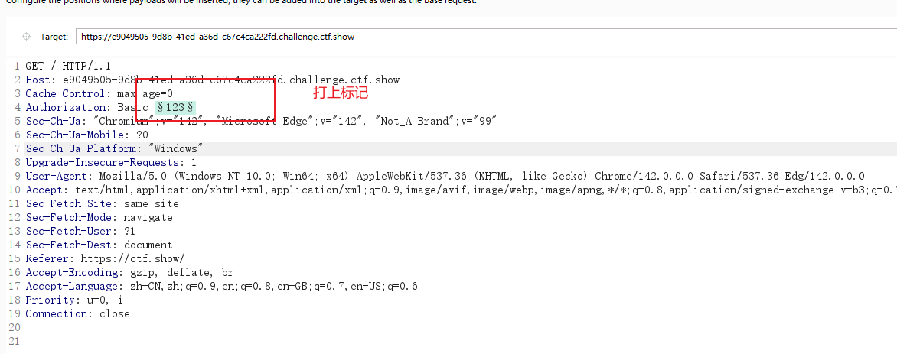

配置参数

Payload processing中添加两个规则，一个是Add prefix添加前缀为【admin:】因为账号猜测为admin固定不动，冒号为固定格式，再添加另外一个规则为Encode -> Base64-encode，把原先的url取消了

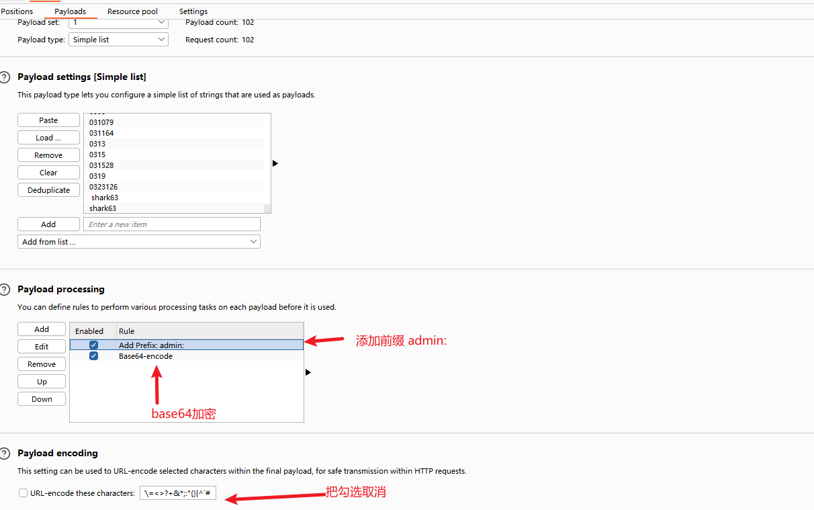

得到返回值为200的

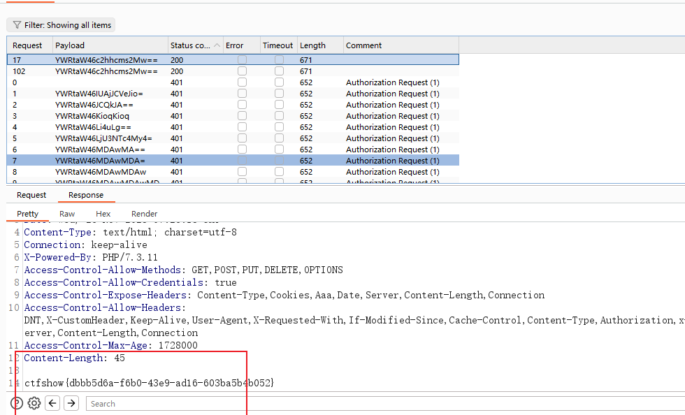

```
ctfshow{dbbb5d6a-f6b0-43e9-ad16-603ba5b4b052}
```


### web22

#### 域名爆破

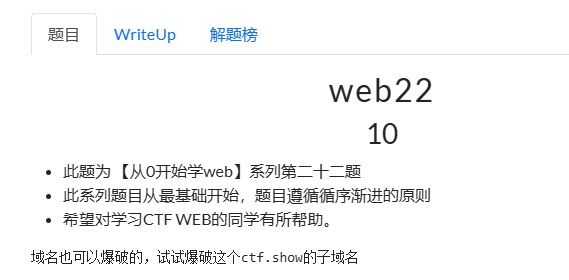

360quake 使用空间搜索引擎--->360quake 搜索语法--->domain="ctf.show" 可以搜索出子域名--->vip.ctf.show 可以发现子域名vip.ctf.show下面有flag--->flag{ctf_show_web}

```
flag{ctf_show_web}
```


### web23

#### hash判断

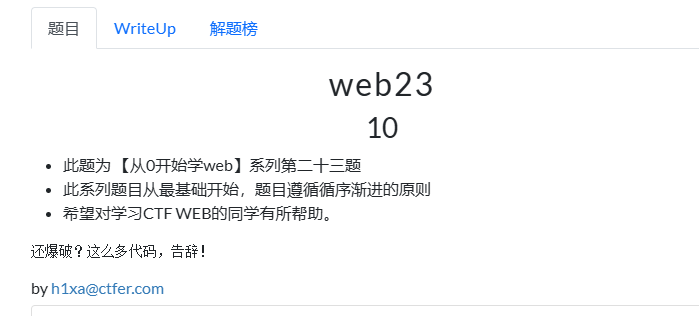

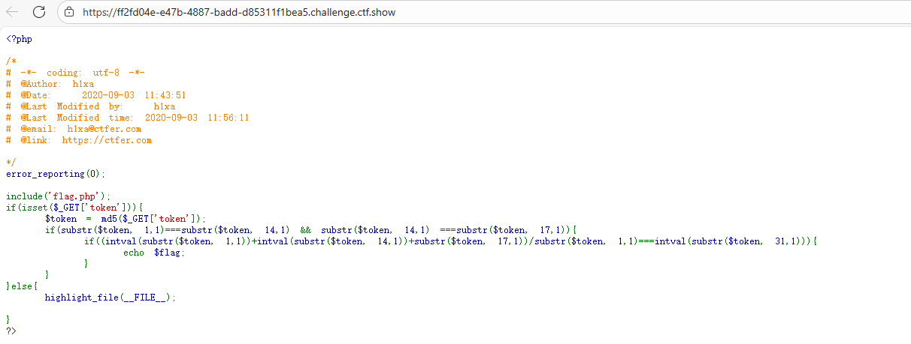

```
error_reporting(0);

include('flag.php');
if(isset($_GET['token'])){
    $token = md5($_GET['token']);
    if(substr($token, 1,1)===substr($token, 14,1) && substr($token, 14,1) ===substr($token, 17,1)){
        if((intval(substr($token, 1,1))+intval(substr($token, 14,1))+substr($token, 17,1))/substr($token, 1,1)===intval(substr($token, 31,1))){
            echo $flag;
        }
    }
}else{
    highlight_file(__FILE__);

}
?>
```

```
代码逻辑分解
输入参数：通过GET方式传入一个名为token的参数。
MD5哈希：将传入的token进行MD5哈希，得到一个32位的十六进制字符串（因为MD5哈希通常以32位十六进制表示）。
第一个条件检查：
检查MD5哈希后的字符串的第2个字符（substr($token, 1,1)，因为索引从0开始）、第15个字符（substr($token, 14,1)）和第18个字符（substr($token, 17,1)）是否相同。
第二个条件检查：
将这三个相同的字符转换为整数（intval），然后计算它们的和除以第一个字符的值，结果应等于第32个字符（substr($token, 31,1)）的整数值。
输出flag：如果以上两个条件都满足，则输出flag。
解决思路
我们需要找到一个字符串，其MD5哈希满足上述两个条件。具体步骤如下：
确定相同字符的位置：首先，我们需要MD5哈希的第2、15、18个字符相同。设这个相同的字符为c。
数学关系：根据第二个条件，(3 * intval(c)) / intval(c) === intval(substr($token, 31,1))。简化后得到3 === intval(substr($token, 31,1))，即第32个字符的整数值必须为3。
字符选择：因此，我们需要：
第2、15、18个字符相同，可以是任意十六进制字符（0-9, a-f）。
第32个字符必须是3（因为intval('3') === 3）
```

写一个脚本

```python
import hashlib
import string
import random

def generate_token(length=10):
    """生成随机字符串"""
    letters = string.ascii_letters + string.digits
    return ''.join(random.choice(letters) for _ in range(length))

def check_token(token):
    """检查token是否满足条件"""
    md5_hash = hashlib.md5(token.encode()).hexdigest()
    c1 = md5_hash[1]   # 第2个字符
    c2 = md5_hash[14]  # 第15个字符
    c3 = md5_hash[17]  # 第18个字符
    c4 = md5_hash[31]  # 第32个字符
    
    if c1 == c2 == c3 and c4 == '3':
        # 检查数学条件
        sum_val = 3 * int(c1, 16)
        divisor = int(c1, 16)
        result = sum_val / divisor
        if result == int(c4, 16):
            return True, md5_hash
    return False, md5_hash

# 暴力破解
found = False
while not found:
    token = generate_token()
    found, md5_hash = check_token(token)
    if found:
        print(f"Found token: {token}")
        print(f"MD5 hash: {md5_hash}")
        break
```

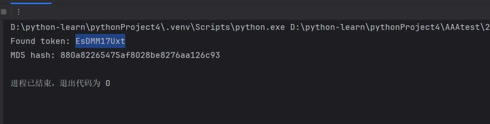

```
ctfshow{96953393-b243-42ff-bb74-4d1a1706219f}
```


### web24


```php
include("flag.php");
if(isset($_GET['r'])){
    $r = $_GET['r'];
    mt_srand(372619038);
    if(intval($r)===intval(mt_rand())){
        echo $flag;
    }
}else{
    highlight_file(__FILE__);
    echo system('cat /proc/version');
}
```

- 程序先用 `mt_srand(372619038)` 设置了随机数种子。
- 然后你用 GET 参数 `r` 提交一个值，**必须等于** `mt_rand()` 的第一次输出。
- 由于种子固定，**mt_rand() 的输出是确定的**。


我们只要逆向一下

```php
<?php
mt_srand(372619038);
echo mt_rand();
?>
    
1155388967
```

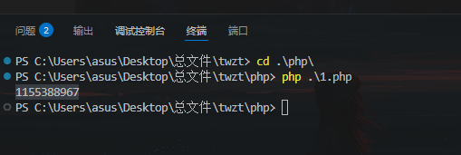


```
ctfshow{fe082771-237f-473d-9e4d-4d2da3ad0de6}
```


### web25

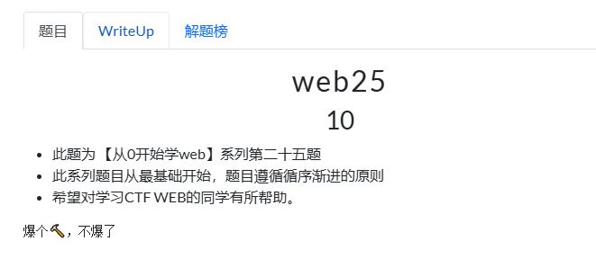

打开的得到

```php
include("flag.php");
if(isset($_GET['r'])){
    $r = $_GET['r'];
    mt_srand(hexdec(substr(md5($flag), 0,8)));
    $rand = intval($r)-intval(mt_rand());
    if((!$rand)){
        if($_COOKIE['token']==(mt_rand()+mt_rand())){
            echo $flag;
        }
    }else{
        echo $rand;
    }
}else{
    highlight_file(__FILE__);
    echo system('cat /proc/version');
}


分析上述代码，可知需要进入到打印flag的分支，需要满足$rand0=0，即$r等于第1次的mt_rand()值，同时需要满足token值等于第2次mt_rand()值与第3次mt_rand()值的和，由于mr_srand()的seed值不变，可由第一次的mt_rand()值反推mr_srand()的seed值。
```

**这个**


url/?r=0，就可以获得-mt_rand()的值，即拿到了mt_rand()第一次生成的随机数=1857153848

有了第一次生成的随机数的值，再加上之前播种的种子是固定不变的， 就可以通过php_mt_seed工具爆破出之前播种的随机数种子的值

可以下载一个

1、输入?r=0得到-1481831950, 则第1次随机值=1481831950

2、下载工具并编译https://www.openwall.com/php_mt_seed/php_mt_seed-4.0.tar.gz

```
tar -xzf php_mt_seed-4.0.tar.gz 

编译

make
┌──(root㉿kali)-[~/桌面/php_mt_seed-4.0]
└─# ./php_mt_seed 1857153848
Pattern: EXACT
Version: 3.0.7 to 5.2.0
Found 0, trying 0xfc000000 - 0xffffffff, speed 3252.2 Mseeds/s 
Version: 5.2.1+
Found 0, trying 0x3e000000 - 0x3fffffff, speed 32.4 Mseeds/s 
seed = 0x3f9b2e30 = 1067134512 (PHP 7.1.0+)
Found 1, trying 0x88000000 - 0x89ffffff, speed 31.9 Mseeds/s 
seed = 0x890d7c51 = 2299362385 (PHP 7.1.0+)
Found 2, trying 0xbe000000 - 0xbfffffff, speed 32.3 Mseeds/s 
seed = 0xbf46a081 = 3209076865 (PHP 7.1.0+)
Found 3, trying 0xfe000000 - 0xffffffff, speed 32.7 Mseeds/s 

```

```
/?r=1857153848

token=1858498537
```

```php
<?php
$seed = 3209076865;   // 先跑第一个，再换 2299362385、3209076865
mt_srand($seed);

$r      = mt_rand();          // 第 1 个随机数
$rand2  = mt_rand();          // 第 2 个
$rand3  = mt_rand();          // 第 3 个
$token  = $rand2 + $rand3;

echo "seed=$seed\n";
echo "r=$r\n";
echo "token=$token\n";
?>
```

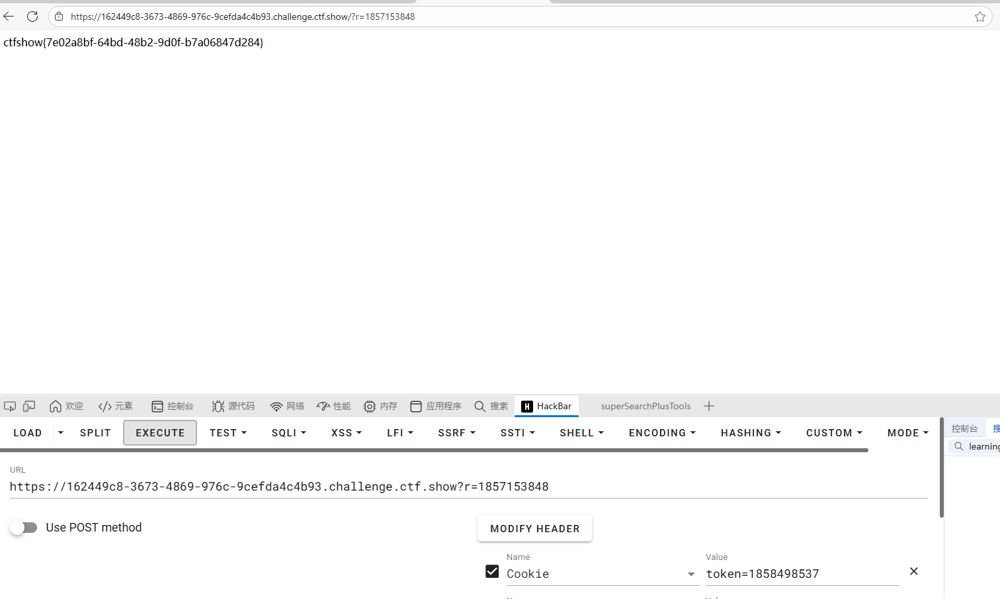

```
ctfshow{7e02a8bf-64bd-48b2-9d0f-b7a06847d284}
```


### web26

爆破数据库密码


抓包，什么都不用填，然后就能看到回显有Flag了

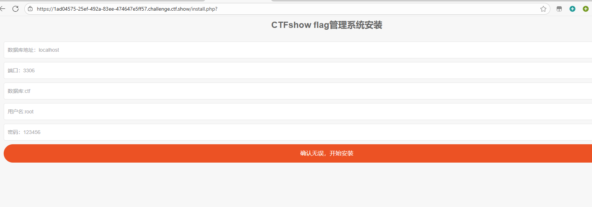

我感觉也可以爆破，得到密码

```
7758521
```

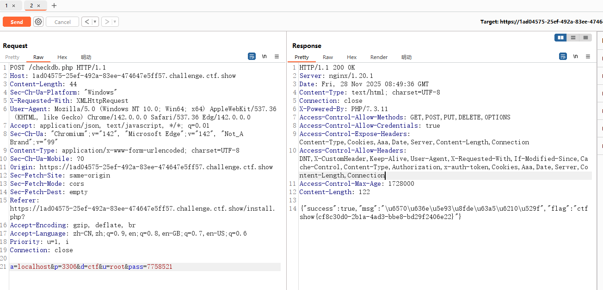


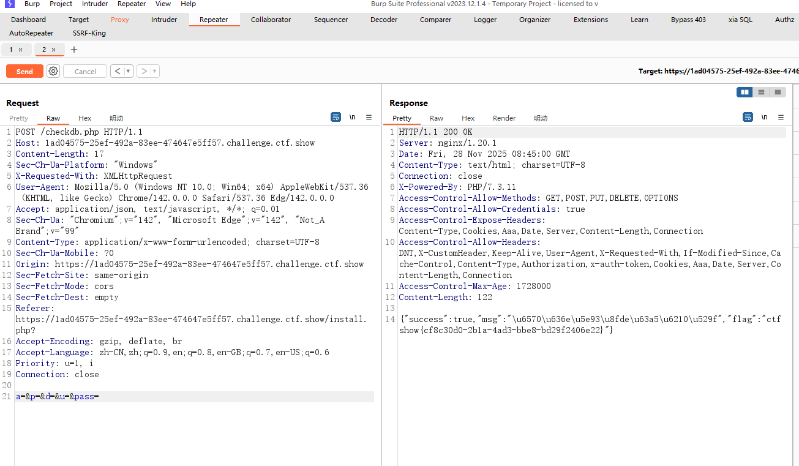

```
ctfshow{cf8c30d0-2b1a-4ad3-bbe8-bd29f2406e22}
```


### web27

#### 身份证爆破

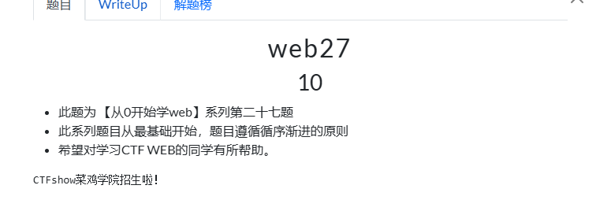

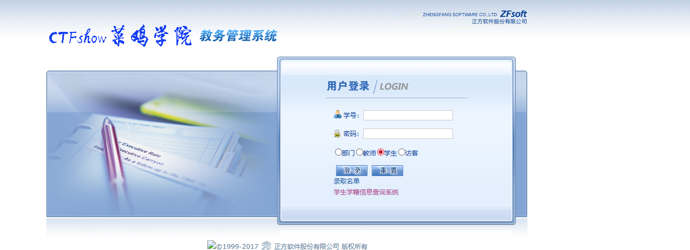

```
打开靶机，发现是个登录页面，需要学号和密码登录，猜测登录后可获得flag，则可围绕获得学号密码来进行，因为两者都不知道，直接爆破不太合适，看看还能提取到什么信息。
当点击到登录按钮下方的录取名单时，自动下载了一个list.xlsx，打开这个文件，发现了几个人的姓名和身份证号部分信息。点击录取名单下面的学生学籍信息查询系统，发现可以根据学生姓名和身份证号进行录取查询，那么第一步要做的可能就是要爆破身份证号了，或许在这里可以查到有用的信息。
```


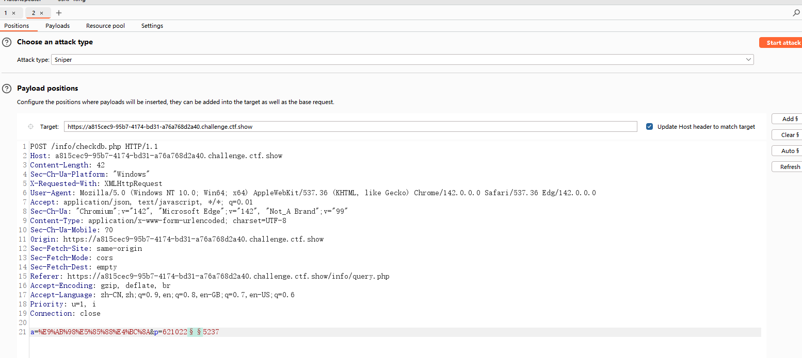

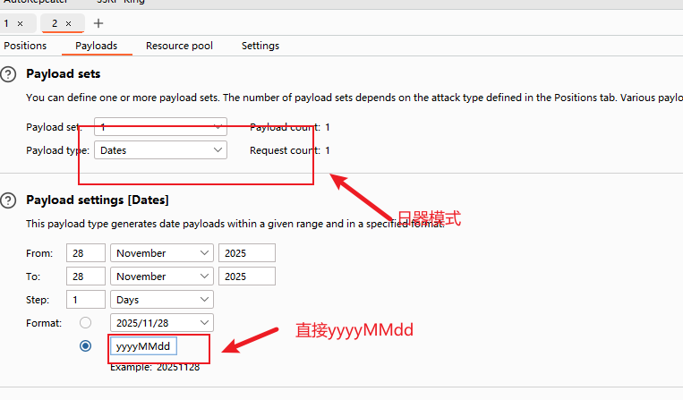

然后爆破

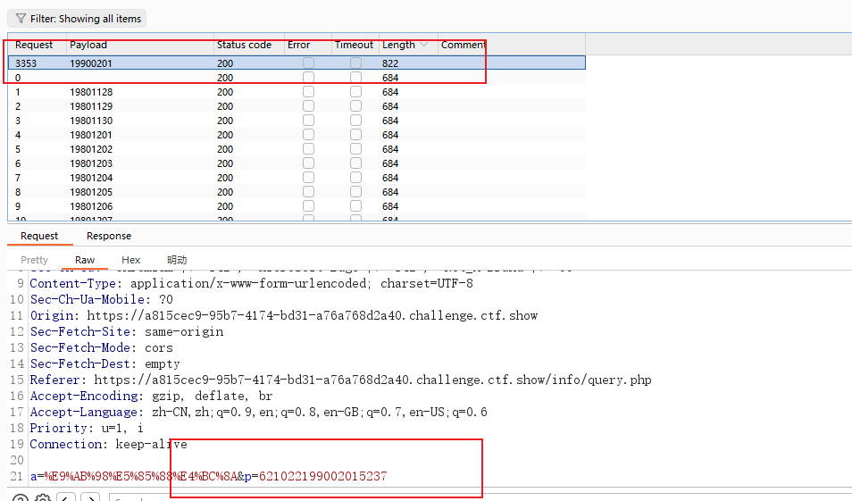

```
高先伊 身份证号：621022199002015237
```

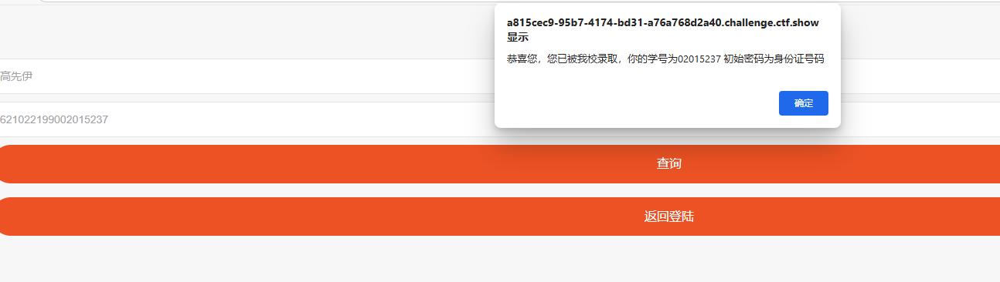

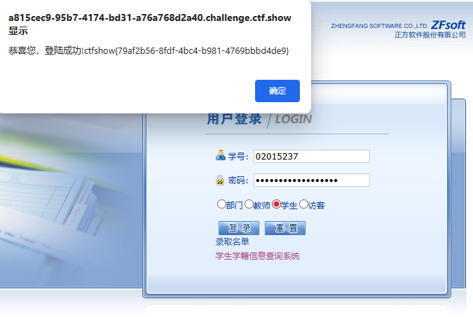

```
ctfshow{79af2b56-8fdf-4bc4-b981-4769bbbd4de9}
```


### web28

#### **目录爆破**


首先要明白302状态码的含义 就是重定向 当你更改url时，会不断的在前面加0/1/ 一直重定向 页面崩溃 爆破的话 就爆破目录

```
还是爆破题 ，用burpsuite爆破

打开题目链接后，直接跳转到了 原url/0/1/2.txt

用burpsuite抓包后，发现 原url 是进行了302跳转 才进入了 原url/0/1/2.txt

如果直接输 原url/1/2 之类，会进行302跳转，然后跳转就会进入死循环，最后直接打不开

根据题意 ，是要进行一定的爆破的，那么，什么是爆破点呢，只能是 原url后面这两个目录 了，

于是将其置入intruder

GET /§0§/§1§/ HTTP/1.1

直接是在get 参数 上做上。

攻击类型 cluster bomb

payload sets 1 。 payload type:numbers from 1 to 99 step 1

payload sets 1 。 payload type:numbers from 1 to 99 step 1

start attack!开始攻击

执行一段时间后，发现有一个httpd状态码是200 其他都403

打开这个的response 发现flag
```

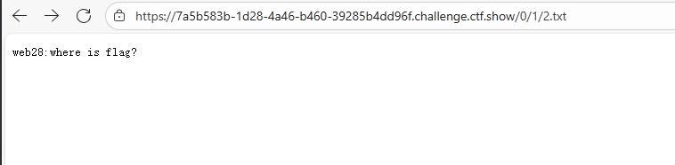

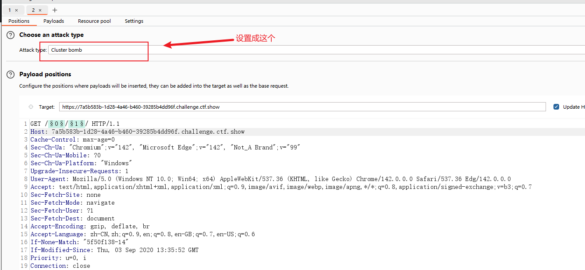

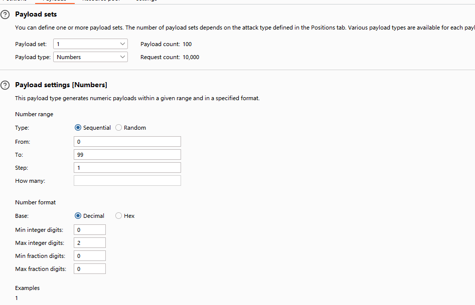

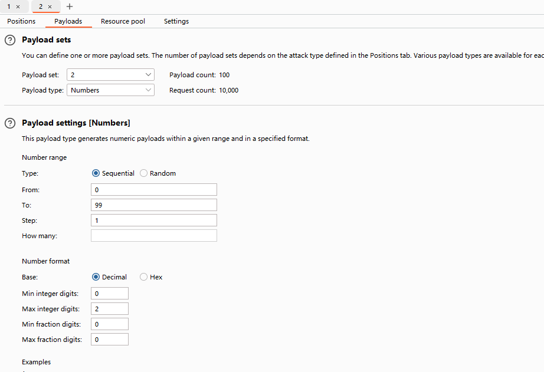

成功发现

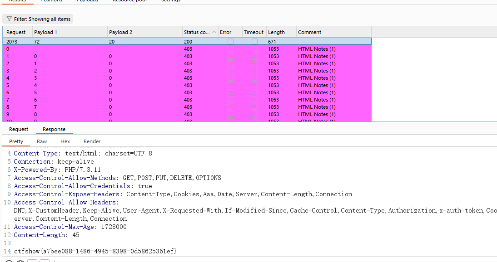

```
ctfshow{a7bee088-1486-4945-8398-0d58625361ef}
```

